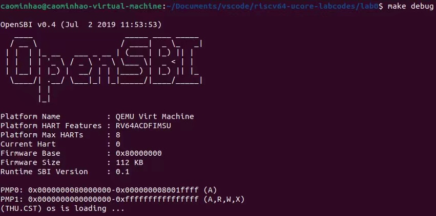

<h2 style="text-align:center">操作系统实验报告  Lab0
<h4 style="float:right">  姓名：曹珉浩&emsp;&emsp;李威远&emsp;&emsp;乔诣昊   
  学号：2113619  2112338  2111256


#### 一、使用GDB验证启动流程

> 实验要求：使用GDB调试QEMU模拟的RISC-V计算机加电开始运行到执行应用程序的第一条指令（即跳转到0x80200000）这个阶段的执行过程，说明RISC-V硬件加电后的几条指令在哪里？完成了哪些功能？要求在报告中简要写出练习过程和回答。

&nbsp;&nbsp;实验环境配置好之后，首先启动实验环境，并查看当前程序计数器PC处于哪里：

```shell
$ make qemu
$ make debug
$ make gdb
(gdb) x/i $pc
```

&nbsp;&nbsp;得到的结果为：

```assembly
=> 0x1000:		auipc	t0,0x0
```

&nbsp;&nbsp;查阅实验手册得知，**0x1000** 是qemu模拟出的处理器的复位地址(复位地址的值会因为厂商的不同实现而发生变化)，即CPU在上电的时候，或者按下复位键的时候，PC被赋的初始值。接下来CPU将从这个复位地址开始，执行复位代码，其功能主要是**将计算机系统的各个组件（包括处理器、内存、设备等）置于初始状态，并且会启动Bootloader**，这个Bootloader将加载操作系统内核并启动操作系统。

&nbsp;&nbsp;我们一条一条运行汇编指令，详细看一下这个过程：

```assembly
(gdb) si
0x0000000000001004 in ?? ()
(gdb) si
0x0000000000001008 in ?? ()
(gdb) si
0x000000000000100c in ?? ()
(gdb) si
0x0000000000001010 in ?? ()
(gdb) si
0x0000000080000000 in ?? ()
```

&nbsp;&nbsp;可以看到，PC的值突然发生了跳转，我们重启实验环境，查看未跳转前的这五条命令：

```assembly
0x1000:		auipc	t0,0x0
0x1004:		addi	a1,t0,32
0x1008:		csrr	a0,mhartid
0x100c:		ld		t0,24(t0)
0x1010:		jr		t0
```

&nbsp;&nbsp;发现原因是执行第五条汇编指令时发生了跳转，这个跳转地址就是qemu源码中定义的，将Bootloader加载到何处的地址(在这里就是OpenSBI.bin)，因此我们可以总结并回答：

- RISC-V硬件有一个内置的ROM，CPU加电后，指令就跳到 **0x1000** 处
- **0x1000** 处存放复位代码，完成一些初始化工作，并加载Bootloader，即OpenSBI，地址为 **0x80000000**，同时内核镜像 os.bin 被加载到以物理地址 **0x80200000** 开头的区域上

&nbsp;&nbsp;接下来就是OpenSBI的工作：操作系统的二进制可执行文件被OpenSBI加载到内存中，然后OpenSBI将PC跳转到内存里的一个位置，开始执行内存中那个位置的指令。由于代码地址的相关性，我们需要保证内核的“入口”指令位于物理地址 **0x80200000** 处，(这里的入口其实是 `entry.S` 中的 `kern_entry`，执行后跳转到真正的入口)，一旦 CPU 开始执行内核的第一条指令，证明计算机的控制权已经被移交给我们的内核。

&nbsp;&nbsp;在GDB中执行命令进行验证：

```assembly
(gdb) break *0x80200000 #在0x80200000处设置断点
BreakPoint 1 at 0x80200000: file kern/init/entry.S, line 7.
(gdb) continue # 执行直到断点，到达entry.S这个“入口”
Breakpoint 1,kern_entry() at kern/init/entry.S:7
(gdb) continue # 接着执行，到init入口时将控制权交给内核
```

&nbsp;&nbsp;这几条命令完成后，发现 debug 窗口出现输出，说明控制权已经被交给了我们的内核。



&nbsp;&nbsp;此外，我们看到物理地址 0x8020000 的断点处在文件 **kern/init/entry.S** 中，接下来我们简单看一下源码，理解这个工作过程。

&nbsp;&nbsp;首先是 **tools/kernel.ld**， 这个文件是链接脚本，描述怎样把输入文件的section映射到输出文件的section, 同时规定这些section的内存布局，并把输入文件链接为输出文件(均含很多section)，在这个链接文件中，明确定义了内核指令的地址：

```assembly
BASE_ADDRESS = 0x80200000;
```

&nbsp;&nbsp;同时，在链接脚本中把程序的入口点定义为 **kern_entry**，而刚才断点信息提到的 **kern/init/entry.S** 用到了这个定义，作为内核的入口，查看其源码，发现其作用就是分配好内核栈，然后跳转到 **kern_init**。

```assembly
    .section .text,"ax",%progbits #可分配，可执行，包含数据
    .globl kern_entry
kern_entry:
    la sp, bootstacktop
    tail kern_init
```

&nbsp;&nbsp;在同目录下的 **init.c** 中编写了 kern_init 这个函数，用到自己实现的函数实现了输出等函数，内容是**(THU.OST) os is loading ...**，这就是我们前面命令行看到的内容。

```c
int kern_init(void) {
    extern char edata[], end[];
    memset(edata, 0, end - edata);
    const char *message = "(THU.CST) os is loading ...\n";
    cprintf("%s\n\n", message);
   while (1)
        ;
}
```

#### 二、知识点

- GDB 调试工具的使用：
  - `x/10i address`：查看地址处的10条数据
  - `si`：执行单条汇编语句
  - `break *address`：在 `address` 处打断点
  - `continue`：执行直到断点

- 操作系统是由固件 `Bootloader(OpenSBI)` 加载的，这个过程大致为：
  - CPU 上电后，从固定的地址开始执行指令
  - 指令会跳到指定地址，这个地址存放操作系统的内核
  - 当执行操作系统内核的第一条指令之后，控制权就交给了操作系统
- QEMU 是一个开源的硬件模拟器，可以模拟 `x86,arm,PowerPC` 等多种架构
