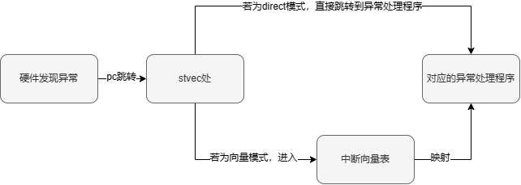
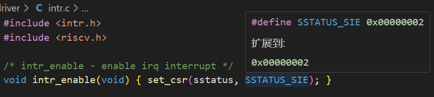
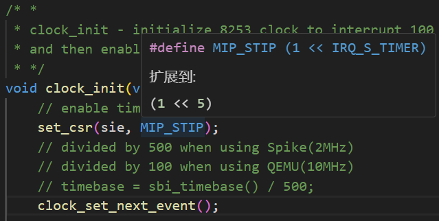
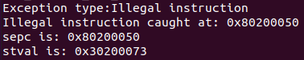
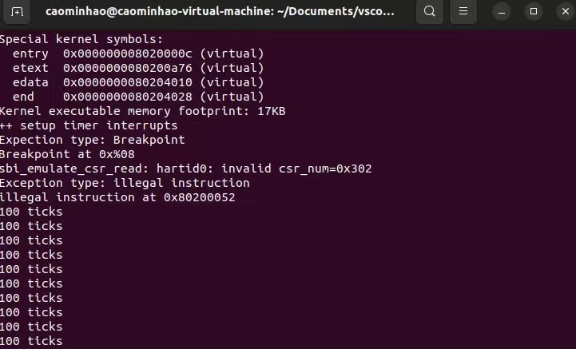

<h2 style="text-align:center">操作系统实验报告  Lab1
<h4 style="float:right">  姓名：曹珉浩&emsp;&emsp;李威远&emsp;&emsp;乔诣昊   
  学号：2113619 2112338 2111256

[toc]

**仓库地址：** visit the [Github](https://github.com/MrGuaB1/Operating-System)

#### 汇总：考察 CSR 功能及其相关指令

在本次实验中，控制状态寄存器(CSR)扮演了非常重要的角色，首先让我们汇总一下本次实验中出现的CSR，看看它们分别是做什么的，并简单汇总一下这些寄存器分别在哪几个关键函数中出现，以此来分析他们的功能，从而帮助我们理解整个操作系统的异常处理、解决和理解练习和几个challenge中提出的问题。

这里，出现了一些CSR相关的指令，如 `csrw`、`csrr`、`csrrw`，其实本质上就是对 `csr` 的 `write`，`read`，`read and write`操作，即对CSR的读写操作。

在 `__alltrap` 的 `SAVE_ALL`接口中仅仅对 `sstatus`、`sepc`、`sbadaddr`、`scause` 四个寄存器进行了存储到结构体中的操作，因此不对`__alltrap` 中对这四个CSR的操作加以赘述。

##### 1.1 stvec

`stvec` 寄存器是本次实验中最为关键的控制状态寄存器，它储存了中断向量表的地址。在硬件发现了异常后，会把 `pc` 跳转到 `stvec` 所在的地址，然后根据异常处理的模式，跳转到对应的异常处理程序的入口。

异常处理向量表有的两种模式，分为直接模式和向量模式，这里我们采用直接模式，即 `stvec` 处只有一个异常处理程序。而向量模式则是在 `stvec` 处存在一个向量表，需要根据异常的类型进行映射到对应的异常处理程序。本次实验中，我们选取第一种直接模式，即 `direct` 模式。



因此，在本次实验中对 `stvec` 的使用，出现在 `trap_init` 函数中，对中断处理的初始化，需要把设定好的中断处理程序的地址赋值给 `stvec`，也就是 `__alltraps` 的地址，即如下所示。

```c
void idt_init(void) {
	extern void __alltraps(void);
	/* Set sscratch register to 0, indicating to exception vector that we are
	* presently executing in the kernel */
	write_csr(sscratch, 0);
	/* Set the exception vector address */
	write_csr(stvec, &__alltraps);
}
```

##### 1.2 sscratch

实验手册提到：寄存器在处理用户态程序的中断时才起作用，在目前其实用处不大。关于其更深入的作用探讨我们放在了后续的扩展中解释，这里我们只针对 `sscratch` 在本实验中的作用进行解释。

考察本次的 `__alltrap` 的异常函数处理入口点，在 `SAVE_ALL` 中可以看出，`sscratch` 主要起到暂时存储原本 `sp` 中的值，也就是我们定义的寄存器结构体的栈底指针，用于后续对栈指针的恢复。

```assembly
# 将sp写入sscratch，此时sscratch中存储原本的sp，即栈底指针
csrw sscratch, sp
# 将sp向下生长36 * REGBYTES大小，开辟36个寄存器的结构体空间，sp为结构体的地址
addi sp, sp, -36 * REGBYTES
……
# 首先将sscratch写入s0，后续写入结构体空间中(通过sp偏移地址的store实现)
# 然后将x0(零寄存器)写入sscratch，这是因为sscratch内核态下规定为0(扩展中提到)
csrrw s0, sscratch, x0
```

此外，`sscratch` 寄存器也在 `trap_init` 函数中出现，将其初始化为0，具体原因在后续扩展中提到。

##### 1.3 sstatus、sie

`sstatus` 寄存器实际上在本次实验中用到较多的是它的 `sie` 位，该二进制位在内核态下是控制是否启用中断的使能信号，其初始值为0，需要设置为1时才能启用中断。

此外，sie寄存器作用与 `sstatus` 的 `sie` 位类似，因此这里放到一起汇总。它的作用是单独使能/禁用某个来源的中断，同样是对应位初始值为0，为1时启用中断。

可以看到，`sstatus` 寄存器中 `sie` 位的设置在 `intr_enable` 和 `intr_disable` 中完成，这两次操作分别对应开启中断使能信号和关闭中断使能信号，如下图所示，根据 `set_csr` (设置某位为1的csr处理函数)可以看出，`sie` 位于 `sstatus` 寄存器的第二位。



`sie` 寄存器的设置自然在单独的时钟来源的中断初始化时设置，即 `clock_init `函数中给出。可以看出，时钟中断的使能对应 `sie` 寄存器中的第6位，此时将其设置为1，即使能了时钟中断。



##### 1.4 sepc、stval

`sepc` 的概念非常简单，它指向发生中断的指令位置。而 `stval` (代码中是sbadaddr)则记录一些中断处理所需要的辅助信息，比如指令获取、访存、缺页异常中，发生问题的目标地址或者出错的指令。这里我们将其两者一起汇总，作为对比，以防概念上出现混淆(事实上在一开始对challenge3的实现中就真的混淆了)。

我们先做一个小小的实验，以区分二者的不同，在challenge3中非法指令的输出代码中进行更改，尝试输出 `sepc` 和 `stval` 的值，结果如下：



可以看到，二者的值显示是有区别的，`sepc` 毫无疑问是非法指令 `mret` 的位置，那么 `stval` 是什么呢？在处理内存访问异常时，`stval` 显然是出现异常的内存地址。但对于非法指令异常，事实上，`stval` 存储的正是 `mret` 这个指令的机器码(十六进制)。

##### 1.5 scause

最后是 `scause` 寄存器，它的概念也比较简单，是对异常和中断原因的记录，在本次实验代码中，用于异常处理程序 `trap.c` 中对异常的分类。概念相对简单，这里就不加赘述了。

#### 扩展：对于sscratch更多的研究

扩展：对于 `sscratch` 更多的研究。在实验手册中只简单提到了这个寄存器在lab1中作用不大。这里我们出于好奇和全面认识csr，对其功能进行了调研，发现它与用户态的中断紧密相关。

因为中断发生时，操作系统需进入内核态，需要在保障32个基本寄存器的值不变的情况下判断目前是否是用户态，然后切换到内核栈。这就需要sscratch作为一个可以进行交换地址的临时寄存器。我们规定，用户态时，sscratch保存内核态栈的地址，而内核态时，`sscratch` 中保存0(这里我们实验中 `sscratch` 实质上一开始是0)。

所以，在存在用户态的可能性时，中断处理首先需要先交换 `sp` 和 `sscratch`，并根据 `sp` 判断是不是用户态中断。如果是用户态中断，此时 `sp` 已经是内核栈了；如果是内核态中断，就再从 `sscratch` 中读出 `sp` 即可。

最终，`sp` 会指向内核栈，而 `sscratch` 指向中断前的栈（U/S）。

#### 练习一：理解内核启动中的程序入口操作

```assembly
la sp, bootstacktop
```

`la` 是 `RISCV` 的伪指令，即 `load address` ，将栈指针 `sp`  的值设置为 `bootstacktop` 的地址，这条指令执行之后，会为操作系统内核初始化栈空间，以供操作系统执行命令和保存状态

```assembly
bootstack:
	.space KSTACKSIZE # 留KSTACKSIZE这么多字节的空间
	.global bootstatcktop # 定义一个全局符号，表示内核栈顶部地址
```

```assembly
tail kern_init
```

`tail` 是一条跳转指令，用于将函数调用转换为无条件跳转，这里的具体作用是跳转到操作系统内核的第一条指令的位置处，操作系统执行它的第一条语句后，就获得了控制权。这条指令进行跳转不保存返回地址(个人理解是把操作权永久交给操作系统，而且不留返回值也是避免一些意外和恶意行为)，此外，尾部跳转不通过 `jal` 调用另一个函数，可以避免函数调用时的额外开销，如保存和恢复寄存器。

#### 练习二：完善中断处理

```c
clock_set_next_event(); // 设置下次时钟中断
if(++ticks == TICK_NUM){
  print_ticks();
  num++;
  ticks = 0;
  if(num == 10) {
    sbi_shutdown(); // 调用函数关机
  }
}
```

#### Challenge1：描述与理解中断流程

> 描述ucore中处理中断异常的流程（从异常的产生开始）

##### 5.1 异常与中断的产生与检测：以时钟中断和非法指令为例：

&nbsp;&nbsp;首先，我们需要认识到，异常与中断都是怎么产生的。
&nbsp;&nbsp;从定义上来看，异常 (Exception) 往往指在执行一条指令的过程中发生了错误，此时我们可以通过中断来处理错误。最常见的异常包括：访问无效内存地址、执行非法指令 (除零)、发生缺页等。他们有的可以恢复 (如缺页)，有的不可恢复 (如除零)，只能终止程序执行。此外，还包括陷入的情况，即我们主动通过一条指令停下来，并跳转到处理函数。常见的形式有通过 ebreak 进入断点等等。
&nbsp;&nbsp;而外部中断 (Interrupt)，简称中断，指的是 CPU 的执行过程被外设发来的信号打断，此时我们必须先停下来对该外设进行处理。典型的有定时器倒计时结束、串口收到数据等。在我们这次实验中，我们分别进行了时钟中断的外部中断和非法指令异常的实验，接下来，我们以这两个例子，实际性来看看这些异常与中断是怎么产生的。

**时钟中断**： 对于时钟中断，从软件上直接触发是难以做到的，我们通过调用 openSBI 固件中提供的 `SBI_SET_TIMER` 接口实现。在lab0.5 中，我们实现了 `sbi_call` 方法，以在软件层面调用 openSBI 的接口。这里，我们应用此方法，封装一个 `sbi_set_timer()` 函数，通过调用这个函数并传参，即可实现按照指定时间对 cpu 发送一个时钟中断。随后，cpu 会在硬件层面检测到这个时钟中断信号，触发中断的处理流程。

可以看出，时钟中断实质上是外部对 cpu 发出的信号，打断了 cpu 的执行过程，使得 cpu 必须停下来先处理这个外部信号的中断。

**非法指令**： 对于非法指令，其属于异常的范畴。因此，不需要像时钟中断一样做很多的处理，来给 cpu传递信号，只需要在 cpu 需要执行的指令中插入一条非法指令，cpu 就能在执行过程中“自发”地检测到这个非法指令，产生异常发生的信号，触发中断的处理流程。
可以看出，非法指令异常实质上是 cpu 在执行过程中自发检测到的异常，cpu 会自己停下来，和软件层面的操作系统内核结合，一同先处理这个异常导致的中断。

##### 5.2 异常与中断的跳转：从硬件到软件

如前文所说，不论是异常还是中断，cpu都能检测到它们的存在。那么，cpu是如何实现从硬件到软件层面的跳转，进入到内核态中进行中断的处理的呢？

这就需要用到本次实验中最为重要的一个CSR，即 `stvec`。这个寄存器和中断向量表的使用已经在先前对CSR的汇总中已经详细解释，这里我们简要概括一下流程，就不再过多赘述了。

在发现异常后，`pc` 会切换到 `stvec` 的值。这里，我们是 `direct` 模式，则会直接跳转到中断处理函数的入口点，即 `__alltrap` 处，接下来，我们将对异常与中断进行初步的处理，保存cpu先前的各个寄存器状态，保证cpu在中断处理能够正常恢复。		

##### 5.3 异常与中断的保存和恢复：现场信息的封装与传递

为了保持 CPU 各寄存器先前的值与状态，我们需要实现上下文切换机制，保存 CPU 的寄存器到内存中，并在中断处理结束后将其恢复，我们通过 `__alltrap` 中的宏定义 `save_all` 实现现场信息的封装，以此来完成上下文切换机制。

这里，我们将 `riscv` 的32个通用寄存器和4个状态寄存器全部通过sp栈指针开辟空间的方式，加载到一块栈空间的内存中，并定义与其对应的 `trapframe` 结构体，将栈空间的基地址作为参数传入中断处理函数 `trap` 中，实现了将异常与中断现场的保存，并把4个状态寄存器中存储的异常与中断的相关信息传入中断处理函数，进行后续的处理。

此外，在中断处理后，需要重新读取这块内存上存储的寄存器值和sstatus、sepc两个和恢复状态相关的寄存器，这里通过进入类似于 `__alltrap` 的 `__trapret` 入口点实现，其中的宏定义 `RESTORE_ALL `即为读取这段栈空间的值到寄存器上，恢复中断处理前的现场，并调用 `sret` 从内核态返回。

##### 5.4 异常与中断的处理：具体情况具体分析

关于传入中断处理函数后的操作，一般需要具体情况具体分析。由于这里 `stvec` 处采用的是直接模式而非向量模式，这里首先需要根据传入的 `scause` 寄存器(保存状态)的值确定下来异常或者的类型，随后根据不同的情况进行处理即可。

这里需要注意的是，对于epc(中断处理后需要返回的地址)的处理，在不同情况下显然也是不同的。比如我们这次实验中的时钟中断，事实上没有对epc进行操作，返回的仍然是当时的epc，cpu继续进行当时的工作。而对于非法指令和断点指令带来的中断，则需要将epc+4或者将epc+2(ebreak为2字节指令)。

总而言之，异常处理在软件上实现会根据不同类型进行分别的处理，处理后就进行先前提到的异常中断的恢复，这就是整个异常与中断的处理过程。

> `mov a0,sp`  的目的是什么？

这条指令把栈顶指针 `sp` 传给参数寄存器 `a0`，此时 `a0` 存放的就是汇编宏 `save_all` 得到的 `trapframe` 结构体的首地址，即将此次中断新生成的 `trapframe` 结构体作为参数，传递给 `trap.c` 中的 `trap()` 函数，从而实现中断。

> `SAVE_ALL` 中寄存器保存在栈中的位置是什么确定的？

为了方便组织上下文的数据，`ucore` 组织了一个结构体，即 `pushregs` 和前面提到的 `trapframe`，而C语言里面的结构体，是若干个变量在内存里的直线排列，也就是说，一个 `trapFrame` 结构体占据36个 `uintptr_t`的空间，里面依次排列通用寄存器 `x0`到 `x31`（`trapframe` 还有4个和中断相关的控制状态寄存器）
知道这一点后，寄存器保存在栈中的位置就很好确定了：只要知道栈顶指针 `sp`，通过固定的偏移量，再乘以索引号，就可以找到我们想要的寄存器。

此外，对于特殊寄存器的 CSR，按照 `sstatus`、`sepc`、`sbadaddr(sval)`、`scause` 的顺序存储在通用寄存器的高地址处，同样通过固定的偏移量乘以索引号即可找到。

> 对于任何中断，`__alltraps` 中都需要保存所有寄存器吗？

对于任何中断，`__alltraps` 中都需要保存所有寄存器。这是因为中断可能会在任何时刻发生，而处理器的状态可能会被修改，因此需要保存所有寄存器以确保中断处理程序能够正确地恢复处理器的状态。此外，由于不同的中断类型可能需要保存的寄存器不同，因此在 `__alltraps` 中保存所有寄存器可以保证处理器状态的完整性。

#### Challenge2：理解上下文切换机制

> 在trapentry.S中汇编代码 csrw sscratch, sp；csrrw s0, sscratch, x0实现了什么操作，目的是什么？

```assembly
csrw sscratch, sp
```

这条指令的作用是将 `sp` (栈指针)保存到临时控制状态寄存器 `sscratch` 中，`sscratch` 寄存器本来的值为0。

```assembly
csrrw s0, sscratch, x0
```

这条指令的作用是：先将临时控制状态寄存器 `sscratch` 的值赋给 `s0`，再把 `x0` 的值赋给 `sscratch` ，`x0` 是零寄存器，也就是把 `sscratch` 的值还原。 这两条命令的目的是保存最开始的`sp`寄存器的值并将`sscratch` 的值恢复。在保存寄存器的值之前将将`sp`的值赋值给了 `sscratch`(因为之后要用sp去开辟栈空间，值会改变)，现在要将其保存，但是SCR不能直接写入内存，所以要借助通用寄存器，然后将 `sscratch`的值恢复为0。

> save all里面保存了stval scause这些csr，而在restore all里面却不还原它们？那这样store的意义何在呢？

`stval` 中记录的是记录一些中断处理所需要的辅助信息，比如发生中断或异常的目标地址或者出错的指令；而 `scauses` 记录中断发生的原因，以及该中断是不是一个外部中断。这两个寄存器存储的信息都会给操作系统的中断处理提供宝贵的信息，因此必须进行 `store` ，但在操作系统处理完毕之后，这些信息就变得无用了，无需浪费资源进行还原。

#### Challenge3：完善异常中断

```c
cprintf("Exception type:Illegal instruction\n");
cprintf("Illegal instruction caught at 0x%08x\n", tf->epc);
tf->epc+=4;
```

```c
cprintf("Exception type: breakpoint\n");
cprintf("ebreak caught at 0x%08x\n", tf->epc);
tf->epc+=2; //断点异常指令占两个字节
```

为了在 `make qemu` 后可以看到我们中断处理的效果，我们在 `init.c` 中加入如下内联汇编：

```assembly
__asm__ __volatile__("mret"); // 触发非法伪指命异常
__asm__ __volatile__("ebreak"); // 触发断点异常
```

查看输出，可以看到异常中断完善成功：



#### 知识点：

> 实验总结：

在 `kern_init` 函数中调用了 `idt_init` 函数，该函数在 `trap.c` 中，这个函数是用来初始化中断描述符表（IDT）的。具体来说，它做了以下两件事情：

- 将 `sscratch` 寄存器的值设置为 0，表示当前正在内核态下执行。在 `RISC-V` 中，`sscratch` 寄存器是一个特殊寄存器，用于保存一些临时状态，比如在中断处理过程中保存被中断代码的一些状态信息。在这里，将 `sscratch` 寄存器的值设置为 0，可以告诉异常向量处理程序，当前正在内核态下执行，从而可以执行一些特权操作。
- 将异常向量表的地址设置为 ` __alltraps` 函数的地址。在 `RISC-V` 中，异常向量表是一个固定的地址，用于存储异常处理程序的入口地址。当发生异常时，处理器会根据异常类型和异常向量表中的偏移量计算出异常处理程序的入口地址，并跳转到该地址执行异常处理程序。在这里，将异常向量表的地址设置为 ` __alltraps` 函数的地址，可以让所有的异常都跳转到 `__alltraps` 函数中执行，从而实现对所有异常的统一处理。

`kern_init` 函数之后又调用了 `intr_enable`，该函数在 `intr.c` 中，这个函数的作用是启用中断。具体来说，它通过设置系统状态寄存器（sstatus）中的 `SIE`（Supervisor Interrupt Enable）位来实现。将 `SIE` 位置为 1，表示允许中断请求进入处理器，从而启用中断。

> 课堂总结：

- 操作系统在切换进程时，需要实现上下文切换：即保存和恢复寄存器
