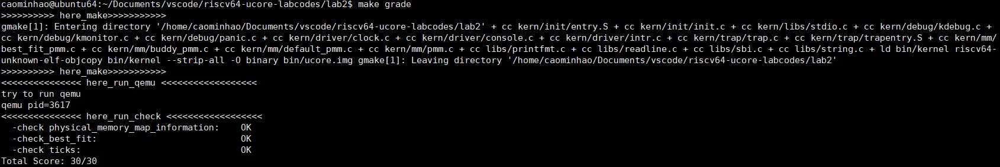

<h2 style="text-align:center">操作系统实验报告  Lab2
<h4 style="float:right">  姓名：曹珉浩&emsp;&emsp;李威远&emsp;&emsp;乔诣昊   
  学号：2113619  2112338  2111256

[toc]

**仓库地址：** visit the [Github](https://github.com/MrGuaB1/Operating-System)

#### 练习1：理解 first-fit 连续物理内存分配算法

##### 1.1 default_init

**这个函数的作用是初始化空闲内存块列表 `free_list`，并将空闲内存块 `nr_free` 设置为0**

##### 1.2 default_init_memmap

**这个函数用于初始化一个内存块**，有两个参数：`struct Page *base` 和 `size_t n`，分别代表内存块的首地址和块的总数量，首先我们要设置内存块的 `property` 字段：

- 如果该页是空闲的并且不是空闲块的第一页，则 p->property 应设置为 0
- 如果此页是空闲的并且是空闲块的第一页，则 p->property 应设置为块的总数量

```c
for (; p != base + n; p ++) {
	assert(PageReserved(p)); 
    p->flags = p->property = 0; //如果该页是空闲的并且不是空闲块的第一页，则 p->property 应设置为 0
    set_page_ref(p, 0);  //将页块的引用计数设置为0
}
base->property = n; //如果此页是空闲的并且是空闲块的第一页，则 p->property 应设置为块的总数量
SetPageProperty(base); //设置property位
nr_free += n;  //增加系统的空闲页数
```

然后需要把这个初始化的内存块加入到空闲列表中，分为三种情况，插入到表头，表中和表尾，分别调用双向链表中的不同函数即可：

```c
if (list_empty(&free_list)) {  //如果空闲页列表为空，那么直接将base加到表头
	list_add(&free_list, &(base->page_link));
} else { // 否则需要遍历列表，找到合适的位置
	list_entry_t* le = &free_list;
    while ((le = list_next(le)) != &free_list) {
		struct Page* page = le2page(le, page_link);
        if (base < page) {
			list_add_before(le, &(base->page_link));
            break;
        } else if (list_next(le) == &free_list)  //已到达末尾，直接add即可
			list_add(le, &(base->page_link));
    }
}
```

##### 1.3 default_alloc_pages

**这个函数的作用是在空闲列表中搜索找到第一个空闲块并调整空闲块的大小，并返回分配的块的地址。**传入参数 `n` 代表需要的内存块的大小(如果 `n>nr_free` 则直接返回空)，首先定义两个指针，分别指向要用于分配的空间(初始为空)和空闲列表的表头，然后进入循环，找到第一个大于等于 `n` 的就退出循环：

```c
struct Page *page = NULL;  // 用于存储分配的页块的指针
list_entry_t *le = &free_list; //指向空闲页块链表头的指针
while ((le = list_next(le)) != &free_list) {
	struct Page *p = le2page(le, page_link);
    if (p->property >= n) { //找到了第一个大于n的块，直接退出循环
		page = p;
        break;
	}
}
```

接着需要把分配出去的这个块从空闲列表中摘除，并更新剩余块的大小。需要注意的是，如果找到的内存块比所需 `n` 要大，那么需要做一下合并工作，最后总页数减 `n`，并清除被分配的页块的property标志位，表示已被分配

```c
if (page->property > n) { //如果该页块的大小大于要分配的页数，就计算出剩余未分配的页块的地址
	struct Page *p = page + n; //增加偏移量，越过要分配的n页
	p->property = page->property - n; // 更新剩余页块的大小
	SetPageProperty(p); //设置标志位：PG_property = 0 PG_reserved = 1
	list_add(prev, &(p->page_link)); // 将剩余页块添加到空闲页块链表中
}
nr_free -= n;
ClearPageProperty(page); // 清除被分配的页块的property标志位，表示已被分配
```

##### 1.4 default_free_pages

**这个函数用于释放内存，并将页面重新链接到空闲列表中。**首先清除标志位和引用次数，然后设置页面的 `property` 位，和在初始化的工作类似，设置空闲块的第一页为 `n`。然后把释放的内存加入到空闲列表，插入的方法仍同初始化工作中的插入。最后，函数还尝试合并低地址或者高地址的内存，工作分为两步：

- 如果释放内存块插入位置的前一个链表项不是空闲链表头，则可以和前面的合并
- 和插入位置的后一个链表项合并，并删除后一个链表项

还有一个重要的问题是如何判断内存页块是地址相邻的呢？函数用到的逻辑是 `p + p->property == base`，其含义就是如果 `p` 是 `base` 的前一个内存页块，并且 `p` 加上它的容量(偏移量)就是 `base` 的首地址，那么它们地址相邻，可以合并。

```c
list_entry_t* le = list_prev(&(base->page_link)); // 获取释放的页块的前一个链表项
if (le != &free_list) { // 如果前一个链表项不是空闲页块链表头，还要和前面的合并
	p = le2page(le, page_link);
	if (p + p->property == base) { //地址相邻
		p->property += base->property;
		ClearPageProperty(base); //清除当前页块的peoperty位
		list_del(&(base->page_link)); //删除页块
        base = p; //返回合并后的页块
	}
}
```

向后合并逻辑类似。

#### 练习2：实现 best-fit 连续物理内存分配算法

##### 2.1 best_fit_init_memmap

- 当base < page时，找到第一个大于base的页，将base插入到它前面，并退出循环
- 当list_next(le) == &free_list时，若已经到达链表结尾，将base插入到链表尾部

```c
if(base<page){
	list_add_before(le,&(base->page_link));
    break;
} else if(list_next(le) == &free_list){
	list_add(le,&(base->page_link));
}
```

##### 2.2 best_fit_alloc_pages

算法思路是利用 `min_size = nr_free + 1`，在循环中记录满足条件 (>=n)的内存块，并设一个指针指向它，当一轮循环结束时就可以记录到最优内存块大小，根据对应指针就可以找到要分配的块，易知当前算法的时间复杂度为 $O(n)$

```c
size_t min_size = nr_free + 1;
while ((le = list_next(le)) != &free_list) {
	struct Page *p = le2page(le, page_link);
    if (p->property >= n && p->property <min_size) {
		min_size = p->property;
		page = p;
    }
}
```

##### 2.3 best_fit_free_pages

```c
if(p+p->property == base){ //判断内存是否连续
	p->property+=base->property; //更新前一个空闲页块的大小，加上当前页块的大小
	ClearPageProperty(base); //清除当前页块的属性标记，表示不再是空闲页块
	list_del(&(base->page_link)); //从链表中删除当前页块
	base=p; //将指针指向前一个空闲页块，以便继续检查合并后的连续空闲页块
}
```

##### 2.4 算法优化

上述算法是一个普通的线性算法，其搜索时间为 $O(n)$，我们可以考虑将双向链表构造为平衡二叉树等高效搜索数据结构，使用地址对其排序，可将搜索时间降低为 $O(log\;n)$

##### 2.5 结果



