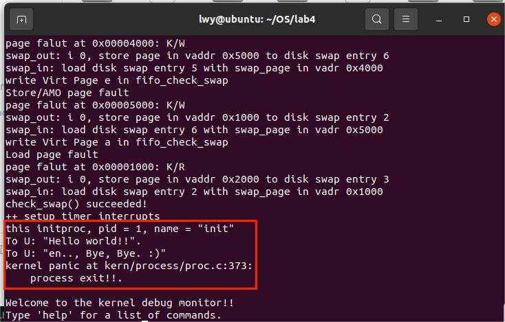

<h2 style="text-align:center">操作系统实验报告  Lab4
<h4 style="float:right">  姓名：曹珉浩&emsp;&emsp;李威远&emsp;&emsp;乔诣昊   
  学号：2113619    2112338   2111256

[toc]

#### Exercise1：分配并初始化一个进程控制块

**alloc_proc函数负责分配并返回一个新的struct proc_struct结构。**

alloc_proc函数（位于kern/process/proc.c中）负责分配并返回一个新的struct proc_struct结构，用于存储新建立的内核线程的管理信息。ucore需要对这个结构进行最基本的初始化，这里需要完成这个初始化过程。

##### 1.1数据结构介绍

###### 1.1.1proc_struct结构体介绍

在kern/process/proc.h中定义了proc_struct结构，在下方的注释里已经说明了各成员变量的作用

```c++
struct proc_struct {
    enum proc_state state;                      // 进程的状态，uCore中进程状态有四种：分别是PROC_UNINIT、PROC_SLEEPING、PROC_RUNNABLE、PROC_ZOMBIE
    int pid;                                    // 进程的ID
    int runs;                                   // 进程的运行次数
    uintptr_t kstack;                           // 进程的内核栈的位置
    volatile bool need_resched;                 // 布尔值: 是否需要调度释放CPU
    struct proc_struct *parent;                 // 该进程的父进程的指针
    struct mm_struct *mm;                       // 进程的内存管理字段，在实验三有说明
    struct context context;                     // 进程的上下文，也就是几个关键的寄存器的值，用于进程切换
    struct trapframe *tf;                       // 中断帧的指针，记录了进程中断前的状态
    uintptr_t cr3;                              // cr3寄存器是x86架构的特殊寄存器，用来保存页表所在的基址。出于legacy的原因，这里仍然保留了这个名字，但其值仍然是页表基址所在的位置。
    uint32_t flags;                             // 进程标志
    char name[PROC_NAME_LEN + 1];               // 进程名字
    list_entry_t list_link;                     // 进程link list，将链入全局变量list_entry_t proc_list 
    list_entry_t hash_link;                     // 进程hash list，将链入全局变量static list_entry_t hash_list[HASH_LIST_SIZE] 
};
```

###### 1.1.2proc_struct结构体介绍

同样是在kern/process/proc.h中定义了proc_state，可以看见有四个状态，下面注释进行了说明

```c++
// 过程在其生命周期中的状态
enum proc_state {
    PROC_UNINIT = 0,  // 未初始化状态
    PROC_SLEEPING,    // 休眠、阻塞状态
    PROC_RUNNABLE,    // 可运行、就绪状态 
    PROC_ZOMBIE,      // 僵尸状态(几乎已经终止，等待父进程回收其所占资源)
};
```


##### 1.2代码实现

###### 1.2.1 变量单独初始化

在alloc_proc函数的实现中，需要初始化的proc_struct结构中的成员变量至少包括：state/pid/runs/kstack/need_resched/parent/mm/context/tf/cr3/flags/name，也就是说除了list_link和hash_link都要进行初始化。

这里我们将需要初始化的分为三类。

**第一类为需要特别赋初值的：**

state赋值为PROC_UNINIT,设置进程为“初始”态。（不过PROC_UNINIT好像也为0，赋值为0应该也可以）

pid赋值为-1，设置进程pid的未初始化值。

cr3赋值为boot_cr3，使用内核页目录表的基址。

**第二类为赋值为0的：**

runs/kstack/need_resched/flags，这些直接赋值为0

context/name，这些不是只有一个变量，需要将所占空间全部赋值为0

**第三类为赋值为NULL的：**

parent/mm/tf，这些变量为指针类型，赋值为NULL

```c++
static struct proc_struct *
alloc_proc(void) {
    struct proc_struct *proc = kmalloc(sizeof(struct proc_struct));
    if (proc != NULL) {
        proc->state = PROC_UNINIT;
        proc->pid = -1;
        proc->runs = 0;
        proc->kstack = 0;
        proc->need_resched = 0;
        proc->parent = NULL;
        proc->mm = NULL;
        memset(&(proc->context), 0, sizeof(struct context));
        proc->tf = NULL;
        proc->cr3 = boot_cr3;
        proc->flags = 0;
        memset(proc->name, 0, PROC_NAME_LEN);
    }
    return proc;
}
```

###### 1.2.2 变量整体初始化

根据上面的分类可以发现，整个结构体除了三个特殊的变量需要特殊赋值，剩下的赋值为0即可，这里就先将整个proc_struct结构体赋值为0，再将特殊的三个变量单独赋值，从结果上来看是可行的。

```c++
static struct proc_struct *
alloc_proc(void) {
    struct proc_struct *proc = kmalloc(sizeof(struct proc_struct));
    if (proc != NULL) {
     	memset(proc, 0, sizeof(struct proc_struct));
        proc->state = PROC_UNINIT;
        proc->pid = -1;
        proc->cr3 = boot_cr3;
    }
    return proc;
}
```

###### 1.2.3 设置检验

在proc.c文件的proc_init函数里面有下面的条件判断，指明了各个变量应该赋值为什么

```c++
if(idleproc->cr3 == boot_cr3 && idleproc->tf == NULL && !context_init_flag
        && idleproc->state == PROC_UNINIT && idleproc->pid == -1 && idleproc->runs == 0
        && idleproc->kstack == 0 && idleproc->need_resched == 0 && idleproc->parent == NULL
        && idleproc->mm == NULL && idleproc->flags == 0 && !proc_name_flag
    ){
        cprintf("alloc_proc() correct!\n");
}
```

##### 1.3说明proc_struct中`struct context context`和`struct trapframe *tf`成员变量含义和在本实验中的作用

###### 1.3.1 struct context context的含义与作用

在kern/process/proc.h中定义了context结构体，可以看见其成员变量就是一些用于内核上下文保存的特殊寄存器，这里可以看出两点，首先是**都是risc-v的寄存器**，**其次只有部分寄存器**，有ra寄存器，用于返回地址，有sp寄存器，用于栈指针，还有s0到s11寄存器。

RISC-V将寄存器分为保留和非保留两类，保留寄存器是指在函数调用前后必须保持相同值的寄存器，因为调用者期望在调用后能够继续使用这些寄存器的值。**保留寄存器包括s0到s11（因此称为saved），sp和ra。**非保留寄存器，也称为临时寄存器，是指在函数调用中可以自由修改的寄存器，不需要保存和恢复。非保留寄存器包括t0到t6（因此称为temporary）和a0到a7，即参数寄存器。

context的作用就是实现上下文切换，具体流程体现在switch.S文件里。

```c++
struct context {
    uintptr_t ra;
    uintptr_t sp;
    uintptr_t s0;
    uintptr_t s1;
    uintptr_t s2;
    uintptr_t s3;
    uintptr_t s4;
    uintptr_t s5;
    uintptr_t s6;
    uintptr_t s7;
    uintptr_t s8;
    uintptr_t s9;
    uintptr_t s10;
    uintptr_t s11;
};
```

switch.S文件位于kern/process/switch.S，上下文的布局必须与switch.S中的代码匹配，swith.S中的代码指switch_to函数（这里是汇编实现），该函数实现了上下文的切换工作，其参数是两个struct context结构体的指针，一个是from，另一个是to。第一个参数from代表着当前线程的上下文，第二个参数to代表着新线程的上下文， switch_to的功能就是保留当前线程的上下文至from上下文结构中，并将to上下文结构中的内容加载到CPU的各个寄存器中，恢复新线程的执行流上下文现场。

具体操作流程可以分为两部分，第一部分就是save，第二部分就是restore。save部分利用STORE将寄存器的值保存到from对应的proc_struct结构体的变量里面，restore部分利用LOAD将to对应的proc_struct结构体里面变量加载到寄存器上。这里两个参数分别通过a0和a1进行调用。

```
#include <riscv.h>

.text
# void switch_to(struct proc_struct* from, struct proc_struct* to)
.globl switch_to
switch_to:
    # save from's registers
    STORE ra, 0*REGBYTES(a0)
    STORE sp, 1*REGBYTES(a0)
    STORE s0, 2*REGBYTES(a0)
    STORE s1, 3*REGBYTES(a0)
    STORE s2, 4*REGBYTES(a0)
    STORE s3, 5*REGBYTES(a0)
    STORE s4, 6*REGBYTES(a0)
    STORE s5, 7*REGBYTES(a0)
    STORE s6, 8*REGBYTES(a0)
    STORE s7, 9*REGBYTES(a0)
    STORE s8, 10*REGBYTES(a0)
    STORE s9, 11*REGBYTES(a0)
    STORE s10, 12*REGBYTES(a0)
    STORE s11, 13*REGBYTES(a0)

    # restore to's registers
    LOAD ra, 0*REGBYTES(a1)
    LOAD sp, 1*REGBYTES(a1)
    LOAD s0, 2*REGBYTES(a1)
    LOAD s1, 3*REGBYTES(a1)
    LOAD s2, 4*REGBYTES(a1)
    LOAD s3, 5*REGBYTES(a1)
    LOAD s4, 6*REGBYTES(a1)
    LOAD s5, 7*REGBYTES(a1)
    LOAD s6, 8*REGBYTES(a1)
    LOAD s7, 9*REGBYTES(a1)
    LOAD s8, 10*REGBYTES(a1)
    LOAD s9, 11*REGBYTES(a1)
    LOAD s10, 12*REGBYTES(a1)
    LOAD s11, 13*REGBYTES(a1)

    ret
```

从分析过程中可以看出，context的就是进程上下文，即进程执行时各寄存器的取值。用于进程切换时保存进程上下文，比如本实验中，当idle进程被CPU切换出去时，可以将idle进程上下文保存在其proc_struct结构体的context成员中，这样当CPU运行完init进程，再次运行idle进程时，能够恢复现场，继续执行。

###### 1.3.2 struct trapframe *tf的含义与作用

在kern/trap/trap.h中定义了trapframe结构体，事实上在前面的实验中已经多次见过。该结构体的成员变量在实验1中已经说明过，这里不再赘述。

```c++
struct trapframe {
    struct pushregs gpr;
    uintptr_t status;
    uintptr_t epc;
    uintptr_t badvaddr;
    uintptr_t cause;
};
```

实验指导书上有说明：`tf`里保存了进程的中断帧。当进程从用户空间跳进内核空间的时候，进程的执行状态被保存在了中断帧中（注意这里需要保存的执行状态数量不同于上下文切换）。系统调用可能会改变用户寄存器的值，我们可以通过调整中断帧来使得系统调用返回特定的值。

接下来观察tf在代码中的具体调用；
在idle_proc和init_proc上下文切换switch_to返回时，CPU中的各个寄存器已经被init_proc线程的context上下文覆盖了，那么此时switch_to的ret返回将会返回到哪里呢？

这时候我们需要看一下从idleproc创建initproc的过程，其中用到了一个proc.c文件里面的copy_thread函数。

```c++
static void
copy_thread(struct proc_struct *proc, uintptr_t esp, struct trapframe *tf) {
    proc->tf = (struct trapframe *)(proc->kstack + KSTACKSIZE - sizeof(struct trapframe));
    *(proc->tf) = *tf;

    // Set a0 to 0 so a child process knows it's just forked
    proc->tf->gpr.a0 = 0;
    proc->tf->gpr.sp = (esp == 0) ? (uintptr_t)proc->tf : esp;

    proc->context.ra = (uintptr_t)forkret;
    proc->context.sp = (uintptr_t)(proc->tf);
}
```

这个函数通过proc->context.ra = (uintptr_t)forkret;这一行代码将switch_to返回后将会跳转到forkret这个所有线程完成初始化后统一跳转的入口，在copy_thread中同时也设置了当前的栈指针sp指向proc->tf。

```c++
    .globl forkrets
forkrets:
    # set stack to this new process's trapframe
    move sp, a0
    j __trapret
```

forkrets（kern/trap/trapentry.S）这里把传进来的参数，也就是进程的中断帧放在了`sp`，这样在`__trapret`中就可以直接从中断帧里面恢复所有的寄存器了。在\_\_trapret中，会执行RESTORE_ALL，依次将前面设置好的临时trap_frame中断栈帧中的各个数据依次还原，执行sret，完成中断返回，S模式下使用sret指令返回原先指令的下一条指令。

```c++
    .globl __trapret
__trapret:
    RESTORE_ALL
    # go back from supervisor call
    sret
```

我们在初始化的时候对于中断帧做了一点手脚，`epc`寄存器指向的是`kernel_thread_entry`，`s0`寄存器里放的是新进程要执行的函数，`s1`寄存器里放的是传给函数的参数。在`kernel_thread_entry`函数中：

```c++
.text
.globl kernel_thread_entry
kernel_thread_entry:        # void kernel_thread(void)
    move a0, s1
    jalr s0

    jal do_exit
```

我们把参数放在了`a0`寄存器，并跳转到`s0`执行我们指定的函数！这样，一个进程的初始化就完成了。至此，我们实现了基本的进程管理，并且成功创建并切换到了我们的第一个内核进程。

tf变量作用于在构造了新的线程的时候，如果要将控制权转交给这个线程，需要使用中断返回的方式进行（与lab1的切换特权级类似），因此需要构造一个伪造的中断返回现场，也就是trapframe（保存着用于特权级转换的栈sp寄存器，进程发生特权级转换时中断帧记录进入中断时任务的上下文），使得可以正确的将控制权转交给新的线程；

具体的切换到新线程的步骤是：
1.调用switch_to函数
2.在该函数中函数返回跳转到forkret函数
3.最终进行中断返回函数__trapret，之后便可以根据tf中构造的返回地址切换新线程

#### Exercise2：为新创建的内核线程分配资源

创建一个线程需要很多的资源，`kernel_thread` 函数通过调用 `do_fork` 函数完成具体内核线程的创建工作。`do_fork` 函数的作用是：创建当前内核线程的一个副本，它们的执行上下文、代码、数据都一样，但是存储位置不同

在实现这个函数之前，首先介绍一些相关的辅助函数和变量，便于了解 fork 的过程：

##### 2.1 辅助函数与变量介绍

<h6> 2.1.1 函数

- `alloc_proc`：这个函数用于分配一个PCB，已经在上一节详细介绍过，不多赘述
- `setup_kstack`：这个函数为进程分配一个内核栈，大小为 `KSTACKPAGE`，如果返回0就是分配成功，否则会返回 `-E_NO_MEM`，这时 `do_fork` 函数应该去到 `bad_fork_cleanup_kstack`，释放进程占用的内存

> `KSTACKPAGE` 的大小为2，因为ucore在创建进程时分配了 2 个连续的物理页作为内核栈的空间

- `copy_mm`：复制父进程的内存信息到子进程，这个函数根据传入的 `clone_flags` 对 clone 过程进行指导，如果 `clone_flags＆CLONE_VM`，则共享虚拟内存，**但是在 Lab4 中，我们什么也没有干**
- `wakeup_proc`：使进程进入 `RUNNABLE` 状态
- `copy_thread`：复制父进程的中断帧和上下文信息，具体来说：该函数在分配的内核栈上分配出一片空间来保存中断帧，然后设置进程上下文：把返回地址寄存器 `ra` 设置为 `forkret`，并把刚才的 `tf` 放入它的栈顶

```c
static void
copy_thread(struct proc_struct *proc, uintptr_t esp, struct trapframe *tf) {
    // 分配的内核栈上分配出一片空间来保存trapframe
    proc->tf = (struct trapframe *)(proc->kstack + KSTACKSIZE - sizeof(struct trapframe));
    *(proc->tf) = *tf;
    // 将 a0 设置为 0，以便子进程知道它刚刚被 fork
    proc->tf->gpr.a0 = 0;
    proc->tf->gpr.sp = (esp == 0) ? (uintptr_t)proc->tf : esp;
    // ra设置为了forkret函数的入口，并且把trapframe放在上下文的栈顶
    proc->context.ra = (uintptr_t)forkret;
    proc->context.sp = (uintptr_t)(proc->tf);
}
```

- `get_pid`：该函数为进程分配一个唯一的 pid，并且相比暴力的维护一个布尔数组的$O(n)$算法来说，进行了一定的优化：在函数中，维护了两个静态变量，`last_pid` 和 `next_safe`，其中 `last_pid` 存储上一个分配的进程标识号，如果 `last_pid++` $\in$ (`last_pid`,`next_safe`)，那么直接返回 `last_pid++` 这个标识号，并且不会产生冲突。如果不在这个范围，那么就要进入循环，遍历标识号，找到一个可用的 `pid`，并设置下一个 `next_safe`，加速后面的 `get_pid` 过程。可见经过这种优化，算法最好的情况为落入区间，则时间复杂度为 $O(1)$，最坏的情况是扫描了几乎全部 `pid` 才找到一个不冲突的标识号，则时间复杂度为 $O(n)$

```c
static int get_pid(void) {
    static_assert(MAX_PID > MAX_PROCESS);
    struct proc_struct *proc; // 当前进程
    list_entry_t *list = &proc_list, *le;
    // 两个静态(全局)变量
    // last_pid 变量保存上一次分配的 PID，(last_pid,next_safe) 表示一段可以使用的 PID 取值范围
    // 如果 last_pid < next_safe，即落入空间，那么直接返回，O(1)
    // 如果没有找到这样的区间，进入循环直到找到这样一个区间，O(n)
    static int next_safe = MAX_PID, last_pid = MAX_PID;
    // 超出范围，重头开始寻找空间
    if (++ last_pid >= MAX_PID) {
        last_pid = 1; 
        goto inside;
    }
    if (last_pid >= next_safe) { // 没找到区间，进入循环直到找到这样一个区间
    inside:
        next_safe = MAX_PID;  // 设置右边界为最大值，后面再缩小这个范围到冲突的pid的位置
    repeat:
        le = list;
        // 遍历每个进程，如果当前进程号和 last_pid 相等，说明冲突，把last_pid+1
        while ((le = list_next(le)) != list) {
            proc = le2proc(le, list_link); 
            if (proc->pid == last_pid) {
                // 左边界超过了右边界，把右边界设置为最大值，再次循环
                if (++ last_pid >= next_safe) {
                    if (last_pid >= MAX_PID) {
                        last_pid = 1;
                    }
                    next_safe = MAX_PID;
                    goto repeat;
                }
            }
            // 落在 (last_pid,next_safe) 的区间，这个范围内一定都没被占用
            // 设置 next_safe，加速后续的 get_pid 过程
            else if (proc->pid > last_pid && next_safe > proc->pid) {
                next_safe = proc->pid;
            }
        }
    }
    // 如果 last_pid < next_safe，即落入区间，那么直接返回，O(1)
    return last_pid;
}
```

<h6> 2.1.2 全局变量

-  `static struct proc* current`：当前占用CPU且处于运行状态的PCB指针，通常这个变量是只读的，只有在进程切换的时候才进行修改，并且整个切换和修改过程需要保证操作的原子性，目前至少需要屏蔽中断。

> 屏蔽中断与恢复中断：利用 kmalloc.c 中封装的两个宏：
>
> - 屏蔽中断：`local_intr_save(intr_flag);`  将 `intr_flag` 设为1，以支持原子操作
> - 恢复中断：`local_intr_restore(intr_flag);`

-  `static struct proc* initproc`：本实验中，指向一个内核线程
- `static list_entry_t hash_list[HASH_LIST_SIZE]`：所有进程控制块的哈希表，`proc_struct` (PCB)中的成员变量 `hash_link` 将基于pid链接入这个哈希表中
- `list_entry_t proc_list`：所有进程控制块的双向线性列表，`proc_struct` 中的成员变量 `list_link` 将链接入这个链表中

##### 2.2 函数实现

基于如上所述的辅助函数和变量，函数的编写变得更加容易，总的来说，`do_fork` 时可能有三种情况：

- 进程数达到上限(`MAX_PROCESS = 4096`)，那么直接返回
- 进程数没有达到上限，但没有内存分配了，也直接返回
- 进程数没有达到上限，并且 `alloc_proc` 成功，执行后续的工作，具体代码如下：

```c
int do_fork(uint32_t clone_flags, uintptr_t stack, struct trapframe *tf) {
    // 先假设不能再创建任何进程了
    int ret = -E_NO_FREE_PROC; 
    struct proc_struct *proc; // 新进程
    if (nr_process >= MAX_PROCESS) { // 如果分配进程数大于最大进程数，那么直接返回
        goto fork_out;
    }
    // 再假设没有内存分配给这个进程了
    ret = -E_NO_MEM;
    // 1.调用alloc_proc分配一个proc_struct
    proc = alloc_proc();
    // 没有内存分配了，那么直接返回，这时ret值就是-E_NO_MEM
    if (proc == NULL)
        goto fork_out;
    // 如果还有内存进行分配
    proc->parent = current; // 设置子进程的父节点
    
    // 2.调用setup_kstack为子进程分配一个内核栈
    if (setup_kstack(proc) != 0) 
        goto bad_fork_cleanup_kstack; // 释放进程内核堆栈的内存空间

    // 3.调用copy_mm()函数复制父进程的内存信息到子进程
    if (copy_mm(clone_flags, proc) != 0) 
        goto bad_fork_cleanup_proc;   

    // 4. 调用copy_thread()函数复制父进程的中断帧和上下文信息
    copy_thread(proc, stack, tf);

    // 5. 将proc_struct插入hash_list && proc_list
    bool intr_flag; // 中断标识
    // 一个在kmalloc.c中的宏定义，屏蔽中断(设为1)以支持原子操作
    local_intr_save(intr_flag); 
    {
        proc->pid = get_pid();
        hash_proc(proc); //建立映射
        list_add(&proc_list, &(proc->list_link));
        nr_process ++;
    }
    local_intr_restore(intr_flag); // 恢复中断

    // 6.调用wakeup_proc使新子进程RUNNABLE
    wakeup_proc(proc);

    // 7.使用子进程pid设置获取值
    ret = proc->pid;

fork_out:
    return ret;

bad_fork_cleanup_kstack:
    put_kstack(proc);
bad_fork_cleanup_proc:
    kfree(proc); // kmalloc.c
    goto fork_out;
}
```

##### 2.3 pid 是否唯一？

> 请说明ucore是否做到给每个新fork的线程一个唯一的id？请说明你的分析和理由

**ucore 可以保证给每个fork的线程唯一的pid。**

首先，在 proc.h 中，定义了最大进程数为4096，并定义最大 pid 为进程数的两倍，因此即使达到了最大进程数量，也不会产生无 pid 分配的情况。

```c
#define MAX_PROCESS                 4096
#define MAX_PID                     (MAX_PROCESS * 2)
```

其次，pid 是通过 `get_pid` 函数返回的，我们前面非常详细的介绍了 `get_pid` 的实现逻辑，它定义了两个静态变量，`last_pid` 表示上一个分配的进程号，(`last_pid`,`next_safe`) 表示一个没有冲突的区间，当未落入这个区间时，算法会不断遍历，直到找到这样一个区间，因为 `MAX_PID = MAX_PROCESS * 2`，因此一定找得到这样的区间，也因此最后一定返回不冲突的进程标识号。

#### Exercise3：编写proc_run 函数

**编写proc_run函数的过程实际上是认识进程切换的过程。**

在我们的Ucore内核进程完成全部的初始化工作后，需要进行调度算法的实现，让我们先前实现的`idleproc`线程交出CPu的控制权，转移到其他内核线程去进行执行，调度算法通过`schedule`函数实现。

调度算法的实现在我们的lab6中会进一步说明，这里我们不过多描述。在完成调度后，需要调用`proc_run`函数将指定的进程切换到CPU上运行，即完成进程间的切换。

这其中，涉及到一个重要函数的实现，即`switch_to`函数。此外，还需要借助`lcr3`函数对页目录表根地址进行修改。接下来，我们从对这几个重要函数和相关数据结果的讲解出发，介绍我们`proc_run`函数实现的思路。

**3.1辅助数据结构与函数介绍**

###### 3.1.1调度算法与线程管理链表 

首先，我们需要认识整个调度算法的基础，也就是我们在程序中维护的进程控制结构体管理链表结构，参考实验指导PPT，整个数据结构如下所示：


其中，左侧的以`proc_list`作为链表哨兵头的链表（下称`proc_list`）是一个双向线性链表，其通过`proc_struct`中的成员变量list_link存储了全部的进程控制结构体。

但是，在正常的操作系统执行过程中，进程的数量可能是难以估计的庞大，因此，有必要采取一种高效的数据结构方便我们对线程进行查找。借助进程关键属性`pid`，我们构造了一个哈希链表结构，大大提升了查找效率。

两个数据结构的维护与进程的创建和释放有关。在创建新进程的do_fork函数中，我们通过以下操作完成了对两个结构插入新的进程控制结构体。

```c++
hash_proc(proc); //建立 hash 映射
list_add(&proc_list, &(proc->list_link)); //将进程加入到进程的链表中
```

其中，`hash_proc()`函数封装了按照生成Hash索引的方式插入对应的`hash_list`数组下的链表的操作。

```c++
#define HASH_SHIFT          10
#define HASH_LIST_SIZE      (1 << HASH_SHIFT)
#define pid_hashfn(x)       (hash32(x, HASH_SHIFT))

// 按照生成的对应的hash索引插入对应的hash_list数组下的链表后
static void hash_proc(struct proc_struct *proc) {
    list_add(hash_list + pid_hashfn(proc->pid), &(proc->hash_link));
}
```

接下来，我们来看看我们的`schedule()`函数，该函数下，我们将进行基于上述两个数据结构的调度算法的实现。

事实上，由于我们lab6中还会进行更为细致的调度算法实现，这里只简单实现了FIFO的调度算法，我们来看看其中具体数据结果的维护与使用，总共分为以下几步：

1. 设置当前内核线程current->need_resched为0；
2. 在proc_list队列中查找下一个处于“就绪”态的线程或进程next； 
3. 找到这样的进程后，就调用proc_run函数，保存当前进程current的执行现场（进程上下文），恢复新进程的执行现场，完成进程切换。

```c++
void
schedule(void) {
    bool intr_flag;//中断标志变量
    list_entry_t *le, *last;//工作指针：当前节点、下一节点
    struct proc_struct *next = NULL;//找到的要切换的进程
    local_intr_save(intr_flag);//中断禁止
    {
        current->need_resched = 0;//设置是否需要调度标志位为否
		//检查是否是idle，如果是idle就从头开始找，否则从现在开始找
        last = (current == idleproc) ? &proc_list : &(current->list_link);
        le = last;
        do {//遍历proc_list，直到找到可以调度的进程
            if ((le = list_next(le)) != &proc_list) {
                next = le2proc(le, list_link);
                // PROC_RUNNABLE标志位记录进程是否可以启用
                if (next->state == PROC_RUNNABLE) {
                    break;//找到一个可以调度的进程，结束循环
                }
            }
        } while (le != last);
        if (next == NULL || next->state != PROC_RUNNABLE) {
            next = idleproc;//未找到可以调度的进程，回到idle
        }
        next->runs ++;//该进程运行次数加一
        if (next != current) {
            proc_run(next);//调用proc_run函数运行新进程
        }
    }
    local_intr_restore(intr_flag);//中断允许
}

```

综上，我们就完成了调度算法的实现，找到了需要调度的进程`next`，接下来，我们通过`proc_run()`函数的实现完成进程的切换。

###### 3.1.2 状态切换

状态的切换与我们先前提到的进程上下文结构体有关，该结构体包含了`ra`，`sp`，`s0~s11`共14个寄存器，这是全部的被调用者保存（`callee-saved`）寄存器。

没有将调用者保存（`caller-saved`）寄存器记录是由于编译器的特性，这里，我们将状态切换放在`proc_run()`函数中实现，编译器会在进程的跳转的时候自动帮助我们保存和回复调用者保存寄存器。

具体的切换状态通过函数`switch_to()`实现，由于涉及寄存器的读取，其定义在switch.S文件中采用riscv汇编指令给出，实质上利用a0和a1两个通用寄存器将状态寄存器进行保存和切换：

```assembly
.text
# void switch_to(struct proc_struct* from, struct proc_struct* to)
.globl switch_to
switch_to:
    # save from's registers
    STORE ra, 0*REGBYTES(a0)
    STORE sp, 1*REGBYTES(a0)
    STORE s0, 2*REGBYTES(a0)
    STORE s1, 3*REGBYTES(a0)
    STORE s2, 4*REGBYTES(a0)
    STORE s3, 5*REGBYTES(a0)
    STORE s4, 6*REGBYTES(a0)
    STORE s5, 7*REGBYTES(a0)
    STORE s6, 8*REGBYTES(a0)
    STORE s7, 9*REGBYTES(a0)
    STORE s8, 10*REGBYTES(a0)
    STORE s9, 11*REGBYTES(a0)
    STORE s10, 12*REGBYTES(a0)
    STORE s11, 13*REGBYTES(a0)

    # restore to's registers
    LOAD ra, 0*REGBYTES(a1)
    LOAD sp, 1*REGBYTES(a1)
    LOAD s0, 2*REGBYTES(a1)
    LOAD s1, 3*REGBYTES(a1)
    LOAD s2, 4*REGBYTES(a1)
    LOAD s3, 5*REGBYTES(a1)
    LOAD s4, 6*REGBYTES(a1)
    LOAD s5, 7*REGBYTES(a1)
    LOAD s6, 8*REGBYTES(a1)
    LOAD s7, 9*REGBYTES(a1)
    LOAD s8, 10*REGBYTES(a1)
    LOAD s9, 11*REGBYTES(a1)
    LOAD s10, 12*REGBYTES(a1)
    LOAD s11, 13*REGBYTES(a1)

    ret
```

其中，可以看出，传入的参数，即a0寄存器指向了原进程的`content`上下文状态结构体，而a1寄存器指向了目的进程的`content`上下文状态结构体。

这里，ra寄存器中存储的是我们先前在`copy_thread()`函数中使其指向的`forkret`函数。因此，执行完`switch_to()`函数后会返回到这里，该函数实际封装了`forkrets`函数的调用，`forkrets`函数的形式如下所示：

```assembly
  .globl forkrets
forkrets:
    # set stack to this new process's trapframe
    move sp, a0
    j __trapret
```

参数a0中是我们当时存储的目标进程`trapframe`中断帧，我们将其存储在sp中，随后进入到我们先前已经见到的`__trapret`函数中，就能够完成所有状态的恢复。

类似的，我们将中断帧中的epc做了修改，使其指向`kernel_thread_entry`函数，也就是`__trapret`函数回到的地址。在这个函数中，参数s0是新进程执行的函数，s1是传给函数的参数，我们通过以下指令完成函数的跳转。

```assembly
.text
.globl kernel_thread_entry
kernel_thread_entry:        # void kernel_thread(void)
    move a0, s1
    jalr s0

    jal do_exit
```

进程执行完毕返回后，我们会跳转到`do_exit()`函数处，结束整个进程。

###### 3.1.3 页表基址切换

之前提到，我们进程控制结构体中的的cr3成员变量实际上是x86的历史遗留，其中存储的是页表所在的基址。

尽管本次实验中我们所有的内核线程的内存地址都是内核虚拟空间，不需要进行切换，但后续用户进程显然是会发生页表的切换，因此，还是需要通过`lcr3`函数的实现，来更改当前的页表基址。

```c++
static inline void
lcr3(unsigned int cr3) {
    write_csr(sptbr, SATP32_MODE | (cr3 >> RISCV_PGSHIFT));
}
```

可以看到，我们的lcr3方法实际上是通过修改`sptbr`这个csr实现的。

考察riscv官方手册，管理员页表基址寄存器`(sptbr)`寄存器保存了当前根页表（root page table）的管理员物 理地址，它必须在 4KB 边界对齐。

这里，我们通过cr3按位右移转为riscv兼容的位级别，设置sptbr的值，实现了页表基址的改变。

##### 3.2 proc_run函数具体实现

经过以上对相关数据结构和函数的考察和学习，实现proc_run函数就相对变得简单起来了，主要分为以下几个步骤

1. 禁用中断，保证不会出现异常。
2. 通过设置指针切换当前进程为要运行的进程。
3. 调用`lcr3()`切换页表，以便使用新进程的地址空间。
4. 调用`switch_to()`函数实现上下文切换。

调用先前介绍的辅助接口，我们给出如下的具体代码实现：

```c++
void
proc_run(struct proc_struct *proc) {
    if (proc != current) {
        // 记录先前进程和目标进程
        struct proc_struct* prev = current, * next = proc;
        // 设置中断禁止
        bool intr_flag;
        local_intr_save(intr_flag);
        {
            // 记录当前进程
            current = proc;
            // 切换页表基地址
            lcr3(next->cr3);
            // 切换上下文状态
            switch_to(&(prev->context), &(next->context));
        }
        // 设置中断启用
        local_intr_restore(intr_flag);
    }
}
```

其中，`local_intr_save`和`local_intr_restore`两个方法我们在challenge中给出介绍。

###### 3.3 问题回答：在本实验的执行过程中，创建且运行了几个内核线程？

在本实验中，创建且运行了两个内核线程：

1. **idleproc：**第一个内核进程，完成内核中各个子系统的初始化，之后立即调度，执行其他进程。
2. **initproc：**用于完成实验的功能而调度的内核进程。

###### 3.3  运行结果展示

综上，完成全部练习后，执行make qemu，可以看到如下运行结果，表明内核的进程管理已经成功实现：



#### Challenge：如何进行开关中断

- > 说明语句`local_intr_save(intr_flag);....local_intr_restore(intr_flag);`是如何实现开关中断的？

事实上，这两个方法我们已经在先前的实验中见过，其形式类似于互斥锁，类似于设置一个保护锁，保证了我们在完成某些工作的时候暂时不允许中断，防止出现异常。

具体的实现上，实际上还与我们先前实验中介绍的csr有关，还记得我们在lab1介绍的`sstatus`寄存器(Supervisor Status Register)吗，它存在一个标志位`SIE`(supervisor interrupt enable)，数值为0的时候，如果当程序在S态运行，将禁用全部中断。

这两个方法实际上就是封装了对`SIE`标志位的设置和处理，让我们来看看具体的代码实现：

```c++
#define local_intr_save(x) 
    do {                   
        x = __intr_save(); 
    } while (0)
#define local_intr_restore(x) __intr_restore(x);
```

其中， `__intr_save()`和 `__intr_restore(x)`函数的实现如下

```c++
static inline bool __intr_save(void) {
    if (read_csr(sstatus) & SSTATUS_SIE) {
        intr_disable();
        return 1;
    }
    return 0;
}

static inline void __intr_restore(bool flag) {
    if (flag) {
        intr_enable();
    }
}
```

这里我们能够看到一个熟悉的函数：`intr_enable()`，早在我们第一次实验我们就接触过它，时至今日，它仍然存在于我们`kern_init()`函数的最后，用于使能中断，启用中断处理。

他们的代码实现也呼之欲出了，即对我们先前提到的SIE标志位进行修改，从而达到启用和关闭中断的处理：

```c++
/* intr_enable - enable irq interrupt */
void intr_enable(void) { set_csr(sstatus, SSTATUS_SIE); }

/* intr_disable - disable irq interrupt */
void intr_disable(void) { clear_csr(sstatus, SSTATUS_SIE); }
```

##### 补充：do{…}while(0)的写法

这里出现了一个很有趣的写法，即为什么要在宏定义中采用do{…}while(0)的写法来封装一段代码块。

这有以下几点好处：

- 若出现空的宏定义，这可以避免warning。
- 将代码分割，可以用来进行变量定义，进行比较复杂的实现。
- 避免内部的变量与外部的命名冲突。
- 如果该宏出现在判断语句后，可以保证其作为一个整体。

对于第四点，为什么不使用{}来代替呢？考察如下的情况，会出现错误：

```c++
#define switch(x,y) {int tmp; tmp="x";x=y;y=tmp;}
if(x>y)
	switch(x,y);
else    //error, parse error before else
	otheraction();
```

宏展开后，会出现一个多余的分号

```c++
if(x>y)
{int tmp; tmp="x";x=y;y=tmp;} ; //这里多了一个分号！！
else
otheraction();
```

因此，使用do{….}while(0) 把宏定义包裹起来，成为一个独立的语法单元，可以避免与上下文发生混淆。

同时，因为绝大多数的编译器都能够识别do{…}while(0)这种无用的循环并进行优化，所以使用这种方法也不会导致程序的性能降低。

#### 知识点总结

##### 5.1 课堂总结

1.进程与程序之间最大的不同在于进程是一个“正在运行”的实体，而程序只是一个不动的文件。进程包含程序的内容，也就是它的静态的代码部分，也包括一些在运行时在可以体现出来的信息，比如堆栈，寄存器等数据，这些组成了进程“正在运行”的特性。如果我们只关注于那些“正在运行”的部分，我们就从进程当中剥离出来了线程。一个进程可以对应一个线程，也可以对应很多线程。这些线程之间往往具有相同的代码，共享一块内存，但是却有不同的CPU执行状态。相比于线程，进程更多的作为一个资源管理的实体，这样线程就作为可以被调度的最小单元，给了调度器更多的调度可能。

2.内核线程是一种特殊的进程，内核线程与用户进程的区别有两个：

- 内核线程只运行在内核态
- 用户进程会在在用户态和内核态交替运行
- 所有内核线程共用ucore内核内存空间，不需为每个内核线程维护单独的内存空间
- 而用户进程需要维护各自的用户内存空间

3.每个线程都有一个内核栈，并且位于内核地址空间的不同位置。对于内核线程，该栈就是运行时的程序使用的栈；而对于普通进程，该栈是发生特权级改变的时候使保存被打断的硬件信息用的栈。

4.子进程会复制父进程的PCB，二者之间代码共享，数据独有，拥有各自的进程虚拟地址空间。子进程创建出来后，与父进程映射访问同一块物理内存，但当父子进程当中有任意一个进程更改了内存中的数据时，会给子进程重新在物理内存中开辟一块空间，并将数据拷贝过去。 这样避免了直接给子进程重新开辟内存空间，造成内存数据冗余。换句话说，如果父子进程都不更改内存中的值，那他们二者各自的进程虚拟地址空间通过页表映射，始终是指向同一块物理内存。

##### 5.2 实验总结

1.ucore内核中的所有内核线程从属于同一个唯一的内核进程，即ucore内核本身

2.进程上下文使用结构体`struct context`保存，其中包含了`ra`，`sp`，`s0~s11`共14个寄存器。RISC-V将寄存器分为保留和非保留两类，保留寄存器是指在函数调用前后必须保持相同值的寄存器，因为调用者期望在调用后能够继续使用这些寄存器的值。保留寄存器包括s0到s11（因此称为saved），sp和ra。非保留寄存器，也称为临时寄存器，是指在函数调用中可以自由修改的寄存器，不需要保存和恢复。非保留寄存器包括t0到t6（因此称为temporary）和a0到a7，即参数寄存器。

3.idleproc所使用的内核栈为bootstack，需要注意以后的其他线程的内核栈都需要通过分配获得，因为uCore启动时设置的内核栈直接分配给idleproc使用了。

4.第0个内核线程主要工作是完成内核中各个子系统的初始化，然后就通过执行cpu_idle函数开始过退休生活。所以uCore接下来还需创建其他进程来完成各种工作。

5.本实验的调度器为FIFO调度器，在proc_list队列中查找下一个处于“就绪”态的线程或进程next，找到这样的进程后，就调用proc_run函数，保存当前进程current的执行现场（进程上下文），恢复新进程的执行现场，完成进程切换。