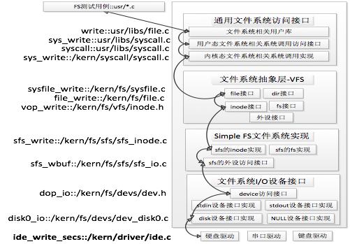
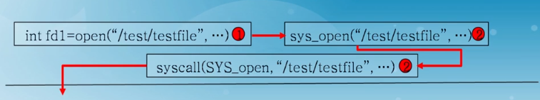
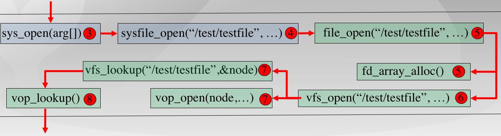
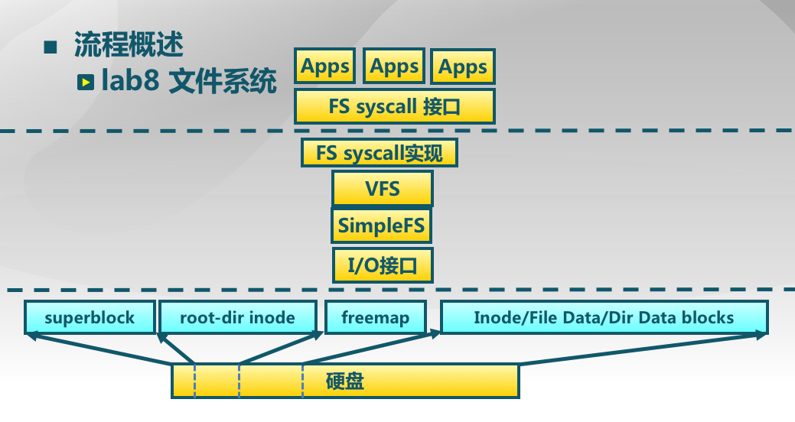
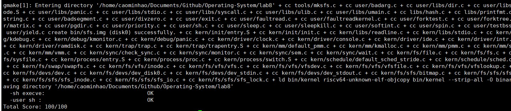
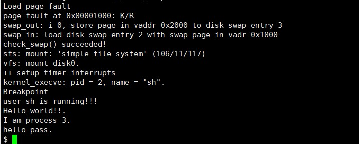
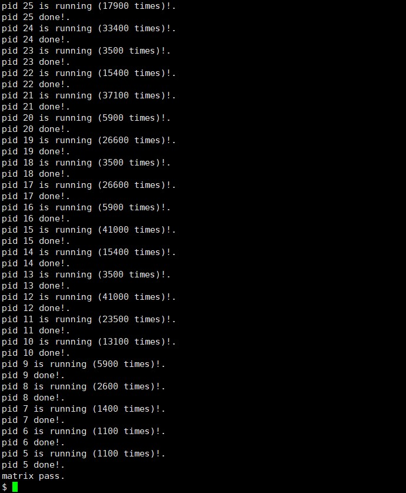

<h2 style="text-align:center">操作系统实验报告  Lab8
<h4 style="float:right">  姓名：曹珉浩&emsp;&emsp;李威远&emsp;&emsp;乔诣昊   
  学号：2113619    2112338   2111256

[toc]

### Before：ucore的文件系统

#### （一）Ucore文件系统概述

**ucore文件系统架构基于UNIX，在UNIX中有几个文件系统抽象概念：**

- **文件(file)**：它主要**从进程的角度描述了一个进程在访问文件时需要了解的文件标识，文件读写的位置，文件引用情况等信息**。它的作用范围是某一具体进程。
- **目录项(dentry)：**维护从”目录里的某一项“到”对应的文件“的链接/指针。一个目录也是一个文件，包含若干个子目录和其他文件。从某个子目录、文件的名称，对应到具体的文件/子目录的地址(或者索引节点inode)的链接，通过目录项(dentry)来描述。目录项**是主要从文件系统的文件路径的角度描述了文件路径中的特定目录**，作用范围是整个OS。
- **索引节点(inode)**：存储关于某个文件的元数据信息（如访问控制权限、大小、拥有者、创建时间、数据内容等等），通常对应磁盘上的**文件控制块（file control block)**. 每个索引节点有一个编号，**唯一确定文件系统里的一个文件**。它**主要从文件系统的单个文件的角度它描述了文件的各种属性和数据所在位置**。它的作用范围是整个OS。
- **超级块(SuperBlock)**：存储整个文件系统的相关信息。它主要**从文件系统的全局角度描述特定文件系统的全局信息**，作用范围是整个OS。
- **挂载点(mount point)：**文件系统被安装在一个特定的文件路径位置，所有的已安装文件系统都作为根文件系统树中的叶子出现在系统中。挂载点是一个起点，从挂载点开始可以访问文件系统中的所有文件。

在架构上，ucore 模仿了 UNIX 的文件系统设计，ucore 的文件系统架构主要由四部分组成：

- **通用文件系统访问接口层：**该层提供了一个从用户空间到文件系统的标准访问接口。这一层访问接口让应用程序能够通过一个简单的接口获得 ucore 内核的文件系统服务。
- **文件系统抽象层：**向上提供一个一致的接口给内核其他部分（文件系统相关的系统调用实现模块和其他内核功能模块）访问。向下提供一个同样的抽象函数指针列表和数据结构屏蔽不同文件系统的实现细节。
- **Simple FS 文件系统层：**一个基于索引方式的简单文件系统实例。向上通过各种具体函数实现以对应文件系统抽象层提出的抽象函数。向下访问外设接口
- **外设接口层：**向上提供 device 访问接口屏蔽不同硬件细节。向下实现访问各种具体设备驱动的接口，比如 disk 设备接口/串口设备接口/键盘设备接口等。

#### （二）Ucore文件系统结构



​	如上图所示，我们给出了一个文件系统的访问处理过程：

- 假如应用程序操作文件（打开/创建/删除/读写），首先需要通过文件系统的**通用文件系统访问接口层**给用户空间提供的访问接口，以此来进入文件系统内部。
- 接着由**文件系统抽象层**把访问请求转发给某一具体文件系统（比如 SFS 文件系统）。
- **具体文件系统**（Simple FS 文件系统层）把应用程序的访问请求转化为对磁盘上的 block 的处理请求，并通过外设接口层交给磁盘驱动例程来完成具体的磁盘操作。

##### 1、通用文件系统访问接口层

​	在我们的Ucore实现中，我们在sysfile.c中实现了如下所示的诸多通用文件系统访问接口，这些接口在具体的系统调用中被调用，用于调用不同的VFS层接口：

```c++
int sysfile_open(const char *path, uint32_t open_flags);    // Open or create a file. FLAGS/MODE per the syscall.
int sysfile_close(int fd);                                  // Close a vnode opened  
int sysfile_read(int fd, void *base, size_t len);           // Read file
int sysfile_write(int fd, void *base, size_t len);          // Write file
int sysfile_seek(int fd, off_t pos, int whence);            // Seek file  
int sysfile_fstat(int fd, struct stat *stat);               // Stat file 
int sysfile_fsync(int fd);                                  // Sync file
int sysfile_chdir(const char *path);                        // change DIR  
int sysfile_mkdir(const char *path);                        // create DIR
int sysfile_link(const char *path1, const char *path2);     // set a path1's link as path2
int sysfile_rename(const char *path1, const char *path2);   // rename file
int sysfile_unlink(const char *path);                       // unlink a path
int sysfile_getcwd(char *buf, size_t len);                  // get current working directory
int sysfile_getdirentry(int fd, struct dirent *direntp);    // get the file entry in DIR 
int sysfile_dup(int fd1, int fd2);                          // duplicate file
int sysfile_pipe(int *fd_store);                            // build PIPE   
int sysfile_mkfifo(const char *name, uint32_t open_flags);  // build named PIPE
```

​	这些函数内部则是 `file.c` 中的各个封装好的file_XX函数，用于操作当前进程的文件数据接口，即 `current->filesp` 结构，用于对进程层面的文件信息的维护。

​	这部分的结构即为进程访问文件的数据结构files_struc，其数据结构如下:

```c++
// kern/fs/fs.h
struct files_struct {
    struct inode *pwd;             //进程当前执行目录的内存inode指针
    struct file *fd_array;         //进程打开文件的数组
    atomic_t files_count;          //访问此文件的线程个数
    semaphore_t files_sem;         //确保对进程控制块中fs_struct的互斥访问
};
```

##### 2、文件系统抽象层(VFS)

​	文件系统抽象层是把不同文件系统的**对外共性接口**提取出来，形成一个函数指针数组，这样，通用文件系统访问接口层只需访问文件系统抽象层，而不需关心具体文件系统的实现细节和接口。

```c++
struct file {
    enum {
        FD_NONE, FD_INIT, FD_OPENED, FD_CLOSED,
    } status;                         //访问文件的执行状态
    bool readable;                    //文件是否可读
    bool writable;                    //文件是否可写
    int fd;                           //文件在filemap中的索引值
    off_t pos;                        //访问文件的当前位置
    struct inode *node;               //该文件对应的内存inode指针
    int open_count;                   //打开此文件的次数
};
```

​	其中，内存inode指针负责把不同文件系统的特定索引节点信息（甚至不能算是一个索引节点）统一封装起来，避免了进程直接访问具体文件系统。其定义如下：

```c++
// kern/vfs/inode.h
struct inode {
    union {                                 //包含不同文件系统特定inode信息的union成员变量
        struct device __device_info;          //设备文件系统内存inode信息
        struct sfs_inode __sfs_inode_info;    //SFS文件系统内存inode信息
    } in_info;
    enum {
        inode_type_device_info = 0x1234,
        inode_type_sfs_inode_info,
    } in_type;                          //此inode所属文件系统类型
    atomic_t ref_count;                 //此inode的引用计数
    atomic_t open_count;                //打开此inode对应文件的个数
    struct fs *in_fs;                   //抽象的文件系统，包含访问文件系统的函数指针
    const struct inode_ops *in_ops;     //抽象的inode操作，包含访问inode的函数指针
};
```

​	事实上，VFS内部封装的大部分函数，都是通过调用inode中的成员inode_ops中封装的操作函数指针列表来实现的，具体包含如下这些，我们此次实验中**重点关注vop_opn、vop_read、vop_write几个重要操作函数**：

```c++
struct inode_ops {
    unsigned long vop_magic;
    int (*vop_open)(struct inode *node, uint32_t open_flags);
    int (*vop_close)(struct inode *node);
    int (*vop_read)(struct inode *node, struct iobuf *iob);
    int (*vop_write)(struct inode *node, struct iobuf *iob);
    int (*vop_getdirentry)(struct inode *node, struct iobuf *iob);
    int (*vop_create)(struct inode *node, const char *name, bool excl, struct inode **node_store);
int (*vop_lookup)(struct inode *node, char *path, struct inode **node_store);
……
 };
```

##### 3、Simple FS 文件系统层(SFS)

###### （1）SFS文件系统布局与概览

​	SFS层的处理是本次实验的一大难点，其中，SFS 文件系统的布局如下表所示：


​	其中，一些相关的概念我们已经在现在介绍过，我们使用第0个块（注意这里的块实际上是一页）存放超级块，用第1个块存放根目录的索引节点。

​	然后我们从第 2 个块开始，根据 SFS 中所有块的数量，用 1 个 bit 来表示一个块的占用和未被占用的情况。这个区域称为 SFS 的 freemap 区域，这将占用若干个块空间。

​	剩余的磁盘空间将会存放所有其他目录和文件的 inode 信息和内容数据信息。


​	SFS的最顶层数据结构如下，这里封装了我们底层设备的超级块`superblock`、所挂载的设备`dev`、以及底层设备中用于表示空间分配情况的`freemap`等信息。

```c++
/* filesystem for sfs */
struct sfs_fs {
    struct sfs_super super;        /* on-disk superblock */
    struct device *dev;            /* device mounted on */
    struct bitmap *freemap;        /* blocks in use are mared 0 */
    bool super_dirty;              /* true if super/freemap modified */
    void *sfs_buffer;              /* buffer for non-block aligned io */
    semaphore_t fs_sem;            /* semaphore for fs */
    semaphore_t io_sem;            /* semaphore for io */
    semaphore_t mutex_sem;         /* semaphore for link/unlink and rename */
    list_entry_t inode_list;       /* inode linked-list */
    list_entry_t *hash_list;       /* inode hash linked-list */
};
```

###### （2）SFS文件系统核心数据结构

**超级块：**

​	对于我们先前提到的超级块，这里也给出了相应的数据结构：

```c++
struct sfs_super {
    uint32_t magic;                     /* magic number, should be SFS_MAGIC */
    uint32_t blocks;                    /* # of blocks in fs */
    uint32_t unused_blocks;             /* # of unused blocks in fs */
    char info[SFS_MAX_INFO_LEN + 1];    /* infomation for sfs  */
};
```

​	可以看到，超级块结构体中存储了以下信息，来描述整个文件系统：

- 这里包含一个**成员变量魔数 magic**，其值为 0x2f8dbe2a，内核通过它来检查磁盘镜像是否是合法的 SFS img；
- **成员变量 blocks** 记录了 SFS 中所有 block 的数量，即 img 的大小；
- **成员变量 unused_block** 记录了 SFS 中还没有被使用的 block 的数量；
- **成员变量 info** 包含了字符串"simple file system"。

**索引节点：**

​	此外，对于索引结点结构，也需要我们在sfs层面给出实现：

> 在`sfs`层面上，`inode`结构既可表示文件`file`、目录`dir`，也可表示设备`device`。而区分`inode`结构的操作有两种，一种是其`in_info`成员变量，另一种是该结构的成员指针`in_ops`。

​	当uCore创建一个**用于存储文件/目录**的`inode`结构（即该`inode`结构的`in_info`成员变量为`sfs_inode`类型）时，程序会执行函数`sfs_create_inode`。该函数会将`inode`结构中的`sfs_inode`成员与磁盘对应结点`sfs_disk_inode`相关联，从而使得只凭`inode`即可操作该结点。

​	**那么，相应的这两个结构是如何实现的呢？我们从底层开始看。**在 SFS 文件系统中，需要我们记录文件内容的存储位置以及文件名与文件内容的对应关系。

​	sfs_disk_inode 结构体正是因此而生，它记录了文件或目录的内容存储的索引信息，代表了一个实际位于磁盘上的文件，我们首先来看看sfs_disk_inode的内容：

```c++
// kern/fs/sfs/sfs.hc
/*inode (on disk)*/
struct sfs_disk_inode {
    uint32_t size;                  //如果inode表示常规文件，则size是文件大小
    uint16_t type;                  //inode的文件类型
    uint16_t nlinks;                            //此inode的硬链接数
    uint32_t blocks;                //此inode的数据块数的个数
    uint32_t direct[SFS_NDIRECT];   //此inode的直接数据块索引值（有SFS_NDIRECT个）
    uint32_t indirect;              //此inode的一级间接数据块索引值
};
```

​	`sfs_disk_inode`结构记录了文件或目录的内容存储的索引信息，该数据结构在硬盘里储存，需要时读入内存，其中有：

- `type`成员表明该结构是目录类型还是文件类型，又或者是链接`link`类型。
- 如果`inode`表示的是文件，则成员变量`direct[]`直接指向了保存文件内容数据的数据块索引值。`indirect`指向的是间接数据块，此数据块实际存放的全部是数据块索引，这些数据块索引指向的数据块才被用来存放文件内容数据。

​	需要注意的是：对于普通文件，索引值指向的 block 中保存的是文件中的数据。而对于目录，索引值指向的数据保存的是目录下所有的文件名以及对应的索引节点所在的索引块（磁盘块）所形成的数组。数据结构如下：

```c++
// kern/fs/sfs/sfs.h
/* file entry (on disk) */
struct sfs_disk_entry {
    uint32_t ino;                                   //索引节点所占数据块索引值
    char name[SFS_MAX_FNAME_LEN + 1];               //文件名
};
```

​	而SFS中的内存节点`sfs_inode`结构体，除了包含SFS的硬盘`sfs_disk_inode`信息，而且还增加了其他一些信息。这些信息用于判断相关硬盘位置是否改写、互斥操作、回收和快速地定位等作用：

```c++
/* inode for sfs */
struct sfs_inode {
    struct sfs_disk_inode *din;         /* on-disk inode */
    uint32_t ino;                                   /* inode number */
    bool dirty;                         /* true if inode modified */
    int reclaim_count;                  /* kill inode if it hits zero */
    semaphore_t sem;                    /* semaphore for din */
    list_entry_t inode_link;            /* entry for linked-list in sfs_fs */
    list_entry_t hash_link;             /* entry for hash linked-list in sfs_fs */
};
```

##### 4、外设接口层（I/O设备）

我们实验中，基于**“设备即文件”**的思想，给出了如下一个比较抽象的设备的结构体描述。

```c
struct device {
    size_t d_blocks;
    size_t d_blocksize;
    int (*d_open)(struct device *dev, uint32_t open_flags);
    int (*d_close)(struct device *dev);
    int (*d_io)(struct device *dev, struct iobuf *iob, bool write);
    int (*d_ioctl)(struct device *dev, int op, void *data);
};
```

这个数据结构能够支持对块设备（比如磁盘）、字符设备（比如键盘）的表示，完成对设备的基本操作。

但这个设备描述没有与文件系统以及表示一个文件的 inode 数据结构建立关系，为此，还需要另外一个数据结构把 device 和 inode 联通起来，这就是 vfs_dev_t 数据结构，这个结构我们放到稍后的流程具体实现中介绍，这里不再赘述了。

#### （三）Ucore文件系统执行流程具体实现（以打开文件为例）

**我们以 `uamin.c` 中用户打开文件的过程为例，自顶向下看看会发生什么：**

```c
int fd1 = open(path, open_flags)
```

当用户像上面那样打开了一个文件的时候，**会首先进入通用文件访问接口层的处理流程：**

接着，和上次实验类似，`file.c` 标准库内会封装一个 `sys_open`：

```c
int open(const char *path, uint32_t open_flags) {
    return sys_open(path, open_flags);
}
```

`sys_open` 是 `syscall` 的一层封装(`syscall.c`)：

```c
int sys_open(const char *path, uint64_t open_flags) {
    return syscall(SYS_open, path, open_flags);
}
```

之后 `syscall` 通过 `ecall` 提升权限：

```c
static inline int syscall(uint64_t num, ...) {
	......
    asm volatile (
		......
        "ecall\n"
		......
      );
    return ret;
}
```

然后经过 `interrupt_handler` 处理进行 `syscall` 转发，根据系统调用号最终会找到 `sysopen`：

```c
static int sys_open(uint64_t arg[]) {
    const char *path = (const char *)arg[0];
    uint32_t open_flags = (uint32_t)arg[1];
    return sysfile_open(path, open_flags);
}
```

`sysopen` 会调用 `fs/sysfile.c` 中的 `sysfile_open`：

```c
int sysfile_open(const char *__path, uint32_t open_flags) {
    int ret;
    char *path;
    if ((ret = copy_path(&path, __path)) != 0) {
        return ret;
    }
    ret = file_open(path, open_flags);
    kfree(path);
    return ret;
}
```

到了这里，需要把位于用户空间的字符串 `__path` 拷贝到内核空间中的字符串 `path` 中，然后调用 `file_open`：

```c
// fs/file.c
int file_open(char *path, uint32_t open_flags) {
	......
    if ((ret = vfs_open(path, open_flags, &node)) != 0) {
        fd_array_free(file);
        return ret;
    }
    file->pos = 0;
    if (open_flags & O_APPEND) {
        struct stat __stat, *stat = &__stat;
        if ((ret = vop_fstat(node, stat)) != 0) {
            vfs_close(node);
            fd_array_free(file);
            return ret;
        }
        file->pos = stat->st_size;
    }
 	......
}
```

`file_open` 给这个即将打开的文件分配一个file数据结构的变量，这个变量其实是当前进程的打开文件数组 `current->fs_struct->filemap[]` 中的一个空闲元素（即还没用于一个打开的文件），而这个元素的索引值就是最终要返回到用户进程并赋值给变量fd。到了这一步还仅仅是给当前用户进程分配了一个file数据结构的变量，还没有找到对应的文件索引节点。**并且可以看到，在这里已经从接口层转移到了文件系统抽象层VFS，接下来看抽象层的工作**

> 接口层总结：用户打开文件，执行：open->sys_open->syscall，从而引起系统调用进入到内核态。到了内核态后，通过中断处理例程，会调用到 sys_open 内核函数，并进一步调用 sysfile_open 内核函数。到了这里，需要把位于用户空间的字符串 `__path`拷贝到内核空间中的字符串 path 中，并进入到文件系统抽象层的处理流程完成进一步的打开文件操作中。
>
> 

```c
// fs/vfs/vfsfile.c
int vfs_open(char *path, uint32_t open_flags, struct inode **node_store) {
 	......    
    ret = vfs_lookup(path, &node);
    
    if ((ret = vop_open(node, open_flags)) != 0) {
        vop_ref_dec(node);
        return ret;
    }
    vop_open_inc(node);
    if (open_flags & O_TRUNC || create) {
        if ((ret = vop_truncate(node, 0)) != 0) {
            vop_open_dec(node);
            vop_ref_dec(node);
            return ret;
        }
    }
    *node_store = node;
    return 0;
}
```

`vfs_open` 函数需要完成两件事情：

- 通过 `vfs_lookup` 找到path对应文件的索引节点
- 调用 `vop_open` 函数打开文件

先来看 `vfs_lookup`：

```c
int vfs_lookup(char *path, struct inode **node_store) {
    int ret;
    struct inode *node;
    if ((ret = get_device(path, &path, &node)) != 0) {
        return ret;
    }
    if (*path != '\0') {
        ret = vop_lookup(node, path, node_store);
        vop_ref_dec(node);
        return ret;
    }
    *node_store = node;
    return 0;
}
```

`vfs_lookup` 函数是一个针对目录的操作函数，它会调用 `vop_lookup` 函数来找到**SFS文件系统**中的目录下的文件。为此，`vfs_lookup` 函数首先调用 `get_device` 函数，并进一步调用 `vfs_get_bootfs` 函数来找到根目录“/”对应的inode。这个inode就是位于vfs.c中的inode变量bootfs_node。这个变量在init_main函数（位于kern/process/proc.c）执行时获得了赋值。通过调用 `vop_lookup` 函数来查找到根目录“/”下对应文件sfs_filetest1的索引节点，如果找到就返回此索引节点。

> 至此抽象层的工作结束，通过层层转发到SFS进行下一步处理：
>
> 

上述以 `vop` 开头的函数，它们都通过一些宏和函数的转发，最后变成对inode结构体里的inode_ops结构体的“成员函数”（实际上是函数指针）的调用。对于SFS文件系统的inode来说，会变成对**SFS文件系统**的具体操作：

```c
.vop_lookup                     = sfs_lookup
```

```c
static int sfs_lookup(struct inode *node, char *path, struct inode **node_store) {
    struct sfs_fs *sfs = fsop_info(vop_fs(node), sfs);
    assert(*path != '\0' && *path != '/');
    vop_ref_inc(node);
    struct sfs_inode *sin = vop_info(node, sfs_inode);
    if (sin->din->type != SFS_TYPE_DIR) {
        vop_ref_dec(node);
        return -E_NOTDIR;
    }
    struct inode *subnode;
    int ret = sfs_lookup_once(sfs, sin, path, &subnode, NULL);

    vop_ref_dec(node);
    if (ret != 0) {
        return ret;
    }
    *node_store = subnode;
    return 0;
}
```

`sfs_lookup` 有三个参数：`node`，`path`，`node_store`。其中 `node` 是**根目录“/”所对应的索引节点**；`path` 是文件 `sfs_filetest1` 的绝对路径 `/sfs_filetest1`，而`node_store` 是经过查找获得的 `sfs_filetest1` 所对应的索引节点。

我们再进一步观察 `sfs_lookup_once` 函数，它调用 `sfs_dirent_search_nolock` 函数来查找与路径名匹配的目录项，如果找到目录项，则根据目录项中记录的 inode 所处的数据块索引值找到路径名对应的 SFS 磁盘 inode，并**读入 SFS 磁盘 inode 对的内容，创建 SFS 内存 inode。**

```c
static int sfs_lookup_once(struct sfs_fs *sfs, struct sfs_inode *sin, 
                           const char *name, struct inode **node_store, int *slot) {
    int ret;
    uint32_t ino;
    lock_sin(sin);
    {   // find the NO. of disk block and logical index of file entry
        ret = sfs_dirent_search_nolock(sfs, sin, name, &ino, slot, NULL);
    }
    unlock_sin(sin);
    if (ret == 0) {
		// load the content of inode with the the NO. of disk block
        ret = sfs_load_inode(sfs, node_store, ino);
    }
    return ret;
}
```

那么读写硬盘操作是如何做的呢？



- 首先是应用程序发出请求，请求硬盘中写数据或读数据，应用程序通过 FS syscall 接口执行系统调用，获得 ucore 操作系统关于文件的一些服务
- 之后，一旦操作系统内系统调用得到了请求，就会到达 VFS 层面，包含很多部分比如文件接口、目录接口等，是一个抽象层面，它屏蔽底层具体的文件系统
- VFS 如果得到了处理，那么 VFS 会将这个 iNode 传递给 SimpleFS，此时VFS 中的 iNode 还是一个抽象的结构，在 SFS 中会转化为一个具体的 iNode
- **SFS通过该 iNode 经过 IO 接口对于磁盘进行读写，到达最底层**

在本实验中，为了统一地访问设备(device)，我们可以**把设备看成一个文件**，通过访问文件的接口来访问设备。目前实现了 stdin 设备文件文件、stdout 设备文件、disk0 设备。stdin 设备（I接口）就是键盘，stdout （O接口）设备就是控制台终端的文本显示，而 disk0 设备是承载 SFS 文件系统的磁盘设备。

在 `fs/devs/dev.h` 中，实现了设备的基础操作：

```c
#define dop_open(dev, open_flags)           ((dev)->d_open(dev, open_flags))
#define dop_close(dev)                      ((dev)->d_close(dev))
#define dop_io(dev, iob, write)             ((dev)->d_io(dev, iob, write))
#define dop_ioctl(dev, op, data)            ((dev)->d_ioctl(dev, op, data))
```

在 `fs/vfs/vfsdev.c` 中，利用 `vfs_dev_t` 数据结构，让文件系统可以通过一个链接 `vfs_dev_t `结构的双向链表找到 `device` 对应的 `inode` 数据结构：

```c
typedef struct {
    const char *devname;
    struct inode *devnode;
    struct fs *fs;
    bool mountable;
    list_entry_t vdev_link;
} vfs_dev_t;
#define le2vdev(le, member)                         \
    to_struct((le), vfs_dev_t, member)
```

了解这些之后，我们的读写就很好实现了，我们会在 Ex1 中实现读文件的操作。

### Exercise 1：完成读文件操作的实现

先前，我们已经介绍和了解了整个打开文件的流程，现在我们来具体的看一看读写文件的流程，并完成其中的sfs_io_nolock()函数，实现读文件中数据的代码。

#### 1、读写文件流程：

##### 1.1 用户态调用读文件接口

​	我们从用户态的调用出发，用户态通过如下的封装来实现对读文件的系统调用，也就是从read->sys_read->syscall的过程，从而进入内核态，进行文件的读取，这一点和我们上次实验中实际上是类似的：

```c
int
read(int fd, void *base, size_t len) {
    return sys_read(fd, base, len);
}
```

​	其中参数含义为：读取fd对应文件，读取长度为len，存入data中。

##### 1.2 通用文件访问接口层的处理

​	我们通过内核态的系统调用转到对应的文件访问接口层进行处理：

```c
static int
sys_read(uint64_t arg[]) {
    int fd = (int)arg[0];
    void *base = (void *)arg[1];
    size_t len = (size_t)arg[2];
    return sysfile_read(fd, base, len);
}
```

​	在sysfile_read函数中，我们给出了对file_read的封装，这部分我认为实际上仍然是**文件访问接口层的工作**，并未进入到vfs层面进行处理，认为指导手册存在一些问题，我们剖析sysfile_read这个函数，看看它具体干了什么事情：

```c
/* sysfile_read - read file */
int
sysfile_read(int fd, void *base, size_t len) {
    struct mm_struct *mm = current->mm; // 获取当前进程的内存管理结构体
    // 如果要读取的长度为0，则直接返回0
    if (len == 0) {
        return 0;
    }
    // 检查文件描述符是否有效，若无效则返回错误码 -E_INVAL
    if (!file_testfd(fd, 1, 0)) {
        return -E_INVAL;
    }
    
    void *buffer;
    // 申请一个缓冲区（IOBUF_SIZE大小），如果申请失败则返回错误码 -E_NO_MEM
    if ((buffer = kmalloc(IOBUF_SIZE)) == NULL) {
        return -E_NO_MEM;
    }
    int ret = 0;
    size_t copied = 0, alen;
    // 当还有数据要读取时执行循环
    while (len != 0) {
        // 确定本次读取的长度 alen，不超过缓冲区大小 IOBUF_SIZE
        if ((alen = IOBUF_SIZE) > len) {
            alen = len;
        }
        // 调用 file_read 函数读取文件内容到缓冲区 buffer 中
        ret = file_read(fd, buffer, alen, &alen);
        // 如果成功读取到数据
        if (alen != 0) {
            lock_mm(mm); // 锁定当前进程的内存管理结构
            {
                // 将缓冲区中的数据复制到用户空间的 base 地址处
                // 如果复制成功，更新 base、len、copied 的值
                if (copy_to_user(mm, base, buffer, alen)) {
                    assert(len >= alen);
                    base += alen, len -= alen, copied += alen;
                }
                // 如果复制失败但返回值为0（未发生其他错误），设置返回错误码 -E_INVAL
                else if (ret == 0) {
                    ret = -E_INVAL;
                }
            }
            unlock_mm(mm); // 解锁当前进程的内存管理结构
        }
        // 如果读取出错或者已经读取完所有数据，则跳出循环
        if (ret != 0 || alen == 0) {
            goto out;
        }
    }

out:
    kfree(buffer); // 释放申请的缓冲区内存
    // 如果成功读取了部分数据，则返回已复制数据的长度
    if (copied != 0) {
        return copied;
    }
    // 否则返回读取过程中遇到的错误码
    return ret;
}
```

​	这个函数实际未涉及文件读取底层的实现，总的来说，它完成以下工作：

1. **验证输入有效性**：
   - 检查要读取的数据长度是否为0。
   - 检查文件描述符的有效性。
2. **分配内存**：
   - 为数据读取操作分配一个缓冲区。
3. **循环读取文件内容**（核心）：
   - 使用**循环读取文件数据并尝试将其复制到用户空间**。
   - 如果读取到数据，将数据从内核缓冲区复制到用户提供的内存空间。
   - 如果复制成功，更新读取的位置和长度。
   - 如果复制失败但没有其他错误发生，设置错误码。
   - 如果读取出错或者已经读取完所有数据，则退出循环。
4. **释放内存**：
   - 释放先前分配的缓冲区内存。
5. **返回结果**：
   - 如果成功读取了部分数据，则返回已复制数据的长度。
   - 否则返回读取过程中遇到的错误码。

​	更近一步的，在其中最为核心的循环读取文件内容部分，我们通过调用**file_read这个函数**来实现，这个函数我认为应该归属于**文件系统抽象层的处理流程**中，我们来看看这个函数做了哪些工作：

##### 1.3 **文件系统抽象层的处理流程**

```c
// read file
int
file_read(int fd, void *base, size_t len, size_t *copied_store) {
    int ret; // 用于存储函数调用的返回值
    struct file *file; // 文件结构体指针
    *copied_store = 0; // 初始化已复制数据长度为0
    // 通过文件描述符获取文件结构体指针，若失败则返回相应错误码
    if ((ret = fd2file(fd, &file)) != 0) {
        return ret;
    }
    // 检查文件是否可读，若不可读则返回错误码 -E_INVAL
    if (!file->readable) {
        return -E_INVAL;
    }
    fd_array_acquire(file); // 获取文件的引用计数
    // 初始化缓冲区用于文件读取，设置缓冲区的起始位置为文件的当前位置
    struct iobuf __iob, *iob = iobuf_init(&__iob, base, len, file->pos);
    // 调用底层文件操作的读取函数，将数据读取到缓冲区中
    ret = vop_read(file->node, iob);
    // 获取实际已复制的数据长度
    size_t copied = iobuf_used(iob);
    // 若文件状态为打开状态，则更新文件的当前位置
    if (file->status == FD_OPENED) {
        file->pos += copied;
    }
    *copied_store = copied; // 更新已复制数据长度
    fd_array_release(file); // 释放文件的引用计数
    return ret; // 返回读取操作的结果
}

```

可以看出，file_read函数完成了如下工作：

1. 首先检查文件描述符是否有效，文件是否可读。
2. 初始化文件IO缓冲区并调用vop_read（）进行底层文件系统的读取操作，将数据读取到缓冲区中。
3. 更新文件的当前位置，并记录实际读取的数据长度。

​	这里，我们就通过调用vop_read（）函数，到达了最关键的SFS层面，**实现真正的对硬盘操作，以此来进行文件的读入内存。**

##### 1.4 SFS文件系统层的处理流程

​	在我们的vop_read函数中，实际上通过先前的inode中函数指针的处理，使其从抽象方法具体到了我们的SFS文件系统中的sfs_read函数，该函数也事实上只是对sfs_io函数进行调用：

```c
static int
sfs_read(struct inode *node, struct iobuf *iob) {
    return sfs_io(node, iob, 0);
}
```

​	sfs_io函数需要三个参数，分别含义如下：node是对应文件的inode，iob是缓存，write表示是读还是写的布尔值（0表示读，1表示写），这里是0。

​	我们来看看sfs_io函数的具体实现：

```c
static inline int
sfs_io(struct inode *node, struct iobuf *iob, bool write) {
    // 获取SFS文件系统信息和SFS inode信息
    struct sfs_fs *sfs = fsop_info(vop_fs(node), sfs);
    struct sfs_inode *sin = vop_info(node, sfs_inode);
    int ret;
    lock_sin(sin); // 锁定SFS inode
    {
        size_t alen = iob->io_resid; // 获取待处理的IO长度
        // 调用SFS文件系统的无锁IO操作函数
        ret = sfs_io_nolock(sfs, sin, iob->io_base, iob->io_offset, &alen, write);
        // 如果实际处理的IO长度不为0，更新iob以跳过已处理的部分
        if (alen != 0) {
            iobuf_skip(iob, alen);
        }
    }
    unlock_sin(sin); // 解锁SFS inode
    return ret; // 返回IO操作的结果
}

```

可以看到，这个函数完成了以下工作：

- 获取了SFS文件系统的信息以及SFS inode 的信息。
- 锁定了SFS inode，确保在IO操作期间不会被其他操作干扰。
- 调用SFS文件系统的sfs_io_nolock函数来执行实际的读取或写入操作。
- 在操作完成后，解锁了SFS inode 并返回IO操作的结果。

​	也就是说，即使我们走到了这里，还实际上没有进行硬盘的操作，实际的处理应当在sfs_io_nolock函数中完成了，这也正是我们需要补充实现的函数功能。

#### 2、sfs_io_nolock函数具体实现：

##### 2.1前期工作

​	我们先来看看sfs_io_nolock函数前半部分做了哪些工作：

```c++
static int
sfs_io_nolock(struct sfs_fs *sfs, struct sfs_inode *sin, void *buf, off_t offset, size_t *alenp, bool write) {
    // 确保文件不是目录类型的inode
    assert(din->type != SFS_TYPE_DIR);

    // 计算本次操作的结束位置
    off_t endpos = offset + *alenp, blkoff;
    *alenp = 0;

    // 检查偏移量是否合法，且不超过文件最大大小
    if (offset < 0 || offset >= SFS_MAX_FILE_SIZE || offset > endpos) {
        return -E_INVAL;
    }

    // 如果起始位置等于结束位置，表示无需进行IO操作
    if (offset == endpos) {
        return 0;
    }

    // 确保结束位置不超过文件最大大小
    if (endpos > SFS_MAX_FILE_SIZE) {
        endpos = SFS_MAX_FILE_SIZE;
    }

    // 对于读操作，如果偏移量超出文件大小，则无需读取
    if (!write) {
        if (offset >= din->size) {
            return 0;
        }
        if (endpos > din->size) {
            endpos = din->size;
        }
    }

    // 根据读写操作选择相应的底层IO操作函数
    int (*sfs_buf_op)(struct sfs_fs *sfs, void *buf, size_t len, uint32_t blkno, off_t offset);
    int (*sfs_block_op)(struct sfs_fs *sfs, void *buf, uint32_t blkno, uint32_t nblks);
    if (write) {
        sfs_buf_op = sfs_wbuf, sfs_block_op = sfs_wblock;
    } else {
        sfs_buf_op = sfs_rbuf, sfs_block_op = sfs_rblock;
    }

    int ret = 0;
    size_t size, alen = 0;
    uint32_t ino;
    uint32_t blkno = offset / SFS_BLKSIZE;          // 起始块号
    uint32_t nblks = endpos / SFS_BLKSIZE - blkno;  // 读写块数
```

可以看到，这部分函数实现主要是完成了如下两个工作：

1. **检查并准备IO参数**：
   - 确保传入的偏移量和长度在有效范围内。
   - 确定文件读写的起始位置和结束位置，并确保不超出文件最大大小。
2. **选择读写方式**：
   - 根据参数 `write` 来选择是读取操作还是写入操作，并设置相应的底层IO操作函数。

​	这时候，实际上产生了三种读入类型，若offset 未与第一个块对齐，则我们需要Rd/Wr 从 offset 到第一个块末尾的一些内容；若如果结束位置与最后一个块不对齐，则我们需要Rd/Wr 从开始到最后一个块的 (endpos % SFS_BLKSIZE) 的一些内容；其余部分按块读取即可。

##### 2.2  读写接口辅助函数

​	我们先前的读写方式选择中，实际上已经给出了对buf和对block的两种操作，即用sfs_buf_op和sfs_block_op两个函数指针进行选取，我们以读取为例，依次来看看这两种操作的实现机理：

```c
int
sfs_rbuf(struct sfs_fs *sfs, void *buf, size_t len, uint32_t blkno, off_t offset) {
    // 确保读取参数的合法性
    assert(offset >= 0 && offset < SFS_BLKSIZE && offset + len <= SFS_BLKSIZE);

    int ret;
    lock_sfs_io(sfs); // 锁定文件系统IO操作
    {
        // 调用 sfs_rwblock_nolock 函数执行块级别的读写操作
        if ((ret = sfs_rwblock_nolock(sfs, sfs->sfs_buffer, blkno, 0, 1)) == 0) {
            // 将缓冲区中的数据复制到用户提供的缓冲区中
            memcpy(buf, sfs->sfs_buffer + offset, len);
        }
    }

    unlock_sfs_io(sfs); // 解锁文件系统IO操作
    return ret; // 返回读取操作的结果
}

```

​	而读块操作中也是调用了sys_rwblock函数，其实现如下，和sfs_rbuf十分类似，都是通过对sfs_rwblock_nolock的调用实现的，

```c
static int
sfs_rwblock(struct sfs_fs *sfs, void *buf, uint32_t blkno, uint32_t nblks, bool write) {
    int ret = 0;
    lock_sfs_io(sfs); // 锁定文件系统IO操作
    {
        while (nblks != 0) {
            // 调用 sfs_rwblock_nolock 函数执行块级别的读写操作
            if ((ret = sfs_rwblock_nolock(sfs, buf, blkno, write, 1)) != 0) {
                break;
            }
            blkno++, nblks--;
            buf += SFS_BLKSIZE; // 更新缓冲区指针到下一个块
        }
    }
    unlock_sfs_io(sfs); // 解锁文件系统IO操作
    return ret; // 返回读写操作的结果
}
```

​	在sys_rbuf中，我们**完成对块中数据的读取，而非块级别的读取**，其中参数的含义为：

- `sfs`: 指向 SFS 文件系统结构体的指针，表示文件系统的实例。
- `buf`: 指向要填充数据的缓冲区。
- `len`: 要读取的数据长度。
- `blkno`: 块的编号，表示要读取的块号。
- `offset`: 在块内的偏移量，表示从块的哪个位置开始读取数据。

​	在sys_rwblock函数中，我们则**完成对块级别整个数据的读取**，其中参数的含义如下：

- `sfs`: SFS 文件系统结构体指针。
- `buf`: 指向要读写数据的缓冲区的指针。
- `blkno`: 要读写的起始块号。
- `nblks`: 要读写的块数。
- `write`: 一个布尔值，表示是否进行写操作（如果为 `true`，则执行写操作；如果为 `false`，则执行读操作）。

​	通过以上两个接口的调用，我们能够实现对块级别和更小粒度的读取和写操作，不过，更具体的内部实现，还需要我们来看看更底层函数的实现：

​	我们一层层追溯下去，到这里为止，我们**通过调用iobuf_init函数，设置了读写的起始位置**，然后通过调用底层的IO操作函数，来进行块的读写，事实上，**这里我们就从SFS层级，转到了设备层级来执行。**

```c++
static int
sfs_rwblock_nolock(struct sfs_fs *sfs, void *buf, uint32_t blkno, bool write, bool check) {
    // 确保块号的合法性
    assert((blkno != 0 || !check) && blkno < sfs->super.blocks);
    // 初始化文件IO缓冲区，设置读写的起始位置
    struct iobuf __iob, *iob = iobuf_init(&__iob, buf, SFS_BLKSIZE, blkno * SFS_BLKSIZE);
    // 调用底层的IO操作函数进行块级别的读写操作
    return dop_io(sfs->dev, iob, write);
}
```

​	dop_io函数封装了device类型中的函数指针d_io，对于我们的读写磁盘操作，实际上是对disk0对象进行了d_io的调用，也就是其函数指针所指向的具体函数，即如下初始化中指向的disk0_io，这部分才是真正完成磁盘级别操作的代码：

```c
    dev->d_open = disk0_open;
    dev->d_close = disk0_close;
    dev->d_io = disk0_io;
    dev->d_ioctl = disk0_ioctl;
```

​	尽管如此，disk0_io函数内部仍然进行了大量的底层函数接口调用，但是我们可以理解其函数功能：

```c
static int
disk0_io(struct device *dev, struct iobuf *iob, bool write) {
    off_t offset = iob->io_offset; // IO操作的起始位置
    size_t resid = iob->io_resid; // IO操作剩余的长度
    uint32_t blkno = offset / DISK0_BLKSIZE; // IO操作起始块号
    uint32_t nblks = resid / DISK0_BLKSIZE; // IO操作涉及的块数

    // 不允许非块对齐的IO操作
    if ((offset % DISK0_BLKSIZE) != 0 || (resid % DISK0_BLKSIZE) != 0) {
        return -E_INVAL;
    }

    // 不允许超出disk0末尾的IO操作
    if (blkno + nblks > dev->d_blocks) {
        return -E_INVAL;
    }

    // 如果没有要读写的数据块，直接返回
    if (nblks == 0) {
        return 0;
    }

    lock_disk0(); // 锁定disk0设备
    while (resid != 0) {
        size_t copied, alen = DISK0_BUFSIZE;

        // 如果是写操作
        if (write) {
            // 移动数据到disk0_buffer
            iobuf_move(iob, disk0_buffer, alen, 0, &copied);
            assert(copied != 0 && copied <= resid && copied % DISK0_BLKSIZE == 0);
            nblks = copied / DISK0_BLKSIZE;

            // 写入块到disk0
            disk0_write_blks_nolock(blkno, nblks);
        }
        else { // 如果是读操作
            if (alen > resid) {
                alen = resid;
            }
            nblks = alen / DISK0_BLKSIZE;

            // 从disk0读取块数据
            disk0_read_blks_nolock(blkno, nblks);

            // 移动数据到缓冲区
            iobuf_move(iob, disk0_buffer, alen, 1, &copied);
            assert(copied == alen && copied % DISK0_BLKSIZE == 0);
        }
        resid -= copied, blkno += nblks;
    }
    unlock_disk0(); // 解锁disk0设备
    return 0; // 返回操作成功
}

```

其中，参数含义如下：

- `dev`: 表示设备的结构体指针。
- `iob`: 是一个 `struct iobuf` 结构体指针，用于表示文件IO操作的相关信息，如起始位置、长度等。
- `write`: 是一个布尔值，表示是否进行写操作（如果为 `true`，则执行写操作；如果为 `false`，则执行读操作）。

​	这里，我们完成了对 `disk0` 设备执行IO操作。根据给定的 `iob` 信息，它会将数据从 `iob` 中移动到 `disk0_buffer` 或者将 `disk0_buffer` 中的数据移动到 `iob` 中。具体的读写过程还在在底层的`disk0_read_blks_nolock` 和 `disk0_write_blks_nolock` 两个函数和移动数据的` iobuf_move` 函数中完成。

​	**所以说，真的封装了好多层啊。**

​	我们还是继续看看吧，以读取的disk0_read_blks_nolock函数为例，可以看到，实际上我们调用了ide的接口，完成了这一工作：

```c
static void
disk0_read_blks_nolock(uint32_t blkno, uint32_t nblks) {
    int ret;
    uint32_t sectno = blkno * DISK0_BLK_NSECT; // 起始扇区号
    uint32_t nsecs = nblks * DISK0_BLK_NSECT; // 总扇区数

    // 使用 IDE 接口从磁盘读取数据块到内存中的 disk0_buffer
    if ((ret = ide_read_secs(DISK0_DEV_NO, sectno, disk0_buffer, nsecs)) != 0) {
        // 如果读取失败，触发内核恐慌，并输出错误信息
        panic("disk0: read blkno = %d (sectno = %d), nblks = %d (nsecs = %d): 0x%08x.\n",
                blkno, sectno, nblks, nsecs, ret);
    }
}

```

​	我们跳过ide内部冗余繁杂的封装和函数指针处理，直接到最底层的处理接口，即ramdisk_read函数，可以看到，我们最底层的实现，实际上只是一个简单的memcpy实现，令人唏嘘。

​	不过，**封装过程中的互斥处理和相关检查**，仍然是十分有必要的。而我们刚刚提到的iobuf_move函数，实际上内部也是内存的移动，从而实现在不同的缓冲区之间移动数据。

```c
static int ramdisk_read(struct ide_device *dev, size_t secno, void *dst, size_t nsecs) {
    // 计算实际读取的扇区数，不能超过设备大小限制
    nsecs = MIN(nsecs, dev->size - secno);
    // 如果读取的扇区数小于0，表示读取越界，返回错误码
    if (nsecs < 0) return -1;
    // 从RAM磁盘的相应位置复制数据到目标内存区域
    memcpy(dst, (void *)(dev->iobase + secno * SECTSIZE), nsecs * SECTSIZE);
    // 返回读取操作的结果，0表示成功，非零表示失败
    return 0;
}

```

​	基于以上一层又一层的剖析，我们**从最顶层的用户调用，一直找到了最根本的设备层面的文件读取实现，梳理了整个文件读取的流程**，了解了相关的函数机制和结构，帮助我们进行练习1代码的实现。

##### 2.3  相关处理具体代码实现

<h6>（1）首部非对齐情况

​	我们首先进行首部非对齐情况的处理：

```c
blkoff = offset % SFS_BLKSIZE;
if (blkoff != 0) {
    // 计算剩余未处理的长度
    size = (nblks != 0) ? (SFS_BLKSIZE - blkoff) : (endpos - offset);
    // 从文件系统中加载块号对应的磁盘块
    ret = sfs_bmap_load_nolock(sfs, sin, blkno++, &ino);
    if (ret != 0) 
        goto out;       
    // 执行对应的块操作，读取或写入数据到缓冲区
    ret = sfs_buf_op(sfs, buf, size, ino, blkoff);
    if (ret != 0) 
        goto out;       
    // 更新已处理长度及缓冲区指针位置
    alen += size;
    buf += size;
    // 如果没有剩余块，直接跳出循环
    if (nblks == 0)
        goto out;
    nblks--;
}

```

- 如果数据在块内是不对齐的，我们先处理这部分不对齐的数据。
- 计算未处理的长度，如果有未处理的块，取当前块内未使用空间或是数据结束位置减去当前偏移量的长度。
- 调用sfs_bmap_load_nolock，从文件系统加载相应块号的磁盘块。
- 执行相应的块操作（读或写）以处理数据到缓冲区，并更新已处理长度和缓冲区指针位置。
- 如果没有剩余块，直接跳出循环。

<h6>（2）中间对齐块处理

```c
if (nblks > 0) {
    // 加载块号对应的磁盘块
    ret = sfs_bmap_load_nolock(sfs, sin, blkno, &ino);
    if (ret < 0) 
        goto out;     
    // 执行块操作，处理对齐的块数据
    ret = sfs_block_op(sfs, buf, blkno, nblks);
    if (ret < 0) 
        goto out;
    // 更新已处理长度及缓冲区指针位置
    alen += nblks * SFS_BLKSIZE;
    buf += nblks * SFS_BLKSIZE;
    blkno += nblks;
    nblks = 0;
}
```

- 如果还有对齐的完整块，我们同样加载相应的磁盘块，并执行块级操作，处理数据到缓冲区。
- 更新已处理长度、缓冲区指针位置以及块号等相关信息。

<h6>（3）末尾非对齐情况

```c
size = endpos % SFS_BLKSIZE;
if (endpos % SFS_BLKSIZE != 0) {
    // 加载块号对应的磁盘块
    ret = sfs_bmap_load_nolock(sfs, sin, blkno, &ino);
    if (ret != 0) 
        goto out;       
    // 处理文件末尾不完整的块，从文件系统读取或写入数据到缓冲区
    ret = sfs_buf_op(sfs, buf, size, ino, 0);
    if (ret != 0) 
        goto out;      
    // 更新已处理长度
    alen += size;   
}
```

- 如果文件末尾存在不完整的块，加载相应的磁盘块，并进行块操作，处理数据到缓冲区。
- 更新已处理长度。

​	基于以上实现，我们处理了文件IO中对齐和不对齐块的读写操作。针对不同情况的数据对齐性进行了区分处理，确保数据的完整性和正确性，以此保证sfs_io_nolock函数的正常实现。

### Exercise 2：完成基于文件系统的执行程序机制的实现

1.在 `alloc_proc` 中，我们应该对新增的 `filesp` 字段进行初始化，它的值为NULL，**用于初始化fs中的进程控制结构**，但由于我们采用 `memset(...,0)` ，然后对不是0或NULL的另作赋值，因此实际上，我们本次实验并没有修改 `alloc_proc` 的代码(但确实多处理了一个字段)：

```c
static struct proc_struct * alloc_proc(void) {
    struct proc_struct *proc = kmalloc(sizeof(struct proc_struct));
    if (proc != NULL) {
        memset(proc, 0, sizeof(struct proc_struct));
        proc->state = PROC_UNINIT;
        proc->pid = -1;
        proc->cr3 = boot_cr3;
        //proc->filesp = NULL; 多处理的字段
    }
    return proc;
}
```

2.还要修改 `do_fork` 函数，主要是新增了对文件系统的处理，有两个辅助函数：

- `copy_files`：用于将 `files_struct` 从当前复制到 `proc`
- `put_files`：用于减少文件的 `ref_count`，如果 `ref_count` 降为0，则销毁 `files_struct`

```c
int do_fork(uint32_t clone_flags, uintptr_t stack, struct trapframe *tf) {
    ......
    // Lab8:调用copy_files，将files_struct复制到proc
    if (copy_files(clone_flags, proc) != 0) 
        goto bad_fork_cleanup_kstack;

fork_out:
    return ret;
bad_fork_cleanup_fs: 
    put_files(proc);
bad_fork_cleanup_kstack:
    put_kstack(proc);
bad_fork_cleanup_proc:
    kfree(proc);
    goto fork_out;
}
```

3.实现 `load_icode`：`load_icode` 是非常复杂的一个函数，它主要干了七件事：

- 建立内存管理器
- 建立页目录
- 将文件逐个段加载到内存中，这里要注意设置虚拟地址与物理地址之间的映射
- 建立相应的虚拟内存映射表
- 建立并初始化用户堆栈
- 处理用户栈中传入的参数
- 设置用户进程的中断帧

我们在代码中添加了(比较)详细的注释，实现代码如下：

```c
static int load_icode(int fd, int argc, char **kargv) {
    //(1) 建立内存管理器
    // 判断当前进程的 mm 是否已经被释放掉了
    if (current->mm != NULL) {  //要求当前内存管理器为空
        panic("load_icode: current->mm must be empty.\n");
    }

    // E_NO_MEM 代表因为存储设备产生的请求错误
    int ret = -E_NO_MEM;
    struct mm_struct *mm;
    // 为进程创建一个新的 mm
    if ((mm = mm_create()) == NULL) {
        goto bad_mm;
    }

    //(2) 建立页目录
    if (setup_pgdir(mm) != 0) { // 建立页目录，并进行页表项的设置
        goto bad_pgdir_cleanup_mm;
    }

    //(3) 将二进制的 TEXT/DATA/BSS 部分复制到进程的内存空间
    struct Page *page;
    struct elfhdr __elf, *elf = &__elf;

    //(3.1) 读取文件中的原始数据内容并解析elfhdr
    // 在前面的实验，这里读取的是内存而非 ELF Handler
    // load_icode_read，用于读取程序文件的原始数据内容
    load_icode_read(fd, (void *)elf, sizeof(struct elfhdr), 0);
    // 判断读入的 ELF Handler 是否正确
    if (elf->e_magic != ELF_MAGIC) {
        ret = -E_INVAL_ELF;
        goto bad_elf_cleanup_pgdir;
    }

    //(3.2) 读取文件中的原始数据内容并根据elfhdr中的信息解析proghdr
    struct proghdr __ph, * ph = &__ph;
    load_icode_read(fd, (void *)ph, sizeof(struct proghdr), elf->e_phoff);
    // 根据 elf-header 中的信息，找到每一个 program header
    // 然后根据每一段的大小和基地址分配不同的内存空间
    uint32_t vm_flags, perm;
    struct proghdr *ph_end = ph + elf->e_phnum;
    // e_phnum 代表程序段入口地址数目，即多少个段
    for(int index = 0; index < elf->e_phnum; index++) {     
        off_t ph_off = elf->e_phoff + sizeof(struct proghdr) * index; 
        // 读取程序的每个段的头部  
        load_icode_read(fd, (void*)ph, sizeof(struct proghdr), ph_off);
        if (ph->p_type != ELF_PT_LOAD) 
            continue;        
        if (ph->p_filesz > ph->p_memsz) {
            ret = -E_INVAL_ELF;
            goto bad_cleanup_mmap;
        }

        // 建立虚拟地址与物理地址之间的映射
        // 根据 ELF 文件中的信息，对各个段的权限进行设置
        vm_flags = 0, perm = PTE_U | PTE_V;
        if (ph->p_flags & ELF_PF_X) vm_flags |= VM_EXEC;
        if (ph->p_flags & ELF_PF_W) vm_flags |= VM_WRITE;
        if (ph->p_flags & ELF_PF_R) vm_flags |= VM_READ;
        // 修改 RISC-V 对应的 perm 位
        if (vm_flags & VM_READ) perm |= PTE_R;
        if (vm_flags & VM_WRITE) perm |= (PTE_W | PTE_R);
        if (vm_flags & VM_EXEC) perm |= PTE_X;

        // 将这些段的虚拟内存地址设置为合法的
        if ((ret = mm_map(mm, ph->p_va, ph->p_memsz, vm_flags, NULL)) != 0) {
            goto bad_cleanup_mmap;
        }
        size_t from = ph->p_offset;
        size_t off, size;
        uintptr_t start = ph->p_va, end, la = ROUNDDOWN(start, PGSIZE);

        ret = -E_NO_MEM;

        // 下面复制数据段和代码段
        end = ph->p_va + ph->p_filesz; // 计算数据段和代码段终止地址
        // 为 TEXT/DATA 段逐页分配物理内存空间
        while (start < end) {
            if ((page = pgdir_alloc_page(mm->pgdir, la, perm)) == NULL) {
                goto bad_cleanup_mmap;
            }
            off = start - la, size = PGSIZE - off, la += PGSIZE;
            if (end < la) {
                size -= la - end;
            }
            // 每次读取size大小的块，直至全部读完
            // 实际上，load_icode_read 是通过 sysfile_read 函数实现文件读取
            // 然后将磁盘上的 TEXT/DATA 段读入到分配好的内存空间中去
            load_icode_read(fd, page2kva(page) + off, size, from);
            start += size, from += size;
        }

        // 计算终止地址，建立BSS段
        end = ph->p_va + ph->p_memsz;
        // 如果存在 BSS 段，并且先前的 TEXT/DATA 段分配的最后一页没有被完全占用
        // 则剩余的部分被BSS段占用，因此进行清零初始化     
        if (start < la) {
            /* ph->p_memsz == ph->p_filesz */
            if (start == end) {
                continue ;  
            }
            off = start + PGSIZE - la, size = PGSIZE - off;
            if (end < la) {
                size -= la - end;
            }
            memset(page2kva(page) + off, 0, size);
            start += size;
            assert((end < la && start == end) || (end >= la && start == la));
        }

        // 如果 BSS 段还需要更多的内存空间的话，进一步进行分配
        while (start < end) {
            // 为 BSS 段分配新的物理内存页
            if ((page = pgdir_alloc_page(mm->pgdir, la, perm)) == NULL) {
                goto bad_cleanup_mmap;
            }
            off = start - la, size = PGSIZE - off, la += PGSIZE;
            if (end < la) {
                size -= la - end;
            }
            // 将分配到的空间清零初始化
            memset(page2kva(page) + off, 0, size);
            start += size;
        }
    }

    // 关闭传入的文件，因为在之后的操作中已经不需要读文件了
    sysfile_close(fd);

    // (4)建立相应的虚拟内存映射表
    vm_flags = VM_READ | VM_WRITE | VM_STACK;  // 设置用户栈的权限
    // 断言用户栈所在的虚拟内存区域合法
    if ((ret = mm_map(mm, USTACKTOP - USTACKSIZE, USTACKSIZE, vm_flags, NULL)) != 0) {
        goto bad_cleanup_mmap;
    }
    assert(pgdir_alloc_page(mm->pgdir, USTACKTOP-PGSIZE , PTE_USER) != NULL);
    assert(pgdir_alloc_page(mm->pgdir, USTACKTOP-2*PGSIZE , PTE_USER) != NULL);
    assert(pgdir_alloc_page(mm->pgdir, USTACKTOP-3*PGSIZE , PTE_USER) != NULL);
    assert(pgdir_alloc_page(mm->pgdir, USTACKTOP-4*PGSIZE , PTE_USER) != NULL);

    // (5)设置用户栈，然后切换到用户的内存空间
    // 后续在栈上设置参数部分的操作将大大简化，因为空间不足而导致的分配物理页的操作会交由pgfault处理
    mm_count_inc(mm);
    current->mm = mm;
    current->cr3 = PADDR(mm->pgdir);
    lcr3(PADDR(mm->pgdir));


    //(6) 处理用户栈中传入的参数，其中 argc 对应参数个数，uargv[] 对应参数的具体内容的地址
    uint32_t argv_size=0, i;
    for (i = 0; i < argc; i ++) {
        argv_size += strnlen(kargv[i],EXEC_MAX_ARG_LEN + 1)+1;
    }
    // 计算当前用户栈顶
    uintptr_t stacktop = USTACKTOP - (argv_size/sizeof(long)+1)*sizeof(long);
    char** uargv=(char **)(stacktop  - argc * sizeof(char *));
    
    argv_size = 0;
    for (i = 0; i < argc; i ++) {
        uargv[i] = strcpy((char *)(stacktop + argv_size ), kargv[i]);
        argv_size +=  strnlen(kargv[i],EXEC_MAX_ARG_LEN + 1)+1;
    }

    stacktop = (uintptr_t)uargv - sizeof(int);
    *(int *)stacktop = argc;

    //(7)设置用户进程的中断帧 
    struct trapframe *tf = current->tf;
    // Keep sstatus
    uintptr_t sstatus = tf->status;
    memset(tf, 0, sizeof(struct trapframe));
    tf->gpr.sp = stacktop ;
    // Set epc to the entry point of the user program
    tf->epc = elf->e_entry;
    // Set appropriate status for user program
    tf->status = sstatus & ~(SSTATUS_SPP | SSTATUS_SPIE);

    ret = 0;
out:
    return ret;
bad_cleanup_mmap:
    exit_mmap(mm);
bad_elf_cleanup_pgdir:
    put_pgdir(mm);
bad_pgdir_cleanup_mm:
    mm_destroy(mm);
bad_mm:
    goto out;
}
```

实验结果：

- `make grade`：



- `make qemu` 后进行一些用户程序测试：

  - `hello`：

  

  - `matrix`：

  

其它程序也可以正常运行，实现基本无误。

### 扩展练习 Challenge1：完成基于“UNIX的PIPE机制”的设计方案

> 如果要在ucore里加入UNIX的管道（Pipe)机制，至少需要定义哪些数据结构和接口？（接口给出语义即可，不必具体实现。数据结构的设计应当给出一个(或多个）具体的C语言struct定义。在网络上查找相关的Linux资料和实现，请在实验报告中给出设计实现”UNIX的PIPE机制“的概要设方案，你的设计应当体现出对可能出现的同步互斥问题的处理。）

<h4> 1.1 介绍
 Linux 下的进程的**用户态地址空间都是相互独立**的，因此两个进程在用户态是**没法直接通信**的，因为找不到彼此的存在；而**内核是进程间共享**的，因此进程间想通信只能**通过内核作为中间人**，来传达信息。所以设计了管道机制，管道可用于**具有亲缘关系进程间的通信**，管道是由内核管理的一个缓冲区，管道的一端连接一个进程的输出，这个进程会向管道中放入信息；管道的另一端连接一个进程的输入，这个进程取出被放入管道的信息。一个缓冲区不需要很大，它被设计成为环形的数据结构，以便管道可以被循环利用。当管道中没有信息的话，从管道中读取的进程会等待，直到另一端的进程放入信息。当管道被放满信息的时候，尝试放入信息的进程会等待，直到另一端的进程取出信息。当两个进程都终结的时候，管道也自动消失。

在 Linux 中，管道的实现并没有使用专门的数据结构，而是借助了文件系统的file结构和VFS的索引节点inode。通过将两个 file 结构指向同一个临时的 VFS 索引节点，而这个 VFS 索引节点又指向一个物理页面而实现的。管道可以看作是由内核管理的一个**缓冲区**，一端连接**进程A的输出**，另一端连接**进程B的输入**。进程A会向管道中放入信息，而进程B会取出被放入管道的信息。当管道中没有信息，进程B会**等待**，直到进程A放入信息。当管道被放满信息的时候，进程A会等待，直到进程B取出信息。当两个进程都结束的时候，管道也自动消失。管道基于**fork**机制建立，从而让两个进程可以连接到同一个PIPE上。

<h4> 1.2 设计

1. 首先我们需要在磁盘上保留一定的区域用来作为PIPE机制的**缓冲区**，或者创建一个文件为PIPE机制服务
2. 对系统文件初始化时将PIPE也**初始化**并创建相应的**inode**
3. 在内存中为PIPE**留一块区域**，以便高效完成缓存
4. 为了确定两个进程是否要建立管道，那么可以在这两个进程的进程控制块上**新增变量**来记录进程的这种属性
5. 建立管道
   1. 实例化两个空file结构体；
   2. 在当前进程文件描述符表中找出两个未使用的文件描述符;
   3. 为这个inode分配dentry结构体，关联file和inode;
   4. 针对可读和可写file结构，分别设置相应属性，主要是操作函数集合属性；
   5. 关联文件描述符和file结构
   6. 将两个文件描述符返回给用户;
6. 当其中一个进程要
7. 对数据进行**写**操作时，通过进程控制块的信息，可以使其先**对临时文件PIPE进行修改**
8. 当一个进行需要对数据进行**读**操作时，可以通过进程控制块的信息完成**对临时文件PIPE的读取**
9. 增添一些相关的系统调用支持上述操作

### 扩展练习 Challenge2：完成基于“UNIX的软连接和硬连接机制”的设计方案

> 如果要在ucore里加入UNIX的软连接和硬连接机制，至少需要定义哪些数据结构和接口？（接口给出语义即可，不必具体实现。数据结构的设计应当给出一个(或多个）具体的C语言struct定义。在网络上查找相关的Linux资料和实现，请在实验报告中给出设计实现”UNIX的软连接和硬连接机制“的概要设方案，你的设计应当体现出对可能出现的同步互斥问题的处理。）

<h4> 2.1 介绍

**硬链接**：多个文件名指向同一索引节点（inode）的连接。硬连接创建的新文件名和原文件名指向同一个索引节点。

**软链接（符号连接）**：是指创建一个特殊的文件，其中包含指向另一个文件或目录的路径。软连接创建的新文件名指向原文件的路径，而不是索引节点。

**硬链接和软链接的主要特征:**

由于硬链接是有着相同 inode 号仅文件名不同的文件，因此硬链接存在以下几点特性：

- 文件有相同的 inode 及 data block；
- 只能对已存在的文件进行创建；
- 不能跨文件系统进行硬链接的创建；
- 不能对目录进行创建（可能会产生目录环），只可对文件创建；
- 删除一个硬链接文件并不影响其他有相同 inode 号的文件,需将源文件和全部硬链接删除,源文件才会删除

软链接的创建与使用没有类似硬链接的诸多限制：

- 软链接有自己的文件属性及权限等；
- 可对不存在的文件或目录创建软链接；
- 软链接可跨文件系统；
- 软链接可对文件或目录创建；
- 创建软链接时，链接计数 i_nlink 不会增加；
- 删除软链接并不影响被指向的文件，但若被指向的原文件被删除，则相关软连接被称为死链接（即 dangling
  link，若被指向路径文件被重新创建，死链接可恢复为正常的软链接）。

<h4> 2.2 设计
保存在磁盘上的`inode`信息均存在一个变量nlinks用于表示当前文件的被链接的计数，因而支持实现硬链接和软链接机制；

- 创建硬链接link时，为`new_path`创建对应的file，并把其inode指向old_path所对应的`inode`，`inode`的引用计数加1。
- 创建软连接link时，创建一个新的文件（inode不同），并把`old_path`的内容存放到文件的内容中去，给该文件保存在磁盘上时`disk_inode`类型为`SFS_TYPE_LINK`, 就是设置成连接类型，再完善对于该类型`inode`的操作即可。
- 删除一个硬链接文件的时候，除了需要删除掉该文件之外，还需要将其指向的`inode`的被链接计数减1，如果减到了0，则需要将该`inode`删除掉；
- 删除一个软链接的时候，直接将其在磁盘上file及对应的inode删掉即可；
- 问硬链接的方式与访问软链接是一致的；

硬链接要做好相关的同步互斥问题处理，比较关键的就是inode的引用计数，该数据如果可以被多个进程同时修改，就会出现一些问题，比如有两个文件进行硬链接，此时inode的引用计数就是2，然后这两个文件同时删除，它们删除时读取的计数都是2，操作完以后都是将1写回计数，但是实际上该inode的引用计数应该为0，应该要被删除掉，但是最后因为已经没有指向该inode的文件了，引用计数无法再改变，导致无法删除。