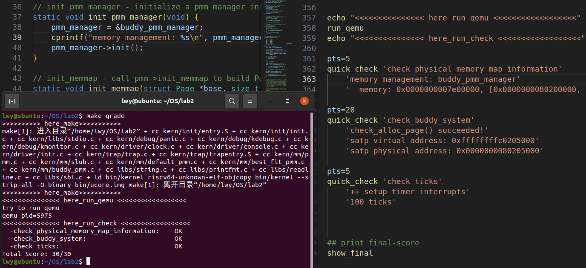

<h2 style="text-align:center">Buddy-System 设计文档
<h4 style="float:right">  姓名：曹珉浩&emsp;&emsp;李威远&emsp;&emsp;乔诣昊   
  学号：2113619  2112338  &nbsp;2111256


[toc]

#### 1.完全二叉树实现方法

##### 1.1 数据结构与辅助算法实现

参考[伙伴分配器的极简实现](https://coolshell.cn/articles/10427.html)，分配器的整体思想是，通过**一个数组形式的完全二叉树**来监控管理内存，二叉树的节点用于标记相应内存块的使用状态，高层节点对应大的块，低层节点对应小的块，在分配和释放中我们就通过这些节点的标记属性来进行块的分离合并。

```c
struct buddy2 {
  unsigned size; //实际大小
  unsigned longest;  //记录实际分配的占用的块的大小
};
struct buddy2 root[80000]; //存放完全二叉树的数组，用于内存分配
```

之后，对二叉树的任何操作，都会转为对 `root` 数组的操作。

在数据结构课上我们知道，完全二叉树拥有良好的性质：

- 如果父节点的标号为 `index`，那么左孩子的标号为`2*index+1`，右孩子为`2*index+2`
- 如果子节点的标号为 `index`，那么父节点的标号为 `(index) + 1) / 2 - 1`

将这个简单的运算过程封装成宏：

```c++
#define LEFT_LEAF(index) ((index) * 2 + 1)
#define RIGHT_LEAF(index) ((index) * 2 + 2)
#define PARENT(index) (((index) + 1) / 2 - 1)
```

接着，由于 Buddy-System 分配逻辑的特殊性，我们免不了寻找与实际请求内存 `n` 相近的2的幂：

```c
//大于a的最小的2^k
#define UINT32_REMAINDER(a) ((a)&(UINT32_MASK(a)>>1))
//小于a的最大的2^k
#define UINT32_ROUND_DOWN(a) (UINT32_REMAINDER(a)?((a)-UINT32_REMAINDER(a)):(a))
```

然后，再定义一个结构，用于记录分配块的信息：

```c
struct allocRecord
{
  struct Page* base; //基地址
  int offset; //偏移量
  size_t nr;//块大小
};
int nr_block; //已分配的块数
```

最后，实现一些辅助的算法，便于内存管理的四个函数的实现：

- `fixsize`：此函数接受参数 `size`，表示实际申请内存，实现的功能是调整参数为不小于它的最小的2的幂次方并进行返回

  ```c++
  static unsigned fixsize(unsigned size) {
    size |= size >> 1;
    size |= size >> 2;
    size |= size >> 4;
    size |= size >> 8;
    size |= size >> 16;
    return size+1; //得到2的幂次方
  }
  ```

  实现思路就是通过按位或运算与右移运算符(每次不断位等于2的幂)实现，比如整数10，其二进制为 `0000 1010`(忽略高8位0)，执行第一条语句：`0000 1010 | 0000 0101 = 0000 1111`，对应的十进制值为15，接着执行下面的语句，发现结果不变(其实就是所有的1在低位连起来，结果就不再变化)，最后结果+1得到16，即$2^4$并返回，由定义可知实现正确。

- `buddy2_new`：这个函数用于初始化二叉树上的节点，在 `buddy_init_memmap` 中调用

  ```c
  void buddy2_new(int size) {
    unsigned node_size = size * 2;
    nr_block=0; //初始化已分配的块数为0
    root[0].size = size;
  
    for (int i = 0; i < 2 * size - 1; i++) {
      if (IS_POWER_OF_2(i+1))
        node_size /= 2;
      root[i].longest = node_size;
    }
    return;
  }
  ```

  调用此函数前，会使用宏，取得小于 size 的最大的2的幂次方，因此可以保证 `size` 可以不断除2，在循环体中，遍历整个二叉树的节点，检查是否是2的幂。如果是2的幂，说明进入了新的一层，将 `node_size` 减半，以表示子节点的大小是父节点大小的一半。

- `buddy2_alloc`：这个函数在二叉树中搜索，找到合适的内存块并分配，然后返回偏移量，是 `buddy_alloc_pages` 中调用的重要函数，这个偏移量的作用是告诉系统在所选块内的哪个位置分配了页面，也便于后续释放的实现

  最为核心的二叉树搜索代码如下：
  
  ```c
  for (node_size = self->size; node_size != size; node_size /= 2) {
   	if (self[LEFT_LEAF(index)].longest >= size) {
  		if (self[RIGHT_LEAF(index)].longest >= size) {
          	//找到两个相符合的节点中内存较小的结点
          	index = self[LEFT_LEAF(index)].longest <= 
          		self[RIGHT_LEAF(index)].longest ? LEFT_LEAF(index) : RIGHT_LEAF(index);            
      	else
          	index = LEFT_LEAF(index);
          }
  	else
  		index = RIGHT_LEAF(index);
  }
  ```
  
  然后计算偏移量，并向上遍历树，确保树中的其他节点也被正确标记为已使用或空闲：
  
  ```c
  self[index].longest = 0;//标记节点为已使用
  offset = (index + 1) * node_size - self->size;
  while (index) {
  	// 向上遍历树，确保树中的其他节点也被正确标记为已使用或空闲
      index = PARENT(index);
      self[index].longest =
  		MAX(self[LEFT_LEAF(index)].longest, self[RIGHT_LEAF(index)].longest);
  }
  return offset;
  ```

##### 1.2 buddy_init

和 `default_init` 与 `best_fit_init` 一样，初始化空闲列表并把空闲块置零

```c
static void buddy_init() {
    list_init(&free_list);
    nr_free=0;
}
```

##### 1.3 buddy_init_memmap

此函数用于初始化一个内存块，与前面 `first-fit` 和 `best-fit` 实现最大的不同是对于 `free_list` 链表的操作。对于传入的内存块大小 `n`，我们找到小于它的最大的2的幂，把它直接加入到空闲链表并初始化二叉树。可以看到我们在这里没有考虑到内存的地址问题，因为对于 `buddy-system`，只有两块内存地址连续并且其大小相同才可以合并(而不像前面两种算法，只要内存连续就可以合并)，考虑到这种情况不易发生，在这里我们简化了实现，即在空闲链表中每个内存块都是相对独立的，不会产生合并，也因此，直接将内存块加入到列表即可，实现代码如下：

```c
static void buddy_init_memmap(struct Page *base, size_t n)
{
    assert(n>0);
    struct Page* p=base;
    for(;p!=base + n;p++)
    {
        assert(PageReserved(p));
        p->flags = 0;
        p->property = 1;
        set_page_ref(p, 0);   
        SetPageProperty(p);
        list_add_before(&free_list,&(p->page_link));     
    }
    nr_free += n;
    int allocpages = UINT32_ROUND_DOWN(n);
    buddy2_new(allocpages);
}
```

##### 1.4 buddy_alloc_pages

此函数调用辅助函数 `buddy2_alloc` 分配内存，并填充分配块结构体(最重要的是偏移量字段)。辅助函数实现后，函数的其余逻辑比较简单：填充分配块信息，修改页面状态，工作和前面两种算法类似，关键代码如下：

```c
rec[nr_block].offset = buddy2_alloc(root, n); //记录偏移量
for (int i = 0; i < rec[nr_block].offset + 1; i++)
	le = list_next(le);
page = le2page(le, page_link);
int allocpages = fixsize(n); //根据需求n得到块大小
rec[nr_block].base = page;//记录分配块首页
rec[nr_block].nr = allocpages;//记录分配的页数
```

##### 1.5 buddy_free_pages

此函数回收内存块，但与 `default_free_pages` 和 `best_fit_free_pages` 不同的是，此函数不仅需要偏移量来确定到底要回收哪棵子树，还需要判断是否可以合并再次回收(递归过程)，得益于 `alloc` 中填充的结构体，我们很容易找到分配了哪个块，并确定它的偏移量：

```c
int i = 0;
for (i = 0; i < nr_block; i++)//找到块
	if (rec[i].base == base)
		break;
int offset = rec[i].offset; //找到偏移量
int pos = i; //暂存i，用于后续重置结构体
```

然后，是最重要的回收逻辑，不仅需要回收当前页，还需要递归到根，检查是否能合并：

```c
while (index) { //向上合并，修改祖先节点的记录值
	index = PARENT(index);
    node_size *= 2;
	left_longest = self[LEFT_LEAF(index)].longest;
	right_longest = self[RIGHT_LEAF(index)].longest;

	if (left_longest + right_longest == node_size)
		self[index].longest = node_size;
	else
		self[index].longest = MAX(left_longest, right_longest);
}
```

最后，恢复结构体，并更新分配块数的值

```c
for (i = pos; i < nr_block - 1; i++)
	rec[i] = rec[i + 1];
nr_block--; 
```

##### 1.6 测试与运行结果

我们的测试代码主要分为四部分：

- 检验内存是否分配成功
- 检验内存是否分配不重复
- 释放内存时，多重递归合并的检验
- buddy-system 的内存分配相对位置检验

```c
static void buddy_check(void) {
    struct Page* p0, * A, * B, * C, * D;
    p0 = A = B = C = D = NULL;

    // 检验是否分配成功
    assert((p0 = alloc_page()) != NULL);
    assert((A = alloc_page()) != NULL);
    assert((B = alloc_page()) != NULL);

    //检验分配是否不重复
    assert(p0 != A && p0 != B && A != B);

    // 多重合并检验，最终的效果是A和P0都指向含1024页的块的首地址
    assert(page_ref(p0) == 0 && page_ref(A) == 0 && page_ref(B) == 0);
    free_page(p0);
    free_page(A);
    free_page(B);
    A = alloc_pages(500);
    B = alloc_pages(500);
    cprintf("A %p\n", A);
    cprintf("B %p\n", B);
    free_pages(A, 250);
    free_pages(B, 500);
    free_pages(A + 250, 250);
    p0 = alloc_pages(1024);
    cprintf("p0 %p\n", p0);
    assert(p0 == A);
    assert(p0 + 512 == B);

    //检验buddy分配规则
    A = alloc_pages(70);
    B = alloc_pages(35);
    assert(A + 128 == B);
    cprintf("A %p\n", A);
    cprintf("B %p\n", B);
    C = alloc_pages(80);
    assert(A + 256 == C);
    cprintf("C %p\n", C);
    free_pages(A, 70);
    cprintf("B %p\n", B);
    D = alloc_pages(60);
    cprintf("D %p\n", D);
    assert(B + 64 == D);
    free_pages(B, 35);
    cprintf("D %p\n", D);
    free_pages(D, 60);
    cprintf("C %p\n", C);
    free_pages(C, 80);
    free_pages(p0, 1000);
}
```

接着，修改内存分配器，并在脚本中注释掉 `best_fit` 测试，添加 `buddy` 测试：

```c
pmm_manager = &buddy_pmm_manager;
```

```sh
pts=25 \
quick_check 'buddy_check' \
```

测试结果，buddy-system 正常工作：


#### 2.双向链表实现方法

参考我们先前给出的的 `best_fit` 代码基本实现，其整体思想是通过维护一个地址从低到高的双向链表，来实现对物理内存页的监控和管理。我们想要在该代码的数据结构框架上进行改进，来实现我们的 `buddy_system`，难点主要在于这三个核心问题：内存块格式处理、内存块如何按二次幂分配、内存块释放时如何按二次幂合并。

##### 2.1 内存块格式处理

类似于第一种算法的 `fixsize` 实现，这里采用了相似的位运算函数，同样能够实现获取一个数相近的二次幂：

```c
//找一个64位数最近的小于它的二进制幂
uint64_t largest_power(uint64_t N)
{
	N = N | (N>>1);
	N = N | (N>>2);
	N = N | (N>>4);
	N = N | (N>>8);
	N = N | (N>>16);
	N = N | (N>>32);
	return (N + 1) >> 1;
}    
//找一个64位数最近的大于等于它的二进制幂
uint64_t smallest_power(uint64_t N)
{
	//类似largest_power实现，注意了对等于2次幂的情况的判断，不加赘述
}
```

在基于链表的算法中，这里这两个内存格式处理，分别应用在两个地方：`smallest_power` 主要应用分配和释放内存中对内存块大小的调整，而 `largest_power` 在代码中仅用于第一次初始化内存块时，对全局的物理内存转为一个小于它的最大二次幂内存块。

##### 2.2 内存块分配处理

考察 `best_fit` 代码中的裂解和合并操作，我们意识到，按照一定的顺序规范来进行二进制幂内存块的分配和释放，并在 `best_fit` 代码的基础上，给 `Page` 结构体增加辅助进行合并判断的**辅助指针**，来记录每一个内存块在分裂时的“伙伴”的地址，可以帮助实现伙伴系统中的释放的合并操作。

首先是如何规范内存块的分配，经过第一步中内存块格式的规范化，在文件执行后，我们已经通过 `page_init` 函数计算内核的结束地址，并通过 `init_memmap` 将剩余的内存全部初始化为一个二次幂的内存块，获得了一块巨大的连续存储物理页面的内存空间。

试想在链表的结构下，如何对这个巨大的二次幂内存块进行分配处理呢？以需要分配 `n` 个 `Page` 为例，我们可以按照如下简单算法思路实现：

1. `best_fit` 方式找到链表中合适大小的内存块，设其头页地址为A
2. 将头页地址为A的内存块(如果只有一个内存块那么就是这个内存块)分为两半，变成链表的两个节点，头页地址为A和B
3. 将高地址的头页地址为B的节点存进链表，替代原本内存块的位置，同时标记B的伙伴地址为A
4. 比较A内存块的大小和n的大小，若内存块的一半仍然大于等于n，跳转到2，否则跳转到5
5. 结束分配，对得到的A内存块进行初始化处理

如果用二叉树的思想来看，在对链表的处理过程自然而然的标记伙伴地址操作，实际上是第一种算法中对兄弟节点的相互标记操作，也是伙伴系统的由来——一同分裂得到的节点才是伙伴，才能够进行后续的合并操作。

实质上，我们仅仅是改进先前实验中的链表结构，对分配的分裂进行了迭代处理，就产生了自然的二叉树状态结构，核心代码如下所示：

```c
while (page->property/2 >= n) {
	struct Page *p = page + page->property/2;       //分裂p作为单独节点
	p->property = page->property/2;
	SetPageProperty(p);
	p->friend = &(page->page_link);     //标记page是p的伙伴位
	list_add(prev , &(p->page_link));       //将p加入链表
	page->property = page->property/2;
}
```

##### 2.3 内存块释放处理

对于 `buddy system` 的实现，二次幂内存块释放中的合并操作是其中的重难点；考察我们在 `best_fit` 中对合并操作的实现，即地址相邻即合并，这显然对于`buddy system`是不够的。对于 `buddy system` 中的两个内存区块，想要合并不仅仅需要二者相邻，还需保证二者大小相同，且为当时分配时分裂的两块才行。

因此，我们在分配阶段利用了一个辅助指针，对每一个高地址的B区块记录了它的伙伴的地址，其实现是对 `Page` 结构体增加一个`list_entry` 指针变量：

```c
struct Page {
	……
	list_entry_t* friend;  //“伙伴”辅助指针
};
```

基于此，我们可以根据是否为伙伴和大小是否相同的两个条件，来实现对内存块是否合并，并且考虑到连续合并的可能性，需要用while循环实现，直至不能分裂，核心代码如下：

```c
while (1) {
	p = le2page(le, page_link);     //前一个节点
	p2 = le2page(le2, page_link);       //后一个节点
	// 判断条件为是否为伙伴、大小相等、不为头节点
	if (le!=&free_list && base->friend==&(p->page_link) &&base->property==p->property) {
		p->property += base->property;  //把base合并到p中
		ClearPageProperty(base);
		list_del(&(base->page_link));
		base = p;  //更新base，继续进行相近地址检查，可能存在连续合并
		le = list_prev(le);
	}
	else if (le2!= &free_list &&p2->friend==&(base->page_link) &&base->property==p2->property) {
		base->property += p2->property;  //把p2合并到base中
		ClearPageProperty(p2);
		list_del(&(p2->page_link));
		le2 = list_next(le2)
	}
	else break;
}
```

##### 2.4 总结

基于辅助指针的双向链表形式来实现 `buddy system`，是在 `best_fit`算法的基础上进行的。事实上，`buddy system`和`best_fit`算法展现出了极高的契合性：

在进行`buddy system`的合适内存块挑选时，`best_fit`能够帮助`buddy system`找到一个合适的内存块，最大程度地减少需要内存块裂解的次数，保证了大内存区块的留存率；此外，通过`buddy system`的二次幂来规范内存块的管理，能够大大减少`best_fit`算法中可能会产生的难以利用的内存碎片，实现更好地内存分配。

##### 2.5 测试与运行结果

给出如下的测试代码，详细地测试各个方面的 `buddy system` 不同功能，其中 `basic_check` 为基础测试，进行一个页的分配和释放等操作，和 `best_fit` 中测试代码相同，这里不作展示：

```c
static voidn buddy_check(void) {
	int score = 0 ,sumscore = 6;
    int count = 0, total = 0;
    list_entry_t *le = &free_list;
    
	//检验空闲页数是否正确，每块的头页标记是否正确
    while ((le = list_next(le)) != &free_list) {
		struct Page *p = le2page(le, page_link);
        assert(PageProperty(p));
        count ++, total += p->property;
    }
    assert(total == nr_free_pages());
    assert(count==1);
        
    //基础测试，基本和best_fit中一致
    basic_check();
#ifdef ucore_test
    score += 1;
    cprintf("grading: %d / %d points\n",score, sumscore);
#endif
   
    //检验分配是否正常
    struct Page *P0 = alloc_pages(7);
    assert(P0->property==8);
    struct Page *P1= alloc_pages(3), *P2= alloc_pages(70),*P3= alloc_pages(3);
    assert(P1->property==4);
    assert(P2->property==128);
    assert(P3->property==4);
    
#ifdef ucore_test
	score += 1;
    cprintf("grading: %d / %d points\n",score, sumscore);
#endif
    
	//检验释放是否正常，需要注意只能一个块一个块是释放
    free_pages(P2, 70);
    assert(PageProperty(P2));
    assert(P2->property==128);
    free_pages(P3,3);
    assert(P3->property==4);
    free_pages(P1,3);
    //发生单次合并
    assert(P1->property==8);
    //发生迭代合并
    free_pages(P0,6);
    assert(P0->property== nr_free_pages());        
#ifdef ucore_test
    score += 1;
    cprintf("grading: %d / %d points\n",score, sumscore);
#endif
    //检验特殊情况的释放页，即128，128，128，128中是否会出现中间两个合并
    //导致两边的2无法合并的现象(通过伙伴标记判断)
    P0 = alloc_pages(70);
    P1 = alloc_pages(69);
    P2 = alloc_pages(90);
    P3 = alloc_pages(121);
    
	free_pages(P1, 69);
    free_pages(P2, 90);
    //此时P1和P2应该不合并
    assert(P1->property==128);
    free_pages(P0,70);
    //此时P1和P0合并
    assert(P0->property==256);
    free_pages(P3, 121);
    //此时四个一起合并，全部合并
    assert(P0->property== nr_free_pages());  
    
#ifdef ucore_test
	score += 1;
    cprintf("grading: %d / %d points\n",score, sumscore);
#endif
	//遍历检查链表状态是否正常
    le = &free_list;
    while ((le = list_next(le)) != &free_list) {
    	struct Page *p = le2page(le, page_link);
        	count --, total -= p->property;
   	}
    assert(count == 0);
    assert(total == 0);
    
#ifdef ucore_test
    score += 1;
    cprintf("grading: %d / %d points\n",score, sumscore);
#endif
}
```

更改 `grade.sh` 测试脚本中检测的输出语句，更改 `pmm.c` 中物理内存管理器指针，使其选用 `buddy_pmm_manager`，并`make grade`执行，可以得到正确执行结果如下图所示：


