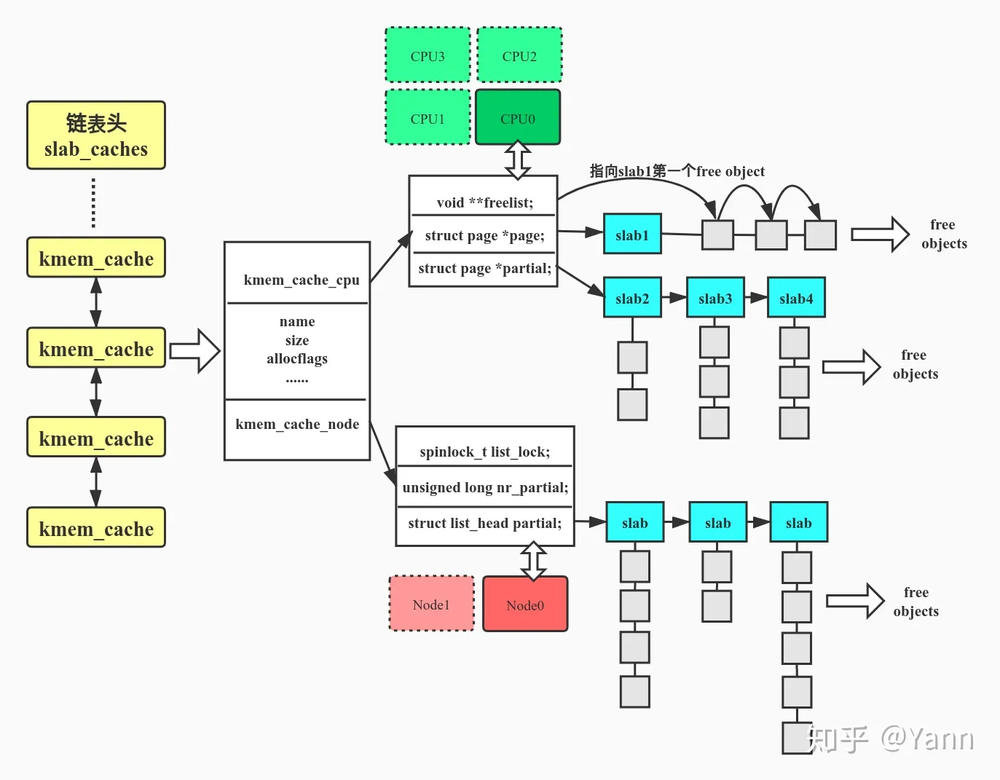
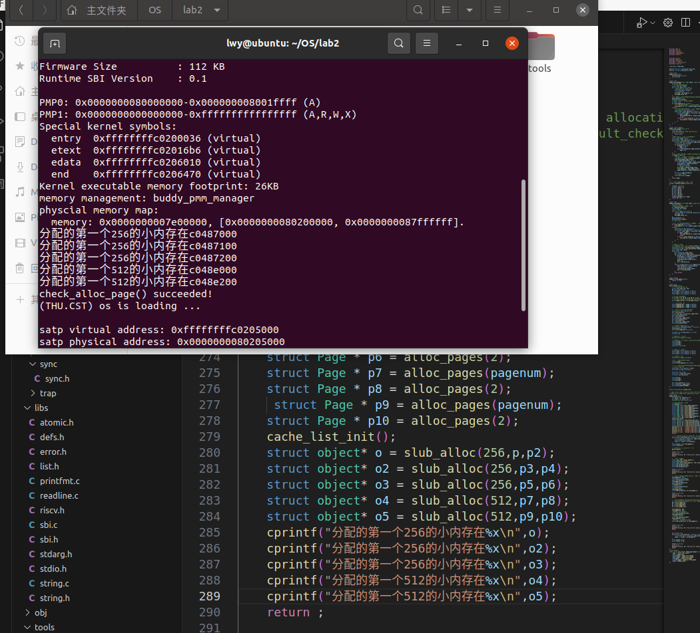

<h2 style="text-align:center">Slub 设计文档
<h4 style="float:right">  姓名：曹珉浩&emsp;&emsp;李威远&emsp;&emsp;乔诣昊   
  学号：2113619  2112338  &nbsp;2111256

[toc]

#### 1.实验原理

Linux中的slub的原理图下图所示：



我们基于上图所示的linux的slub分配算法（该算法与buddy system结合使用）进行了如下几点简化：

- 由于只使用单核cpu和非NUMA模式，不必要分为per_node和per_cpu，也不需要进行node层次的缓存来加快cpu层的运算速度，因此我们这次实验只对node作处理，实现简单的任意大小内存分配即可
- 事实上，每个per_node会形成一个类似于hash链表的结构来存储slab，这里，我们利用per_node本身遗留的指针数组(本来应该指向不同node)实现存储
- 对于obejct的实现,其内部还有较为复杂的结构,这里我们忽略了object的内部结构
- slub算法的核心就是以下四个接口,我们对其进行了实现，还需要进一步的外部封装才能简洁的使用，现在使用的时候需要先在buddy system中进行页的分配,比较麻烦,但是能够实现功能

#### 2.结构体

```c
struct kmem_cache {
	/*per-cpu变量，用来实现每个CPU上的slab缓存。好处如下：
	1.促使cpu_slab->freelist可以无锁访问，避免了竞争，提升分配速度
	2.使得本地cpu缓存中分配出的objects被同一cpu访问，提升TLB对object的命中率(因为一个page中有多个object，他们共用同一个PTE)
	3.这里我们默认只有一个cpu，单核下进行slub算法实现
	*/
	struct kmem_cache_cpu *cpu_slab;
	/*下面这些是初始化kmem_cache时会设置的一些变量 */
	/*kmem_cache_shrink缩减partial slabs时，将被保有slab的最小值。由函数set_min_partial(s, ilog2(s->size)/2)设置。*/
	unsigned long min_partial;
	/*object的实际大小，其实可以细分，这里不做细分了*/
	size_t size;

	//所在的页
	struct Page* page;	
	/*kmem_cache的链表结构，通过此成员串在slab_caches链表上*/
	list_entry_t list;   
	/*每个node对应一个数组项，kmem_cache_node中包含partial slab链表*/
	int free_node;
	struct kmem_cache_node *node[20];
};
```

```c
struct kmem_cache_cpu {
	/*指向下面page指向的slab中的第一个free object*/
	void **freelist;      
	/*指向当前正在使用的slab*/
	struct page *page;      
	/*本地slab缓存池中的partial slab链表*/
	struct page *partial; 
}
```

```c
struct kmem_cache_node {
	/*node中slab的数量*/
    unsigned long nr_partial;
	/*指向partial slab链表*/
	list_entry_t partial;  
}
```

#### 3.函数

下面的这个函数的功能是对cache进行初始化，传入的参数是分配的内存大小和Page结构体的指针。主要就是实例化kmem\_cache类并初始化相关参数。

首先将 p2 的物理地址加上偏移量 PHYSICAL\_MEMORY\_OFFSET，然后将结果强制类型转换为kmem\_cache 类型的指针并赋值给 cache 变量。

接着设置了cache 的一些属性：size 的值为传入的size，表示object的实际大小；min\_partial 的值为 30；free\_node 的值为 0，即空闲节点的数量为0；page 的值为传入的 p2，即将p2设为该cache所在的页。

最后，函数计算了 p2+1 的物理地址，加上偏移量 PHYSICAL\_MEMORY\_OFFSET，然后将结果强制类型转换为 struct kmem\_cache\_node 类型的指针，并将其赋值给 cache 的 node[0] 属性。

最后，函数返回了初始化好的cache。

```c
struct kmem_cache * cache_int(size_t size,struct Page * p2){
    struct kmem_cache * cache;
    cache = (struct kmem_cache *)(page2pa(p2)+PHYSICAL_MEMORY_OFFSET);
    // cache = &kmem_caches[now];
    // now++;
    cache->size = size;
    cache->min_partial = 30; 
    cache->free_node =0;
    cache->page = p2;
    cache->node[0] = (struct kmem_cache_node *)(page2pa(p2+1)+PHYSICAL_MEMORY_OFFSET);
    return cache;
}
```

下面的代码是一个用于创建cache的函数。主要就是通过遍历cache的链表并比较大小，最后在链表上假如指定大小的cache。

首先，代码使用断言（assert）来确保每个小内存块能够容纳下一个结构体（object）的大小，要求size大于等于128。

之后声明了一个uintptr\_t类型的变量p\_address，用于存储页面p的物理地址。并设le为cache链表的起始位置，用于之后的遍历。最后设了一个kmem\_cache类型的指针cache并初始化为NULL。

如果cache链表为空，那么直接初始化cache并将其插入链表即可。如果cache链表不为空，那么就要和已有的cache比较size大小，如果一样就将cache设为已有的并返回，否则依然是初始化cache并将其插入链表。

如果这个cache是新插入的，那么后面还要对该cache内部的对应的object进行初始化。这里主要就是取得该cache的首个节点node，并设le为开始位置，通过循环将节点的地址设置好，将节点都加到链表里面，前后连接好。对nr\_partial进行++，记录节点数量。

```c
struct kmem_cache *kmem_cache_create(size_t size,struct Page * p,struct Page * p2)
{
    //保证每个小内存块能放下object结构体
    assert(size>=128);
    //接下来找到合适的cache
    uintptr_t p_address = page2pa(p);
    list_entry_t* le = &cache_list;
    struct kmem_cache* cache =NULL;
    if (list_empty(&cache_list)) {
        //若链表为空，caches初始化一个新的
        cache = cache_int(size,p2);
        list_add(&cache_list, &(cache->list));
    } 
    else {
        //否则遍历链表，有size相同就拿，否则加入新的
        while ((le = list_next(le)) != &cache_list) {
            struct kmem_cache* cache2 = le2cache(le, list);
            if (cache2->size == size) {
                cache = cache2;
                cache->free_node ++;
                cache->node[cache->free_node] = (struct kmem_cache_node *)(cache->node[cache->free_node-1]+sizeof(struct kmem_cache_node));
                return cache;
            }
        }
        cache = cache_int(size,p2);
        list_add(le, &(cache->list));
    }
    struct kmem_cache_node* node = cache->node[cache->free_node];
    // 接下来处理node管理的object链表（简化：cpu不作处理）
    list_init(&node->partial);
    // 遍历这些页，按照size划分，通过结构体object实现链表和寻址
    le = &node->partial;
    for(int i=0;i<p->property*PGSIZE;i+=size){
        struct object * o = (struct object *)(p_address+PHYSICAL_MEMORY_OFFSET+i);
        list_add(le, &(o->object_link));
        le = &o->object_link;
        node->nr_partial++;
    }
    return cache;
}
```

下面的函数作用为销毁一个cache，就是通过循环对cache的object链表的每个值进行处理

```c
void kmem_cache_destroy( struct kmem_cache *cachep){
    list_del(&cachep->list);
    for(int i =0;i<=cachep->free_node;i++){
        list_del_init(&cachep->node[i]->partial);
    }
}
```

下面的函数作用是根据cache分配一个slab的object。传入的参数是cache的指针，返回的是object的指针。

代码通过遍历cachep指针所指向的cache的所有node，寻找第一个合适的块供对象分配。循环里面首先是取node，然后通过检查node的partial链表是否为空来确定是否有可用的对象。如果partial为空，表示有空闲的对象可供分配，返回对应的object的指针并从链表删除掉该节点。

如果在遍历完所有的slab块后仍然没有找到可用的对象，则函数返回NULL表示分配失败。

```c
struct object* kmem_cache_alloc(struct kmem_cache* cachep){
    //遍历所有slab,找到第一个合适的块返回
    for(int i =0;i<=cachep->free_node;i++){
        struct kmem_cache_node* node = cachep->node[i];
        if(!list_empty(&node->partial)){
            struct object*o = le2object(node->partial.next,object_link);
            list_del(node->partial.next);
            return o;
        }
    }
    return NULL;
}
```

```c
void kmem_cache_free(struct kmem_cache* cachep,  struct object* objp){
    //遍历所有slab,找到等于object指针的加入即可
    for(int i =0;i<cachep->free_node;i++){
        struct kmem_cache_node* node = cachep->node[i];
        if(list_prev(&objp->object_link)==&node->partial){
            list_add(&node->partial,&objp->object_link);
        }
    }
}
```

下面的函数为整合，以申请几个字节为例子

```c
struct object* slub_alloc(size_t size, struct Page * p,struct Page * p2){
    //如果有相同大小的slab的cache，就不再新建了
    struct kmem_cache* cache;
    if (!list_empty(&cache_list)) {
        //遍历链表，有size相同就拿，否则再申请几个页创建一个
        list_entry_t* le = &cache_list;
        while ((le = list_next(le)) != &cache_list) {
            cache = le2cache(le, list);
            if (cache->size == size) {
                break;
            } 
        }
    }
    cache = kmem_cache_create(size,p,p2);
    struct object* o =kmem_cache_alloc(cache);
    return o;
}
```

#### 4.测试与结果


