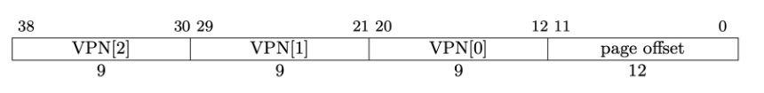
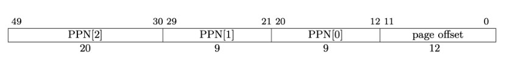
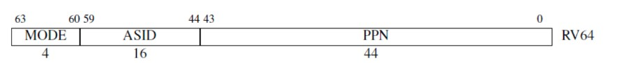
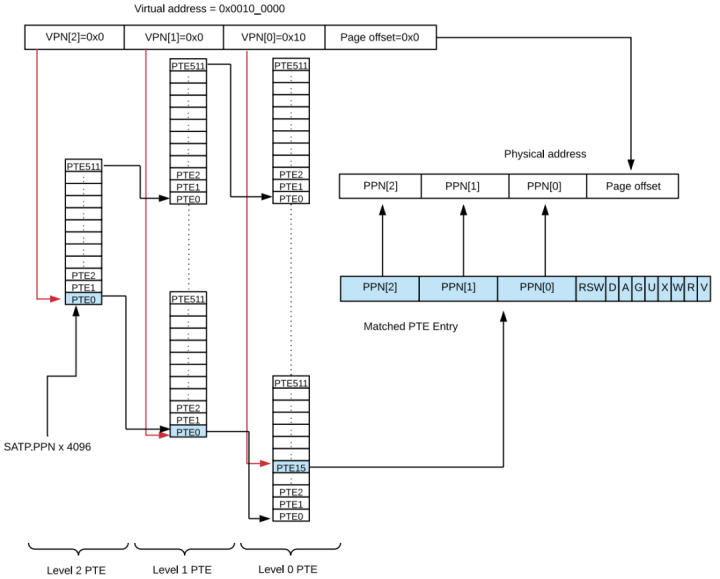
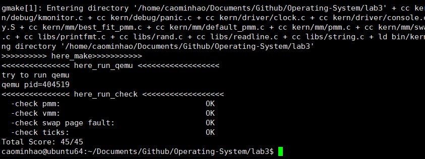

<h2 style="text-align:center">操作系统实验报告  Lab3
<h4 style="float:right">  姓名：曹珉浩&emsp;&emsp;李威远&emsp;&emsp;乔诣昊   
  学号：2113619    2112338   2111256

[toc]

#### Exercise1：理解基于FIFO的页面替换算法

>描述FIFO页面置换算法下，一个页面从被换入到被换出的过程中，会经过代码里哪些函数/宏的处理（或者说，需要调用哪些函数/宏），并用简单的一两句话描述每个函数在过程中做了什么？
>
>- 至少正确指出10个不同的函数分别做了什么？如果少于10个将酌情给分。我们认为只要函数原型不同，就算两个不同的函数。
>- 要求指出对执行过程有实际影响,删去后会导致输出结果不同的函数（例如assert）而不是cprintf这样的函数。如果你选择的函数不能完整地体现”从换入到换出“的过程，比如10个函数都是页面换入的时候调用的，或者解释功能的时候只解释了这10个函数在页面换入时的功能，那么也会扣除一定的分数

**总览：** 首先让我们从替换算法的初始化开始，回顾整个页面置换算法被调用的流程，对流程用到的重要函数/宏进行解释。其中，重要的函数会用链接体表示，其详细解释可以直接链接跳转，不太关键或非核心步骤的函数就用黑体表示，涵盖在重要的函数的解释中。

1. 在最开始的时候，我们在**kern_init()**函数中调用了一系列初始化函数，完成对物理内存管理、虚拟内存管理、中断处理等操作的初始化。这里，我们调用[swap_init()函数](#函数1)，完成对页面替换算法的初始化。在初始化函数中，我们用到**swapfs_init()**函数进行初始化检查。随后，我们会设置swap_manager指针指向选定方法（这里是FIFIO），若该方法初始化成功，就进入到**check_swap()**函数中，进行swap功能的检验。
2. 在完成初始化之后，Ucore就能够在遇到页访问异常时，调用swap_manager(下面简称sm)的具体方法进行swap操作，而检测到页访问异常后，首先需要来到我们所熟悉的[exception_handler()函数](#函数2)，根据异常原因转入对应的处理程序[pgfault_handler()函数](#函数2)，检验并运用**print_pgfault()函数**打印原因，再转入[do_pgfault()函数](#函数3)进行真正的swap换页处理。
3. 这里，我们转入了 [do_pgfault()函数](#函数4)，以此，我们就开始了换页的整个过程，该函数是整个换页机制的核心，也是最顶层封装。在这个函数内部，需要完成换入页和换出页两个任务，通过调用其他接口实现。在这里，需要做好换入页的准备，如获取vma、pte和初始化页标志位等等，调用了**find_vma()函数**和[get_pte()函数](#函数8)。这里[get_pte()函数](#函数8)很重要，但是练习2中会详细介绍，因此我们只罗列和阐述大致功能，但不作细致讲解。
4. 换入页面：随后，若先前完成了swap_manager的初始化，则首先调用[swap_in()函数](#函数4)进行页面的换入，在其中调用**alloc_page()宏(**事实上是[alloc_pages()函数](#函数6)的封装)完成对页的分配，同时完成对是否需要换出页的判断。然后找到/构建该地址对应的页表项，将该页的内容调用[swapfs_read()函数](#函数5)写入页表项，即完成了数据从硬盘到内存的转入。
5. 然后利用[page_insert()函数](#函数7)将新的页表项插入页表，这里还是会用到[get_pte()函数](#函数8)来找到地址对应的页表项，同时，还运用了**page_ref_inc()、page_ref_dec()**和**page_remove_pte()、pte_create()**等完成对page的ref的调整和对pte的操作，最后调用**tlb_invalidate()**函数刷新tlb，这些函数的具体作用将在[page_insert()函数](#函数7)函数中给出，不做详细介绍。
6. 最后，调用[swap_map_swappable()函数](#函数9)（这个函数封装了sm的map_swappable接口，我们视为一个函数进行讲解）来设置页面可交换。这里，我们维护了一个类似于先进先出队列的链表结构，结合之后换出页面中会用到的[swap_out_victim函数()](#函数11)实现FIFO算法。
7. 换出页面：在先前换入页面时调用的[alloc_pages()函数](#函数6)获取页的时候，同时还需要判断是否需要换出页，若需要，则会调用[swap_out()函数](#函数10)进行换出页的处理。在这个函数中，我们开始了页面的换出操作：首先通过调用sm的[swap_out_victim函数()](#函数11)函数找到需要换出的页，若成功找到，则根据该页的虚拟地址获取对应的页表项，进行页权限的判断。
8. 然后利用[swapfs_write()函数](#函数5)实现对页面内容从内存到磁盘的换出，若失败，则需要调用[swap_map_swappable()函数](#函数9)进行复原；若成功，则需要调用**free_page(page)宏**进行页的释放，至此，我们成功完成了一次页面的换出。

##### <a name="函数1">1.1 swap_init()</a>

- **swap_init()函数为对页面替换算法进行初始化的函数，完成初始化检验、选定swap_manager类型并初始化和调用swap功能检查的函数。**

1. 详细地来看，在初始化函数中，我们首先会使用到swapfs_init()函数，该函数通过调用获取模拟硬盘信息的接口（如ide_device_size这些），来设置最大的页偏移数并进行检查。
2. 随后，该函数会设置swap_manager指针指向选定方法的swap管理器（这里是FIFO）并初始化，若初始化成功，就设置标志swap_init_ok = 1，并调用check_swap()函数检查swap功能。
3. check_swap()函数是make grade和make qemu能否正常执行的核心，其中调用了各类方法来检查swap的功能，这里我们不对其内部检验方法做详细展示，其原理是基于用assert函数判断数值是否准确、程序是否执行正常来实现的。

```c
int swap_init(void){
     swapfs_init();
     // Since the IDE is faked, it can only store 7 pages at most to pass the test
     if (!(7 <= max_swap_offset &&
        max_swap_offset < MAX_SWAP_OFFSET_LIMIT)) {
        panic("bad max_swap_offset %08x.\n", max_swap_offset);
     }
     sm = &swap_manager_fifo;//use first in first out Page Replacement Algorithm
     int r = sm->init();
     if (r == 0){
          swap_init_ok = 1;
          cprintf("SWAP: manager = %s\n", sm->name);
          check_swap();
     }
     return r;
}
```

##### <a name="函数2">1.2 exception_handler()、pgfault_handler()</a>

- **exception_handler()函数是我们非常熟悉的异常处理函数，在lab1中已经详细学习过了，cpu在发生CAUSE_LOAD_PAGE_FAULT(取异常)和CAUSE_STORE_PAGE_FAULT(存异常)后，通过stvec寄存器跳转到exception_handler()处。根据case类型调用pgfault_handler()函数进行更一步的处理**。
- **pgfault_handler()完成的工作非常简单，首先获取在vmm.c处声明的mm虚拟内存管理结构体，然后调用print_pgfault()函数打印异常，最后，将异常结构体中的状态寄存器stval(代码中叫badvaddr，我们之前在lab1分析过，在存取指令中，这个csr存储异常的访问地址)和错误原因传入do_pgfault进行处理**

```c
static int pgfault_handler(struct trapframe *tf) {
    extern struct mm_struct *check_mm_struct;
    print_pgfault(tf);
    if (check_mm_struct != NULL) {
        return do_pgfault(check_mm_struct, tf->cause, tf->badvaddr);
    }
    panic("unhandled page fault.\n");
}

void exception_handler(struct trapframe *tf) {
    int ret;
    switch (tf->cause) {
        /* .... other cases */
        case CAUSE_FETCH_PAGE_FAULT:// 取指令时发生的Page Fault先不处理
            cprintf("Instruction page fault\n");
            break;
        case CAUSE_LOAD_PAGE_FAULT:
            cprintf("Load page fault\n");
            if ((ret = pgfault_handler(tf)) != 0) {
                print_trapframe(tf);
                panic("handle pgfault failed. %e\n", ret);
            }
            break;
        case CAUSE_STORE_PAGE_FAULT:
            cprintf("Store/AMO page fault\n");
            if ((ret = pgfault_handler(tf)) != 0) { //do_pgfault()页面置换成功时返回0
                print_trapframe(tf);
                panic("handle pgfault failed. %e\n", ret);
            }
            break;
        default:
            print_trapframe(tf);
            break;
    }
}
```

##### <a name="函数3">1.3 do_pgfault()</a>

- **do_pgfault()函数为整个换页机制的最顶层封装，也是一切的起点和终点，我们将从这个函数出发，一步步调用底层接口，实现换入页和换出页的处理。**

1. 详细地来看，该函数首先调用 `find_vma()` 函数，该函数是通过遍历链表的方式，**在虚存管理结构体中找到一块包含地址addr的虚拟内存块，将在这个虚拟内存块上建立虚拟内存到物理内存的映射**。其中addr由stval即badvaddr传入，即需要使用的发生缺页异常的虚拟地址。同时完成对pgfault_num的计数更新（该计数用于check的assert）和对vma的检查。
2. 随后，该函数会根据该虚拟内存块的标志位设置参数，该参数将用于页表项的建立，即其0-9位保存的映射的状态信息，这里事实上都会设置成用户态的可读可写。然后将addr按页对齐，调用get_pte方法获取这个虚存管理结构体包含的虚拟页对应的页表项，这里实际上不存在，在get_pte中会创建一个新的页表项并返回。
3. 完成上述的准备后，会进行一些检查，防止信息缺失。然后我们就会进入到函数的核心部分：通过**调用swap_in()函数完成页的换入**(这之中可能会发生换出页)，并获取换入的新物理页。然后**通过page_insert()函数将这个新物理页的物理地址映射到虚拟地址**。最后通过swap_map_swappable()设置该页是可交换的，完成整个换页的过程。

```c
int do_pgfault(struct mm_struct *mm, uint_t error_code, uintptr_t addr) {
    int ret = -E_INVAL;
    //try to find a vma which include addr
    struct vma_struct *vma = find_vma(mm, addr);

    pgfault_num++;
    //If the addr is in the range of a mm's vma?
    if (vma == NULL || vma->vm_start > addr) {
        cprintf("not valid addr %x, and  can not find it in vma\n", addr);
        goto failed;
    }

    uint32_t perm = PTE_U;
    if (vma->vm_flags & VM_WRITE) {
        perm |= (PTE_R | PTE_W);
    }
    addr = ROUNDDOWN(addr, PGSIZE);
    ret = -E_NO_MEM;
    pte_t *ptep=NULL;
    ptep = get_pte(mm->pgdir, addr, 1);  //(1) try to find a pte, if pte's
                                         //PT(Page Table) isn't existed, then
                                         //create a PT.
    if (*ptep == 0) {
        if (pgdir_alloc_page(mm->pgdir, addr, perm) == NULL) {
            cprintf("pgdir_alloc_page in do_pgfault failed\n");
            goto failed;
        }
    } else {
        if (swap_init_ok) {
            struct Page *page = NULL;
            swap_in(mm,addr,&page);
            page_insert(mm->pgdir,page,addr,perm);
            swap_map_swappable(mm,addr,page,0);
            page->pra_vaddr = addr;
        } else {
            cprintf("no swap_init_ok but ptep is %x, failed\n", *ptep);
            goto failed;
        }
   }
   ret = 0;
failed:
    return ret;
}
```

##### <a name="函数4">1.4 swap_in()</a>

- **swap_in()函数作为将硬盘的页换入内存的最顶层接口，完成了数据从硬盘到内存的转移，同时隐含了对换出页的判断和执行(调用alloc_pages实现)。**

1. 详细地来看，swap_in函数首先调用alloc_page宏为访问的虚拟地址分配一个对应的物理页，这里alloc_page宏实际上是对alloc_pages()函数的封装，后续只介绍alloc_pages()函数。在这其中隐含了对换出页的判断和执行。
2. 随后，调用assert函数来看result结果是否正常。再调用get_pte函数获取该虚拟地址对应的页表项，并调用swapfs_read()方法将物理地址的数据(视作硬盘)写入页表项(视作内存)。然后将获取的页返回，结束页换入的过程。

```c
int swap_in(struct mm_struct *mm, uintptr_t addr, struct Page **ptr_result)
{
     struct Page *result = alloc_page();// 
     assert(result!=NULL);

     pte_t *ptep = get_pte(mm->pgdir, addr, 0);
     cprintf("SWAP: load ptep %x swap entry %d to vaddr 0x%08x, page %x, No %d\n", ptep, (*ptep)>>8, addr, result, (result-pages));
    
     int r;
     if ((r = swapfs_read((*ptep), result)) != 0)
     {
        assert(r!=0);
     }
     cprintf("swap_in: load disk swap entry %d with swap_page in vadr 0x%x\n", (*ptep)>>8, addr);
     *ptr_result=result;
     return 0;
}
```

##### <a name="函数5">1.5 swapfs_read()、swapfs_write()</a>

- **swapfs_read()、swapfs_write两个函数完成对硬盘的读写，在换入页和换出页时分别调用，事实上是通过调用ide中定义的宏和接口实现的。**

1. 详细地来看，这两个函数首先调用了ide_read_secs()和ide_write_secs()这两个ide提供的接口，接口参数为挂载磁盘数、写入读入大小(磁盘扇区数)、页的虚拟地址、页所需扇区数。
2. 事实上，这两个接口仅仅只是通过memcpy()函数将字符串从"磁盘"复制到内存处，这是由于我们的"磁盘"仅仅只是内存模拟的一块区域。

```c
int swapfs_read(swap_entry_t entry, struct Page *page) {
    return ide_read_secs(SWAP_DEV_NO, swap_offset(entry) * PAGE_NSECT, page2kva(page), PAGE_NSECT);
}

int swapfs_write(swap_entry_t entry, struct Page *page) {
    return ide_write_secs(SWAP_DEV_NO, swap_offset(entry) * PAGE_NSECT, page2kva(page), PAGE_NSECT);
}

int ide_read_secs(unsigned short ideno, uint32_t secno, void *dst,
                  size_t nsecs) {
    int iobase = secno * SECTSIZE;
    memcpy(dst, &ide[iobase], nsecs * SECTSIZE);
    return 0;
}

int ide_write_secs(unsigned short ideno, uint32_t secno, const void *src,
                   size_t nsecs) {
    int iobase = secno * SECTSIZE;
    memcpy(&ide[iobase], src, nsecs * SECTSIZE);
    return 0;
}

```

##### <a name="函数6">1.6 alloc_pages()</a>

- **alloc_pages()函数分配闲置的物理页，同时进行页是否满需要换出的检验。事实上，该函数还被kmalloc()封装，用于可用虚拟内存块和可用虚拟内存管理结构体的初始化。**

1. 详细地来看，该函数首先调用我们lab2实现的物理内存管理器来分配页并用于返回，这里的local_intr_save(intr_flag)宏和local_intr_restore(intr_flag)宏事实上是防止函数执行被打断，造成不可修复的影响。
2. 其中，若成功找到页、需要分配多个页、swap没有初始化三种情况，不进行换出，否则将调用swap_out()函数，在先前提到的mm虚拟内存管理结构体范围内进行页的换出。

```c
struct Page *alloc_pages(size_t n) {
    struct Page *page = NULL;
    bool intr_flag;

    while (1) {
        local_intr_save(intr_flag);
        { page = pmm_manager->alloc_pages(n); }
        local_intr_restore(intr_flag);

        if (page != NULL || n > 1 || swap_init_ok == 0) break;
        
        extern struct mm_struct *check_mm_struct;
        swap_out(check_mm_struct, n, 0);
    }

    return page;
}
```

##### <a name="函数7">1.7 page_insert()</a>

- **page_insert()函数完成物理页到页表项映射的建立，同时在建立的过程调用page_ref相关函数进行ref数的设置，最后还需要刷新TLB。**

1. 详细地来看，该函数首先根据页表基址、虚拟地址调用get_pte函数获取对应页表项。
2. 随后，该函数通过调用page_ref_inc()、page_ref_dec()等函数对该物理页面的映射数进行调整。这里，需要判断原先是否存在映射，若存在一样的映射，则不需要增加ref，否则则需要删除到其他物理页面的映射。
3. 最后，要根据物理页号、传入的标志位参数perm进行页表项的构建，通过调用pte_create()实现，随后需要调用tlb_invalidate()函数(事实上，该函数封装了我们先前lab2用到的 `sfence.vma` 汇编指令)对TLB进行刷新。

```c
int page_insert(pde_t *pgdir, struct Page *page, uintptr_t la, uint32_t perm) {
    pte_t *ptep = get_pte(pgdir, la, 1);
    if (ptep == NULL) {
        return -E_NO_MEM;
    }
    page_ref_inc(page);
    if (*ptep & PTE_V) {
        struct Page *p = pte2page(*ptep);
        if (p == page) {
            page_ref_dec(page);
        } else {
            page_remove_pte(pgdir, la, ptep);
        }
    }
    *ptep = pte_create(page2ppn(page), PTE_V | perm);
    tlb_invalidate(pgdir, la);
    return 0;
}
```

##### <a name="函数8">1.8 get_pte()</a>

- **get_pte()函数是非常重要的函数，它构建了虚拟地址到其页表项的映射关系：找到虚拟地址其对应的页表项，若没有，则为其创建一个新的。由于练习2中将会详细介绍，这里不过多讲解。**

```c
pte_t *get_pte(pde_t *pgdir, uintptr_t la, bool create) {
    
    pde_t *pdep1 = &pgdir[PDX1(la)];
    if (!(*pdep1 & PTE_V)) {
        struct Page *page;
        if (!create || (page = alloc_page()) == NULL) {
            return NULL;
        }
        set_page_ref(page, 1);
        uintptr_t pa = page2pa(page);
        memset(KADDR(pa), 0, PGSIZE);
        *pdep1 = pte_create(page2ppn(page), PTE_U | PTE_V);
    }
    pde_t *pdep0 = &((pde_t *)KADDR(PDE_ADDR(*pdep1)))[PDX0(la)];

    if (!(*pdep0 & PTE_V)) {
    	struct Page *page;
    	if (!create || (page = alloc_page()) == NULL) {
    		return NULL;
    	}
    	set_page_ref(page, 1);
    	uintptr_t pa = page2pa(page);
    	memset(KADDR(pa), 0, PGSIZE);

    	*pdep0 = pte_create(page2ppn(page), PTE_U | PTE_V);
    }
    return &((pte_t *)KADDR(PDE_ADDR(*pdep0)))[PTX(la)];
}

```

##### <a name="函数9">1.9 swap_map_swappable()</a>

- **swap_map_swappable()函数在每个sm结构体下的成员函数中给出实现，作用是设置一个页可以交换，在本次实验中，事实上每个换入的页都可以交换。接下来以FIFO为例介绍其逻辑**

1. 事实上，FIFO的 `swap_map_swappable()` 函数逻辑是简单的，这里我们介绍其用到的数据结构。我们在Page结构体中增加了一个成员：链表节点类pra_page_link。通过它，我们维护了一个类似于先进先出队列结构的链表。
2. 在 `swap_map_swappable()` 中，我们将新进入的页的通过pra_page_link放到链表最前方，基于此，就完成了对该页可以交换的初始化(后续通过该链表进行换出)。

```c
static int _fifo_map_swappable(struct mm_struct *mm, uintptr_t addr, struct Page *page, int swap_in)
{
    list_entry_t *head=(list_entry_t*) mm->sm_priv;
    list_entry_t *entry=&(page->pra_page_link);
 
    assert(entry != NULL && head != NULL);
    //record the page access situlation

    //(1)link the most recent arrival page at the back of the pra_list_head qeueue.
    list_add(head, entry);
    return 0;
}
```

##### <a name="函数10">1.10 swap_out()函数</a>

- **swap_out()函数作为将内存的页换出硬盘的最顶层接口，完成了数据从内存到硬盘的转移，调用FIFO算法对页进行了释放**

1. 事实上，本次实验的swap_out()函数能够实现对多个页的换出，但我们并未实现多页换出的顶层接口，因此实际上只能进行一个页一个页的换出操作。接下来，我们忽略其while循环(保证能多页换出的操作)，详细来看看swap_out函数的逻辑。
2. 在swap_out()函数中，首先根据sm中的swap_out_victim函数获取可以换出的page，若page不为空，则根据page存储的其虚拟地址，获取其对应的虚拟页表项，再用assert函数判断是否满足权限。
3. 若上述操作均成功执行，接下来就可以进行内存页面的换出，也就是调用先前我们提到的swapfs_write()接口实现，若成功，则调用free_page(page)宏进行该页的释放。事实上，free_page(page)宏是对我们lab2中实现的物理内存管理器的free_pages的封装。最后对TLB进行初始化，至此，我们完成了页面的换出操作。

```c
int swap_out(struct mm_struct *mm, int n, int in_tick){
     int i;
     for (i = 0; i != n; ++ i)
     {
          uintptr_t v;
          //struct Page **ptr_page=NULL;
          struct Page *page;
          // cprintf("i %d, SWAP: call swap_out_victim\n",i);
          int r = sm->swap_out_victim(mm, &page, in_tick);
          if (r != 0) {
                    cprintf("i %d, swap_out: call swap_out_victim failed\n",i);
                  break;
          }          
         
          v=page->pra_vaddr; 
          pte_t *ptep = get_pte(mm->pgdir, v, 0);
          assert((*ptep & PTE_V) != 0);

          if (swapfs_write( (page->pra_vaddr/PGSIZE+1)<<8, page) != 0) {
                    cprintf("SWAP: failed to save\n");
                    sm->map_swappable(mm, v, page, 0);
                    continue;
          }
          else {
                    cprintf("swap_out: i %d, store page in vaddr 0x%x to disk swap entry %d\n", i, v, page->pra_vaddr/PGSIZE+1);
                    *ptep = (page->pra_vaddr/PGSIZE+1)<<8;
                    free_page(page);
          }
          
          tlb_invalidate(mm->pgdir, v);
     }
     return i;
}
```

##### <a name="函数11">1.11 swap_out_victim()函数</a>

- **swap_out_victim函数()同样在每个sm结构体下的成员函数中给出实现，作用是找出应该换出的页victim，接下来以FIFO为例介绍其逻辑**

1. 结合先前我们在swap_map_swappable()函数中介绍的FIFO的辅助数据结构——一个链表实现的先进先出队列，swap_out_victim()函数的逻辑也很简单了，即找到链表最后的节点，这就是需要换出的页面。
2. 这里，通过获取哨兵前一个节点得到链表的尾节点，将其对应的页存入ptr_page指向的地址，即可实现换出页victim的获取，随后删除该节点即可。

```c
static int _fifo_swap_out_victim(struct mm_struct *mm, struct Page ** ptr_page, int in_tick)
{
     list_entry_t *head=(list_entry_t*) mm->sm_priv;
         assert(head != NULL);
     assert(in_tick==0);
     /* Select the victim */
     //(1)  unlink the  earliest arrival page in front of pra_list_head qeueue
     //(2)  set the addr of addr of this page to ptr_page
    list_entry_t* entry = list_prev(head);
    if (entry != head) {
        list_del(entry);
        *ptr_page = le2page(entry, pra_page_link);
    } else {
        *ptr_page = NULL;
    }
    return 0;
}
```

**综上：**我们整理了在FIFO算法中，一个页面从被换入到被换出的过程，其中涉及到三十多个函数，我们详细指出了其中13个函数（其中有两组功能类似放在了一起讲解）的具体功能并对代码进行了细致的讲解，涵盖了换入和换出过程中的所有核心操作。

#### Exercise2：深入理解不同分页模式的工作原理

`get_pte` 函数**获取pte并返回该pte的内核虚拟地址**作为需要映射的线性地址，并且如果页表中不包含这个pte，需要给页表分配一个新页。在分析函数功能之前，先了解一下RISC-V中的不同分页模式：

##### 2.1 RISC-V 的分页模式及工作原理

[RISC-V特权文档](https://rcore-os.cn/rCore-Tutorial-Book-v3/chapter4/3sv39-implementation-1.html)中定义了几种分页机制：sv32，sv39和sv48(还有sv57)。其中，sv32用于32位系统，sv39和sv48用于64位系统，后面跟着的数字表示**虚拟地址长度**的位数：

- sv32的地址长度为32位：由12位的页内偏移和两个**10位**的页号组成，分别对应一级和二级页表
- sv39的地址长度为39位，sv48的地址长度为39位，由12位页偏移和三(四)个**9位**页号组成，分别对应一级、二级、三级(四级页表)

对于我们所使用的**sv39**模式，其虚拟内存地址格式如下：



三种分页模式可寻址的**物理内存**也不同，sv32的物理地址空间为34位，可以寻址16GB的内存；Sv39的物理地址空间为56位，可以寻址256TB的内存；Sv48的物理地址空间为64位，可以寻址16EB的内存。

对于我们所使用的**sv39**模式，其物理内存地址格式如下：



这三种分页模式的寻址过程都利用 `satp` 寄存器，其位数和系统的位数有关：

- sv32中 `satp` 为32位，其中低20位存放根页表地址，高12位存放分页模式（0000表示关闭分页，0001表示开启Sv32）
- sv39和sv64中 `satp` 为64位，其中低44位存放根页表地址，高4位存放分页模式（0000表示关闭分页，1000表示开启Sv39，1001表示开启Sv48），具体格式如下图所示：



那么如何利用 `satp` 寻址呢？以三级页表sv39为例：我们可以通过 `satp` 获取到二级页表（根页表）的地址，再使用VPN[2]获取到对应的页表项。根据页表项可以取到一级页表的地址，再使用VPN[1]获取到一级页表项。同，然后继续用VPN[0]取到零级页表项。零级页表项就可以取出虚拟地址对应的物理页地址， 加上页内偏移地址，就完成了整个寻址过程。

类似地，sv32需要少寻找一次，因为只有两级页表(但需要注意页号是10位的)；sv48需要多寻找一次

整个寻址过程的示意图如下所示：



##### 2.2 get_pte 函数解析

参数及返回值解释：

- pgdir:  PDT(Page Directory Table，疑似x86遗留叫法)的内核虚拟基地址
- la:   需要映射的线性地址
- create: 决定是否为 PT 分配页面的逻辑值
- 返回值：该 pte 的内核虚拟地址

由于我们使用的是sv39分页模式，这个函数的逻辑就是上面描述的那样，首先第一段代码：

```c
pde_t *pdep1 = &pgdir[PDX1(la)];
if (!(*pdep1 & PTE_V)) { //没有找到，检查create
   struct Page *page;
    if (!create || (page = alloc_page()) == NULL) {
        return NULL;
    }
    set_page_ref(page, 1);
    uintptr_t pa = page2pa(page);
    memset(KADDR(pa), 0, PGSIZE);
    *pdep1 = pte_create(page2ppn(page), PTE_U | PTE_V);
}
```

首先，利用 `PDX` 宏计算虚拟地址 `la` 的页目录项索引，并将其指向 `pgdir` 的**VPN[1]**。然后进入判断，检查这个目录项是否有效，检查是否为pte分配页面，如果是的话则分配一个新页面并设置映射数量为1，然后利用`KADDR`获取新页面的物理地址并返回对应的内核虚拟地址，最后分配一个新的 PTE。

接着是极为相似的第二段代码：

```c
pde_t *pdep0 = &((pde_t *)KADDR(PDE_ADDR(*pdep1)))[PDX0(la)];
if (!(*pdep0 & PTE_V)) {
	struct Page *page;
	if (!create || (page = alloc_page()) == NULL) {
		return NULL;
	}
	set_page_ref(page, 1);
	uintptr_t pa = page2pa(page);
	memset(KADDR(pa), 0, PGSIZE);
	*pdep0 = pte_create(page2ppn(page), PTE_U | PTE_V);
}
```

首先，通过 `pdep1` 和虚拟地址 `la` 得到 **VPN[0]** ，即`pdep0`，具体做法是：将pdep1所指向的页目录项中存放的物理地址转换成虚拟地址，并强制转换成页目录项类型的指针，即 `(pde_t *)KADDR(PDE_ADDR(*pdep1))`，然后利用 `PDX` 宏提取 `la` 中的第二级页目录索引，接下来的操作和上面一模一样，检查有效性以及分配页面和pte。

```c
return &((pte_t *)KADDR(PDE_ADDR(*pdep0)))[PTX(la)];
```

最后，返回对应的页表项的指针。

> 在设计中，页表项从高到低的三级页表的页码分别称作PDX1,PDX0和PTX

这两段代码极为相似的原因是**它们执行了相同的操作，只不过是在不同级别的页表上**，因为这个函数是为了支持Sv39分页模式而设计的，所以它需要处理三级页表，同时由于每一级页表的管理方式和原理都相似，这个函数应该容易变化为 `sv32` 和 `sv48` 分页模式下的。比如对于 `sv32`，我们可以把 `PDX1(la)` 修改为 `PDX(la)` 因为sv32模式只有一个页目录索引；同时把 `pdep0` 改为 `pdep`，因为sv32只有一个页表项指针；还有把 `KADDR(PDE_ADDR(pdep1))` 改为 `KADDR(pdep1)`，因为Sv32模式的这一级中存放的就是页表的物理地址，不需要再取低44位。

##### 2.3 合并 or 拆分

我觉得这种写法好，因为调用者只需要调用一次 `get_pte` 就可以获得对应的页表项的指针，无论它是否存在，如果拆开成两个函数，一个用来查找页表项，一个用来分配页表项，那么调用者就需要先调用查找函数，然后判断返回值是否为空，如果为空再调用分配函数，然后再次调用查找函数，这样就更加要求调用者的细心程度，并且很容易出错，虽然这种写法可能导致一些不必要的开销，比如在不需要创建新页表的情况下，也要传递一个create参数，但对于操作系统这么大的工程，简化开发的优先级应该比解耦更高。

#### Exercise3：给未被映射的地址映射上物理页

##### 3.1 函数实现

```c
if (swap_init_ok) {
    struct Page *page = NULL;
    swap_in(mm,addr,&page);
    page_insert(mm->pgdir,page,addr,perm);
    swap_map_swappable(mm,addr,page,1);
    page->pra_vaddr = addr;
}
```

实现思路就是首先分配一个内存页，然后根据PTE中的swap条目的addr，找到磁盘页的地址，将磁盘页的内容读入这个内存页；然后建立page和虚拟地址la的映射，最后设置页面可交换。

##### 3.2 PDE与PTE对页替换算法的用处

首先，来看一下 **PDE** 的结构，如下图所示：

> 注：由于只有低12位有其他用途，因此64位的PDE/PTE的情况和32位大体相同，仅以32位为例：


PDE的前20位表示以4K对齐的，对应的页表的起始位置；第9-11位保留给OS使用；第8位可以忽略；第7位用于设置Page大小，为0则为4K；第6位恒为0；第5位为引用位，表示是否被使用过；第4位若设置为1则表示不对该页进行缓存；第三位用于设置是否使用直写法策略；第二位表示特权等级；第一位表示是否允许读写；第0位是PDE的存在位。

再来看一下 **PTE** 的结构，如下图所示：


前20位和PDE类似；第9-11位保留给OS使用；第7，8位恒为0；第6位表示该页是否为dirty，即是否需要在换出的时候写回外存；第5位为引用位，表示是否被使用过；第3，4位恒为0；第2位表示特权等级；第1位表示是否允许读写；第0位是PTE的存在位。

知道了它们的结构之后，我们来观察并总结一下它们对于页替换算法的用途：

- 最重要的功能： **PDE 和 PTE 包含虚拟地址与物理地址的映射关系**。当一个进程访问虚拟内存中的某个地址时，操作系统使用这些页表项来确定对应的物理页面。这是虚拟内存系统的核心功能
- 仔细观察二者的结构，可以发现无论是页目录项还是页表项，表项中均保留了3位供操作系统进行使用，可以为实现一些页替换算法的时候提供支持
  - 二者都含有 `access bit`，使得OS可以粗略地得知当前的页面是否具有着较大的被访问概率，使得OS可以利用程序的局部性原理来对也替换算法进行优化
  - 此外PTE中还有 `dirty bit`，用于表示当前的页是否经过修改，这就使得OS可以使用这个位来判断是否可以省去某些已经在外存中存在着，内存中的数据与外存相一致的物理页面换出到外存这种多余的操作

##### 3.3 出现异常硬件的操作

> - 如果ucore的缺页服务例程在执行过程中访问内存，出现了页访问异常，硬件要做哪些事情？

根据代码中 **x86** 的注释，当发生异常时，应该将发生错误的线性地址( `la` )保存在 `cr2` 寄存器中；然后在中断栈中依次压入`EFLAGS`，`CS`,` EIP`，以及页访问异常码 `error code`；最后交给软件进行异常处理

而在 **riscv** 中，对应的操作应该是设置 `scause` 寄存器，将发生错误的 `la` 保存在 `stval` 寄存器中；然后设置中断向量表，跳转到`exception_handler()` 处，进行异常处理

> - 数据结构Page的全局变量的每一项与页表中的页目录项和页表项有无对应关系？如果有，其对应关系是什么？

`Page` 和 `PTE,PDE` 有对应关系：当一个页对应的某一级页表项不存在时，会为其分配一个页，即存在全局变量 `Page` 中；当这个页面被换出的时候，它对应的页表项和页目录项也会释放对应页面，即从全局变量 `Page` 中删除。

#### Exercise4：补充完成Clock页替换算法

##### 4.1 函数实现

`_clock_init_mm` 函数和 `_clock_map_swappable` 函数实现都比较简单，在此不多赘述，下面简单介绍一下 `_clock_swap_out_victim` 函数的实现：

```c
while (1) {
    curr_ptr = list_next(curr_ptr);
    if(curr_ptr == &pra_list_head)
        curr_ptr = list_next(curr_ptr);
    struct Page* page = le2page(curr_ptr,pra_page_link);
    if(!page->visited){
        cprintf("curr_ptr 0xffffffff%x",curr_ptr);                
        list_del(curr_ptr);
        *ptr_page = page;
        break;
    }
    page->visited = 0;
}
```

首先获取当前指针，如果当前指针又转回了链表头，那么再往后推一个；接着获取当前页面对应的Page结构指针，如果当前页面未被访问，则将该页面从页面链表中删除，并将该页面指针赋值给 `ptr_page` 作为换出页面，否则将将 `visited` 标志置为0，表示该页面已被重新访问，为通过 `make grade`，还增加了相应输出

实验结果如下图，成功通过了测试：



##### 4.2 比较 Clock 与 FIFO

**FIFO 算法**的核心思想是：选择要替换的页面是最早进入物理内存的页面。它维护一个队列，每当需要替换页面时，就将队列头部的页面替换出去。

**Clock 算法**的核心思想是：思路是仅对页面的访问情况进行大致统计，增加 `access bit` 和 `dirty bit`，描述在过去一段时间内页面是否被访问和修改，然后把各个页面组织成环形链表，当缺页发生时，修改页面标志位，以跳过有修改的页面。

时钟算法可以看作是 FIFO 算法和 LRU 算法的一个折中，它也通常比 FIFO 算法更有效，因为它可以避免频繁使用的页面被替换，而且也不会产生 **Belady现象**。但时钟算法的开销较大，因为需要周期性地扫描和重置 `access bit` 和 `dirty bit`；而FIFO 算法的开销较小，因为只需维护一个队列。

#### Exercise5：理解页表映射方式相关知识

> 如果我们采用”一个大页“ 的页表映射方式，相比分级页表，有什么好处、优势，有什么坏处、风险？

**好处：**

- 减少页表访问次数：使用一个大页表可以减少对页表的访问次数，因为不用访问多级页表，从而减少了不同级页表之间的层级切换
- 高效的地址转换：大页表可以通过更少的地址转换步骤快速定位到物理内存地址，从而加快内存访问速度

**坏处：**

- 内存碎片化：使用大页表可能会导致内存碎片化问题，因为大页表需要连续的物理内存空间来存储，可能会产生一些无法被利用的细小空间
- 粗粒度：采用大页表后，如果不想消耗太多的空间存储页表项，每个页表项就需要映射更多的虚拟地址范围，这可能会导致地址映射的粒度变粗，不够灵活
- 消耗空间大：如果想要地址映射的粒度变细，那么就需要更多的页表项，以sv39为例，一共39位，其中有12位页内偏移，还剩下27位，2的27次方再乘8B，结果就是1GB，会消耗大量的空间

#### Challenge：实现不考虑实现开销和效率的LRU页替换算法

这部分的详细内容请参考 [我们的设计文档](https://github.com/MrGuaB1/Operating-System/blob/main/reports/%E6%93%8D%E4%BD%9C%E7%B3%BB%E7%BB%9F%E5%AE%9E%E9%AA%8C%E6%8A%A5%E5%91%8A%20Lab3/LRU%E8%AE%BE%E8%AE%A1%E6%89%8B%E5%86%8C.md)

#### 知识点总结

##### 7.1 实验知识点

1. 这次在 init.c 文件里面主要增加了三个初始化函数：`vmm_init()`,`ide_init()`,`swap_init()`。这三个函数分别完成虚拟内存管理机制的初始化，对用于页面换入和换出的硬盘（通常称为swap硬盘）的初始化工作，用于初始化页面置换算法。其中 `ide_init()` 函数在此处并没有做什么具体的操作，所以重点说明 `vmm` 和 `swap` 部分。

   - **vmm**：首先在trap.c里面增加了CAUSE\_LOAD\_PAGE\_FAULT和CAUSE\_STORE\_PAGE\_FAULT异常情况的处理，会调用pgfault\_handler处理函数，而该处理函数又会调用do\_pgfault函数。

     函数的输入参数包括一个进程的内存管理结构体（struct mm\_struct *mm）、错误代码（uint\_t error\_code）和发生错误的地址（uintptr\_t addr）。

     首先，函数会尝试根据给定的虚拟地址找到对应的虚拟内存区域（vma）。如果找不到vma，或者vma的起始地址大于给定的虚拟地址，则表示给定的虚拟地址无效，函数会打印错误信息并返回错误码。之后函数会根据vma的权限信息和页面错误的类型，确定页面的访问权限。如果vma是可写的，则页面的权限设置为可读可写，否则只设置为可读。然后，函数会将给定的虚拟地址向下对齐到页面大小（PGSIZE）的倍数，以确保页面对齐。

     之后是该函数的核心部位：

     函数会尝试获取给定虚拟地址对应的页表项（pte）。如果页表项不存在，则表示页面尚未分配，函数会调用pgdir\_alloc\_page函数分配一个物理页面，并将该页面与虚拟地址建立映射关系。

     如果页表项已存在，则表示页面已经分配。在这种情况下，函数会根据页表项中的交换条目（swap entry）从磁盘中加载数据，并将物理页面与虚拟地址建立映射关系。然后，函数会设置页面可交换，并记录页面的访问情况。这里主要用到三个函数swap\_in,page\_insert和swap\_map\_swappable，swap\_in的作用为分配一个内存页，然后根据PTE中的swap条目的addr，找到磁盘页的地址，将磁盘页的内容读入这个内存页。page\_insert的作用为建立一个Page的phy addr与线性addr la的映射。swap\_map\_swappable的作用为设置页面可交换。

   - **swap**：总体来说本次实验采取的是消极换出策略，只有当试图得到空闲页时，发现当前没有空闲的物理页可供分配（alloc\_pages()），这时才开始查找“不常用”页面，并把一个或多个这样的页换出到硬盘上。

     选取这个“不常用”页面基础实验这里谈到了FIFO和clock，FIFO(First in, First out)页面置换算法，就是把所有页面排在一个队列里，每次换入页面的时候，把队列里最靠前（最早被换入）的页面置换出去。swap\_fifo.c文件里面是用双向链表完成的，每一个新的页面插入都是插入在head的后面，那么最早被换入的页就在head的前面，需要换出的时候就选head前面的进行换出。

     对于clock算法，这里采取了比较简单的时钟算法，时钟算法需要在页表项（PTE）中设置了一位访问位来表示此页表项对应的页当前是否被访问过。当该页被访问时，CPU 中的 MMU 硬件将把访问位置“1”。当操作系统需要淘汰页时，对当前指针指向的页所对应的页表项进行查询，如果访问位为“0”，则淘汰该页，如果该页被写过，则还要把它换出到硬盘上；如果访问位为“1”，则将该页表项的此位置“0”，继续访问下一个页。时钟页替换算法在本质上与 FIFO 算法是类似的，不同之处是在时钟页替换算法中跳过了访问位为 1 的页。具体在代码方面和FIFO类似，就是要读取或者修改visited的值，在换出页面的时候需要观察visited的值，如果visited的值是1就跳过。

##### 7.2 课堂知识点

- FIFO置换策略：先入先出
- clock置换算法：只考虑该页面是否被访问，按时钟轮转清除visited,置换页面时不选择visited为1的页面
- 改进的clock置换算法：同时考虑页面是否被访问(access)和修改(dirty)，改进的时钟置换算法除了考虑页面的访问情况，还需考虑页面的修改情况。即该算法不但希望淘汰的页面是最近未使用的页，而且还希望被淘汰的页是在主存驻留期间其页面内容未被修改过的。（0，0）表示最近未被引用也未被修改，首先选择此页淘汰；（1，0）最近使用而未修改，其次选择；（0，1）最近未被使用，但被修改，再次选择；（1，1）最近使用且修改，最后选择。
- LRU置换策略:比较当前内存里的页面最近一次被访问的时间，把上一次访问时间离现在最久的页面置换出去。
- LFU置换策略:当一个缺页中断发生时，选择访问次数最少的那个页面，并淘汰之。实现方法：对每个页面设置一个访问计数器，每当一个页面被访问时，该页面的访问计数器加1，淘汰计数值最小的那个页面
