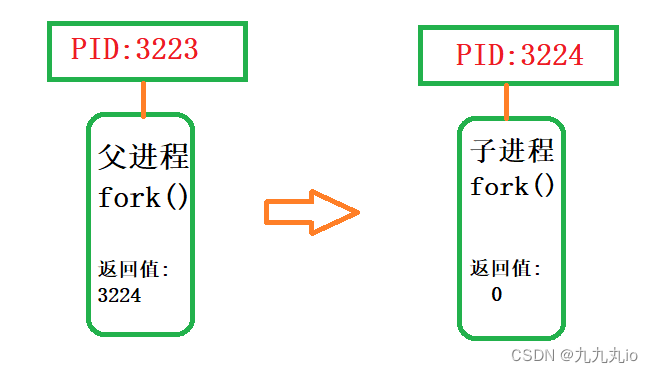
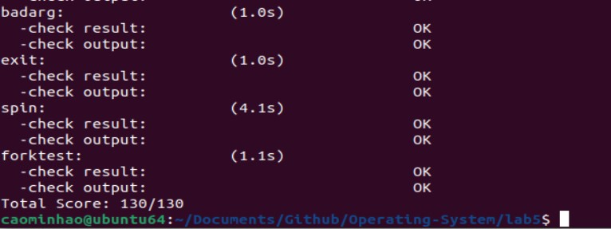

<h2 style="text-align:center">操作系统实验报告  Lab5
<h4 style="float:right">  姓名：曹珉浩&emsp;&emsp;李威远&emsp;&emsp;乔诣昊   
  学号：2113619    2112338   2111256

[toc]

### Exercise 1：加载应用程序并执行

#### 1.1 相关函数介绍

do_execv函数的主要功能和实现： **完成用户进程的创建工作**

为加载新的执行码做好用户态内存空间清空准备。如果mm不为NULL，则设置页表为内核空间页表，且进一步判断mm的引用计数减1后是否为0，如果为0，则表明没有进程再需要此进程所占用的内存空间，为此将根据mm中的记录，释放进程所占用户空间内存和进程页表本身所占空间。最后把当前进程的mm内存管理指针为空。由于此处的initproc是内核线程，所以mm为NULL，整个处理都不会做。
加载应用程序执行码到当前进程的新创建的用户态虚拟空间中。这里涉及到读ELF格式的文件，申请内存空间，建立用户态虚存空间，加载应用程序执行码等。load_icode函数完成了整个复杂的工作。

```c++
//主要用来清理原来进程的内存空间，为新进程执行准备好空间和资源
int do_execve(const char *name, size_t len, unsigned char *binary, size_t size) {
    struct mm_struct *mm = current->mm;
    if (!user_mem_check(mm, (uintptr_t)name, len, 0)) {
        return -E_INVAL;
    }
    if (len > PROC_NAME_LEN) {
        len = PROC_NAME_LEN;
    }

    char local_name[PROC_NAME_LEN + 1];
    memset(local_name, 0, sizeof(local_name));
    memcpy(local_name, name, len);
	//如果mm不为NULL，则不执行该过程
    if (mm != NULL) {
        cputs("mm != NULL");
        //将cr3页表基址指向boot_cr3,即内核页表
        lcr3(boot_cr3);
        if (mm_count_dec(mm) == 0) {
            //下面三步实现将进程的内存管理区域清空
            exit_mmap(mm);//清空内存管理部分和对应页表
            put_pgdir(mm);//清空页表
            mm_destroy(mm);//清空内存
        }
        current->mm = NULL;//最后让它当前的页表指向空，方便放入自己的东西
    }
    int ret;
    //填入新的内容，load_icode会将执行程序加载，建立新的内存映射关系，从而完成新的执行
    if ((ret = load_icode(binary, size)) != 0) {
        goto execve_exit;
    }
    //给进程新的名字
    set_proc_name(current, local_name);
    return 0;

execve_exit:
    do_exit(ret);
    panic("already exit: %e.\n", ret);
}
```

load_icode函数的主要就是**给用户进程建立一个能够让用户进程正常运行的用户环境**。完成了如下重要工作：

- 调用mm_create函数来申请进程的内存管理数据结构mm所需内存空间，并对mm进行初始化；

- 调用setup_pgdir来申请一个页目录表所需的一个页大小的内存空间，并把描述ucore内核虚空间映射的内核页表（boot_pgdir所指）的内容拷贝到此新目录表中，最后让mm->pgdir指向此页目录表，这就是进程新的页目录表了，且能够正确映射内核虚空间；

- 根据应用程序执行码的起始位置来解析此ELF格式的执行程序，并调用mm_map函数根据ELF格式的执行程序说明的各个段（代码段、数据段、BSS段等）的起始位置和大小建立对应的vma结构，并把vma插入到mm结构中，从而表明了用户进程的合法用户态虚拟地址空间；

- 调用根据执行程序各个段的大小分配物理内存空间，并根据执行程序各个段的起始位置确定虚拟地址，并在页表中建立好物理地址和虚拟地址的映射关系，然后把执行程序各个段的内容拷贝到相应的内核虚拟地址中，至此应用程序执行码和数据已经根据编译时设定地址放置到虚拟内存中了；

- 需要给用户进程设置用户栈，为此调用mm_mmap函数建立用户栈的vma结构，明确用户栈的位置在用户虚空间的顶端，大小为256个页，即1MB，并分配一定数量的物理内存且建立好栈的虚地址<—>物理地址映射关系；

- 至此,进程内的内存管理vma和mm数据结构已经建立完成，于是把mm->pgdir赋值到cr3寄存器中，即更新了用户进程的虚拟内存空间，此时的initproc已经被hello的代码和数据覆盖，成为了第一个用户进程，但此时这个用户进程的执行现场还没建立好；

- 先清空进程的中断帧，再重新设置进程的中断帧，使得在执行中断返回指令“iret”后，能够让CPU转到用户态特权级，并回到用户态内存空间，使用用户态的代码段、数据段和堆栈，且能够跳转到用户进程的第一条指令执行，并确保在用户态能够响应中断；

  

至此完成了用户环境的搭建。此时**initproc**将按产生系统调用的函数调用路径原路返回，执行中断返回指令**iret**后，将切换到用户进程程序的第一条语句位置`_start`处开始执行。

#### 1.2 设置正确的trapframe内容

根据提示，应该设置tf->gpr.sp, tf->epc, tf->status这三个变量。

- tf->gpr.sp 应该被设置为用户栈的栈顶
- tf->epc should 应该被设置为用户程序的入口
- tf->status 的值应该适合用户程序

```c++
tf->gpr.sp = USTACKTOP;
tf->epc = elf->e_entry;
tf->status = sstatus & ~(SSTATUS_SPP | SSTATUS_SPIE);
```

SPP记录的是在进入S-Mode之前处理器的特权级别，为0表示陷阱源自用户模式(U-Mode)，为1表示其他模式。当执行一个陷阱时，SPP会由硬件自动根据当前处理器所处的状态自动设置为0或者1。当执行SRET指令从陷阱中返回时，如果SPP位为0，那么处理器将会返回U-Mode，为1则会返回S-Mode。我们可以看到之后设ebreak来进行系统调用，在ebreak之后SPP的数值为1，sret之后会回到S mode在内核态执行用户程序。所以load_icode()函数在构造新进程的时候，会把SSTATUS_SPP设置为0，使得sret的时候能回到U mode。

SPIE位记录的是在进入S-Mode之前S-Mode中断是否开启。当进入陷阱时，硬件会自动将SIE位放置到SPIE位上，相当于起到了记录原先SIE值的作用，并最后将SIE置为0，表明硬件不希望在处理一个陷阱的同时被其他中断所打扰，也就是从硬件的实现逻辑上来说不支持嵌套中断。当使用SRET指令从S-Mode返回时，SPIE的值会重新放置到SIE位上来恢复原先的值，并且将SPIE的值置为1。

#### 1.3 简要描述这个用户态进程被ucore选择占用CPU执行（RUNNING态）到具体执行应用程序第一条指令的整个经过

分析在创建了用户态进程并且加载了应用程序之后，其占用CPU执行到具体执行应用程序的整个经过：

- 在经过调度器占用了CPU的资源之后，用户态进程调用了exec系统调用，从而转入到了系统调用的处理例程；
- 在经过了正常的中断处理例程之后，最终控制权转移到了syscall.c中的syscall函数，然后根据系统调用号转移给了sys_exec函数，在该函数中调用了上文中提及的do_execve函数来完成指定应用程序的加载；
- 在do_execve中进行了若干设置，包括推出当前进程的页表，换用kernel的PDT之后，使用load_icode函数，完成了对整个用户线程内存空间的初始化，包括堆栈的设置以及将ELF可执行文件的加载，之后通过current->tf指针修改了当前系统调用的trapframe，使得最终中断返回的时候能够切换到用户态，并且同时可以正确地将控制权转移到应用程序的入口处；
- 在完成了do_exec函数之后，进行正常的中断返回的流程，由于中断处理例程的栈上面的epc已经被修改成了应用程序的入口处，sp也设置为了用户栈的栈顶，因此iret进行中断返回的时候会将堆栈切换到用户的栈，并且完成特权级的切换，并且跳转到要求的应用程序的入口处；
- 接下来开始具体执行应用程序的第一条指令；

### Exercise 2：父进程复制自己的内存空间给子进程

> 创建子进程的函数`do_fork`在执行中将拷贝当前进程（即父进程）的用户内存地址空间中的合法内容到新进程中（子进程），完成内存资源的复制。具体是通过`copy_range`函数（位于kern/mm/pmm.c中）实现的，请补充`copy_range`的实现，确保能够正确执行。请在实验报告中简要说明你的设计实现过程。
>
> - 如何设计实现`Copy on Write`机制？给出概要设计，鼓励给出详细设计。

#### 2.1 相关函数和结构介绍

在开始本次练习的实验设计之前，我们首先需要宏观上正确认识do_fork这个函数。

类似于do_execv，do_fork函数也是一个内核函数，在系统调用中被封装。其作用是复制原本的进程，**在执行中将拷贝当前进程（即父进程）的用户内存地址空间中的合法内容到新进程中（子进程），完成内存资源的复制，以创建一个新的进程，它们的执行上下文、代码、数据都一样，但是存储位置不同。**即如下图所示：



在lab4中，我们实际上就使用了do_fork函数，通过复制当前的内核线程，复制得到一个新的内核线程，回顾当时我们所做的工作和do_fork代码实现（上次实验已经详细分析，这里不作具体代码展示），可以得出do_fork()函数具有如下的执行过程：

1. 调用alloc_proc()申请一个proc结构体，**这里，我们新增了几个成员，即sleep_state和进程关系指针，因此需要增加相应的初始化**
2. 调用setup_kstack()去为子进程分配内核栈
3. 调用copy_mm()函数，根据clone_flag选择性地为子进程复制内存空间。**上次实验中，由于内核进程的内存空间相同，都是整个内核虚拟内存空间，所以没有对copy_mm()函数进行实现**。这次实验中，我们将重点实现这个函数。
4. 调用copy_thread函数，为子进程设置上下文等信息。
5. 把新进程结构体插入到进程管理的数据结构中，该**结构在上次实验中已经实现，即hash链表和双向链表，但由于引入了进程关系指针，我们封装了set_links()函数来为进程设置合适的关系，我们放到之后解释**
6. 设置新进程为可执行状态。
7. 返回新生成的进程的pid。

其中，相较于上一次实验，有一些细微的区别，即上述加粗的部分，我们来看看新增的成员，以及相应的维护函数set_links()。

如下即进程管理结构体新增的四个个成员变量，其中：

- **wait_state：**不同于state成员，并非用于标识进程的状态，而是进程进入阻塞状态的原因，因此在初始状态下该成员应当置零，表示还未进入阻塞状态。
- **cptr(child ptr)：**指向该进程的刚刚插入的子进程，实际上为子线程双向链表头结点。
- **yptr(younger ptr)：**指向第一个比自己年轻的同父的进程，我称之为弟弟进程，实际上相当于子线程双向链表的next指针，用于串联整个子线程双向链表。
- **optr(older ptr):** 指向第一个比自己老的同父的进程，我称之为哥哥进程，实际上相当于子线程双向链表的last指针，用于串联整个子线程双向链表。

```c++
proc->wait_state = 0;  // 当前线程进入wait阻塞态的原因，初始化为0
proc->cptr = proc->optr = proc->yptr = NULL; //进程关系指针初始化 
```

我们在setlinks中重新封装add_list，并为进程设置合适的关系指针：

这里，我们将新的子进程的哥哥进程设置为上一个生成的子进程，使其插入进子进程的双向链表当中，随后，我们将父进程的cptr指向新的进程，完成关系的设置。

```c++
// set_links - set the relation links of process
static void
set_links(struct proc_struct *proc) {
    list_add(&proc_list, &(proc->list_link));
    proc->yptr = NULL;
    if ((proc->optr = proc->parent->cptr) != NULL) {
        proc->optr->yptr = proc;
    }
    proc->parent->cptr = proc;
    nr_process ++;
}
```

#### 2.2 内存资源复制：copy_range函数实现

在do_fork函数调用的第三步中，我们需要拷贝当前进程（即父进程）的用户内存地址空间中的合法内容到新进程中（子进程），完成内存资源的复制。这一步操作需要借助我们上次实验中没有实现的copy_mm函数来实现。

我们可以先来看看copy_mm函数实现了什么内容：

```c++
static int
copy_mm(uint32_t clone_flags, struct proc_struct *proc) {
    struct mm_struct *mm, *oldmm = current->mm;

    /* current is a kernel thread */
    if (oldmm == NULL) { //当前进程地址空间为 NULL
        return 0;
    }
    if (clone_flags & CLONE_VM) { //可以共享地址空间（也许和COW有关）
        mm = oldmm;  //共享地址空间
        goto good_mm;
    }
    int ret = -E_NO_MEM; 
    if ((mm = mm_create()) == NULL) { //创建地址空间未成功
        goto bad_mm;
    }
    if (setup_pgdir(mm) != 0) { 
        goto bad_pgdir_cleanup_mm;
    }
    lock_mm(oldmm); //打开互斥锁,避免多个进程同时访问内存
    {
        ret = dup_mmap(mm, oldmm); //调用 dup_mmap 函数
    }
    unlock_mm(oldmm); //释放互斥锁
    if (ret != 0) {
        goto bad_dup_cleanup_mmap;
    }
good_mm:
    mm_count_inc(mm);  //共享地址空间的进程数加一
    proc->mm = mm;     //复制空间地址
    proc->cr3 = PADDR(mm->pgdir); //复制页表地址
    return 0;
    
bad_dup_cleanup_mmap:
    exit_mmap(mm);
    put_pgdir(mm);
bad_pgdir_cleanup_mm:
    mm_destroy(mm);
bad_mm:
    return ret; 
}
```

可以看到，实际上copy_mm中只对输入进行了一些检查，具体内存资源复制是通过调用dup_mmap函数来实现的，接下来，我们来看看dup_mmap函数是怎么实现的。

```c++
int dup_mmap(struct mm_struct *to, struct mm_struct *from) {
    assert(to != NULL && from != NULL); //必须非空
    
    // 从源进程的 mmap_list 开始遍历虚拟地址空间的所有段
    list_entry_t *list = &(from->mmap_list), *le = list;
    while ((le = list_prev(le)) != list) { // 遍历所有段
        struct vma_struct *vma, *nvma; 
        vma = le2vma(le, list_link); // 获取某一段
        // 根据源段信息创建一个新的段
        nvma = vma_create(vma->vm_start, vma->vm_end, vma->vm_flags);
        if (nvma == NULL) {
            return -E_NO_MEM; // 如果内存不足，返回错误
        }
        insert_vma_struct(to, nvma); // 向目标进程插入新创建的段

        bool share = 0; // 初始化共享标志为 false
        // 调用 copy_range 函数，将源进程的数据拷贝到目标进程
        if (copy_range(to->pgdir, from->pgdir, vma->vm_start, vma->vm_end, share) != 0) {
            return -E_NO_MEM; // 如果拷贝失败，返回错误
        }
    }
    return 0; // 拷贝成功，返回 0
}
```

可以看到，实际上，在dup_mmap函数中，我们也没有进行拷贝的具体处理，而是在dup_mmap函数中完成了新进程内存空间的初始化，还需要将原本进程的内存空间进行拷贝才可以。整个调用的过程如下所示：

```
copy_mm-->dup_mmap-->copy_range
```

那么，这部分核心功能，就在我们的copy_range函数的实现中给出，其中，需要我们实现的代码已经给出，即注释exercise2完成的部分以下的四步操作。

```c++
int copy_range(pde_t *to, pde_t *from, uintptr_t start, uintptr_t end,
               bool share) {
    assert(start % PGSIZE == 0 && end % PGSIZE == 0);
    assert(USER_ACCESS(start, end));
    // 按页单元进行内容复制。

    do {
        // 通过地址 start 调用 get_pte 找到父进程的页表项 pte。
        pte_t *ptep = get_pte(from, start, 0), *nptep;
        if (ptep == NULL) {
            // 如果找不到页表项，就向下一个页的地址跳转。
            start = ROUNDDOWN(start + PTSIZE, PTSIZE);
            continue;
        }

        // 通过地址 start 调用 get_pte 找到子进程的页表项 pte。
        // 如果 pte 为空，就分配一个页表项。
        if (*ptep & PTE_V) {
            if ((nptep = get_pte(to, start, 1)) == NULL) {
                return -E_NO_MEM;
            }
            // 从 ptep 中获取页信息。
            struct Page *page = pte2page(*ptep);
            // 为子进程分配一个新的页。
            struct Page *npage = alloc_page();
            assert(page != NULL);
            assert(npage != NULL);
            int ret = 0;
            
			//>>>>>>>>>exercise2完成的部分<<<<<<<<<<
            // 1. 获取子进程对应页的内核虚拟地址。
            void *kva_src = page2kva(page);
            // 2. 获取父进程对应页的内核虚拟地址。
            void *kva_dst = page2kva(npage);
            // 3. 将父进程的内容复制到子进程。
            memcpy(kva_dst, kva_src, PGSIZE);
            // 4. 在子进程的页表中建立物理地址与页的映射关系。
            ret = page_insert(to, npage, start, (*ptep & PTE_USER));
        }
        start += PGSIZE;
    } while (start != 0 && start < end);

    return 0;
}
```

内存复制的copy_range代码实现的逻辑如下：

1. 首先，确保开始地址和结束地址都是页对齐的，并且处于用户态地址范围内。
2. 通过循环迭代，按照页的大小逐个复制页面内容。
3. 对于每一页：
   - 通过父进程的页表 `from` 找到页表项 `ptep`。
   - 如果找不到页表项，将 `start` 地址向下取整到下一个页的边界。
   - 如果找到了页表项，检查页表项是否有效（ PTE_V标志），如果有效则开始复制：
     - 在父进程的页表 `to` 中找到或分配一个新的页表项 `nptep`。
     - 从 `ptep` 中获取页的信息 `page`，为子进程分配一个新的页 `npage`。
     - 获取父进程和子进程对应页的内核虚拟地址 `kva_src` 和 `kva_dst`。
     - 将父进程的内容复制到子进程中。
     - 在子进程的页表中建立物理地址与页的映射关系。
4. 完成所有页面的复制后返回 0，表示复制成功。

通过以上操作，我们就能完成父进程到子进程的内存复制的实现，确保其能正确执行。

#### 2.3 Copy-on-write(COW)实现设计思路

首先，我们先回顾一下COW机制是什么，引用一段指导书的话：

> Copy-on-write（简称COW）的基本概念是指如果有多个使用者对一个资源A（比如内存块）进行读操作，则每个使用者只需获得一个指向同一个资源A的指针，就可以读取该资源了。若某使用者需要对这个资源A进行写操作，系统会对该资源进行拷贝操作，从而使得该“写操作”使用者获得一个该资源A的“私有”拷贝—资源B，可对资源B进行写操作。该“写操作”使用者对资源B的改变对于其他的使用者而言是不可见的，因为其他使用者看到的还是资源A。

可以看出，Copy on Write 是在复制一个对象的时候并不是真正的把原先的对象复制到内存的另外一个位置上，而是在新对象的内存映射表中设置一个指针，指向源对象的位置，并把那块内存的Copy-On-Write位设置为1。

那么，在我们的代码中，如何具体实现COW机制呢？分为如下几个核心问题：

- **如何检查是否需要COW机制，并设置共享空间处理呢？**
- **如何保障这个共享空间只允许读呢？**
- **如何在进行写操作的时候，进行私有的资源拷贝呢？**

**实际上，对于问题一**，我们的代码中，do_fork函数拥有标记位CLONE_VM，即标记该进程的虚拟内存可以在多个进程之间共享。

而在我们的kern_thread函数调用中，生成的内核进程实际上是共享整个内存虚拟空间的，因此也需要对这个标记位置1，即采用如下所示调用：

```c++
do_fork(clone_flags | CLONE_VM, 0, &tf);
```

而在copy_mm的最一开始，我们也对该标记位进行了判断：

```c++
if (clone_flags & CLONE_VM) { //可以共享地址空间
    mm = oldmm;  //共享地址空间
    goto good_mm;
}
……
good_mm:
    mm_count_inc(mm);  //共享地址空间的进程数加一
    proc->mm = mm;     //复制空间地址
    proc->cr3 = PADDR(mm->pgdir); //复制页表地址
    return 0;
```

这也就是为什么我们在lab4的内核进程构建中，不需要处理这部分的代码实现，因为实际上内核线程就是共享read和write，共同享有整个内核内存空间。所以可以采用类似的处理即可，我们的代码中也给出了标记位share的实现。

但是，我们的COW机制要求，共享read是可行的，共享write显然是不合适的，因此，还需要进一步考虑问题二和问题三，尝试对其实现：

**对于问题二和问题三**，实际上，我们可以巧妙地利用trap异常处理来实现：

- 当进行内存访问时，CPU会根据PTE上的**读写位PTE_P、PTE_W**来确定当前内存操作是否允许，如果不允许，则缺页中断，**我们可以在缺页中断处理程序中复制该页内存，并设置该页内存所对应的`PTE_W`为1。**
- 因此，我们可以在copy_range函数中，将父进程中**所有PTE中的PTE_W置为0**，这样便可以将父进程中所有空间都设置为只读。然后使子进程的PTE全部指向父进程中PTE存放的物理地址，这样便可以达到内存共享的目的，又可以保障只读和写时复制，完美完成我们的要求。

综上，我们基于这种设计思想即可完成我们的处理，具体的设计实现在 [COW设计手册.pdf](./COW设计手册.pdf) 中给出 。

### Exercise 3：理解进程执行 fork/exec/wait/exit 的实现，以及系统调用的实现

> - 请分析fork/exec/wait/exit的执行流程。重点关注哪些操作是在用户态完成，哪些是在内核态完成？内核态与用户态程序是如何交错执行的？内核态执行结果是如何返回给用户程序的？
> - 请给出ucore中一个用户态进程的执行状态生命周期图（包执行状态，执行状态之间的变换关系，以及产生变换的事件或函数调用）。（字符方式画即可）

#### 3.1 fork/exec/wait/exit 的执行流程

##### 3.1.1 fork的执行流程

在`user`目录下存储了一些用户程序，它们在编译的时候放到生成的镜像里。我们先以 `user/forktest.c` 为例，自顶向下进行分析。首先，在 `forktest.c` 中，主要的就是不断尝试调用 `fork` 函数创建一些子进程：

```c
for (n = 0; n < max_child; n ++) {
    if ((pid = fork()) == 0) {
        cprintf("I am child %d\n", n);
        exit(0);
    }
    assert(pid > 0);
}
```

`fork` 的函数定义在 `user/libs/ulib.c(h)` 给出和实现，可以看到是一个封装的函数，其余什么也没干：

```c
int fork(void) {
    return sys_fork();
}
```

再次溯源，其函数定义和实现在 `user/libs/syscall.c(h)` 中：

```c
int sys_fork(void) {
    return syscall(SYS_fork);
}
```

又是一层封装，在函数体中调用了本文件中实现的 `syscall` 函数：

```c
static inline int syscall(int64_t num, ...) {
    va_list ap; // 参数列表(此时未初始化)
    va_start(ap, num);  // 初始化参数列表, 从num开始
    uint64_t a[MAX_ARGS];
    int i, ret;
    // 依次取出参数并赋值
    for (i = 0; i < MAX_ARGS; i ++) 
        a[i] = va_arg(ap, uint64_t);
    va_end(ap);
    asm volatile (
        "ld a0, %1\n"  # num存到a0寄存器， a[0]存到a1寄存器
        "ld a1, %2\n"
        "ld a2, %3\n"
        "ld a3, %4\n"
        "ld a4, %5\n"
    	"ld a5, %6\n"
        "ecall\n"      
        "sd a0, %0"
        : "=m" (ret)
        : "m"(num), "m"(a[0]), "m"(a[1]), "m"(a[2]), "m"(a[3]), "m"(a[4])
        :"memory");
    return ret; // ecall的返回值存到ret
}
```

可以看到，在这里就不仅仅是用户态的封装了，我们知道，用户程序在用户态运行(U mode)，系统调用在内核态执行(S mode)，那么用户如何在用户态使用操作系统的资源呢？(比如我们现在的例子 `fork`)，操作系统应当提供给用户程序一些接口，让用户程序使用操作系统提供的服务，这些接口就是**系统调用**，使用系统调用的时候，有一个**CPU的特权级切换**的过程，**即使用 ecall 指令从U mode进入S mode**。到这里，其实也就能解释为什么用户程序只能使用 `fork` 而不能使用下一层的 `sys_fork`，因为 `sys_fork` 中会调用 `ecall` 指令从用户态进入到内核态，而我们不能让用户来干这件事情，否则用户态和内核态也就没什么区别了。

我们接着回去看函数，函数接收可变长度参数，由一个必选参数**系统调用号** `num` 和可选参数列表组成，然后遍历参数列表，存储在数组 `a` 中，接着在内联汇编中，将 `num` 和参数数组的内容加载到对应的寄存器中，然后执行 `ecall` 指令，根据系统调用号 `num` 来触发相应的系统调用，最后 `ret` 用于存储系统调用的返回值。

我们可以看到，在封装的函数中，我们调用了 `SYS_fork` 这个系统调用号，它们定义在 `libs/unistd.h` 中，其值是2(我们会在后面汇总这些信息)。了解函数的功能和作用后，那么调用 `ecall` 后，究竟发生了什么呢？

实际上，**CPU特权级的切换就是通过中断(异常)来实现的**。当在 U Mode 中通过内联汇编调用 `ecall` 指令后，会生成一个 trap，然后进入到 S Mode中进行异常处理，下面我们追踪这个过程：在 `kern/trap/trap.c` 中，我们会根据中断帧tf，调用 `exception_handler` 处理：

```c
void exception_handler(struct trapframe *tf) {
    int ret;
    // 通过中断帧里 scause寄存器的数值，判断出当前是来自USER_ECALL的异常
    switch (tf->cause) {
		......
        case CAUSE_USER_ECALL:
            //cprintf("Environment call from U-mode\n");
            tf->epc += 4;
            syscall(); // 调用syscall转发
            break;
            ......
}
```

可以看到，异常处理机制会通过中断帧里 `scause` 寄存器的数值，判断出当前是来自`USER_ECALL`的异常，然后调用 `syscall` 函数进行系统调用的转发，同时注意到，在转发之前，还让 `epc+4`，这是因为 `epc` 寄存器是产生异常的指令的位置，在异常处理结束后，会回到`epc` 的位置继续执行，而对于 `ecall` , 我们希望 `epc`寄存器要指向产生异常的指令(ecall)的下一条指令，这样才能避免死循环。

接着来看系统调用转发的 `syscall` 函数，位于 `kern/syscall/syscall.c`：

```c
void syscall(void) {
    struct trapframe *tf = current->tf;
    uint64_t arg[5];
    // 获取系统调用号：a0寄存器保存了系统调用编号
    int num = tf->gpr.a0;
    if (num >= 0 && num < NUM_SYSCALLS) {
        if (syscalls[num] != NULL) {
            arg[0] = tf->gpr.a1;
            arg[1] = tf->gpr.a2;
            arg[2] = tf->gpr.a3;
            arg[3] = tf->gpr.a4;
            arg[4] = tf->gpr.a5;
            tf->gpr.a0 = syscalls[num](arg);
            //把寄存器里的参数取出来，转发给系统调用编号对应的函数进行处理
            return ;
        }
    }
    print_trapframe(tf);
    //如果执行到这里，说明传入的系统调用编号还没有被实现，就崩掉了
    panic("undefined syscall %d, pid = %d, name = %s.\n",
            num, current->pid, current->name);
}
```

我们在 `user/libs/syscall.c` 的内联汇编中看到，系统调用号保存在寄存器 `a0`中，因此我们要首先获取这个系统调用号，然后根据 `syscalls` 数组中的不同元素，取出寄存器的参数后进行不同的处理。`syscalls` 其实是一个函数指针的数组，因此它的不同元素进行的处理，也就是调用函数指针所指向的不同的函数：

```c
static int (*syscalls[])(uint64_t arg[]) = {
    [SYS_exit]              sys_exit,
    [SYS_fork]              sys_fork,
    [SYS_wait]              sys_wait,
    [SYS_exec]              sys_exec,
    [SYS_yield]             sys_yield,
    [SYS_kill]              sys_kill,
    [SYS_getpid]            sys_getpid,
    [SYS_putc]              sys_putc,
    [SYS_pgdir]             sys_pgdir,
};
```

这些函数也在这个文件下被定义，我们还是来看 `sys_fork`：

```c
static int sys_fork(uint64_t arg[]) {
    struct trapframe *tf = current->tf;
    uintptr_t stack = tf->gpr.sp;
    return do_fork(0, stack, tf);
}
```

可以看到，已经到了最后进行处理的时刻，`do_fork` 函数就是我们上次实验内核进程的重要函数，它的作用也在我们的 Exercise2中进行了回顾，在这里不进行赘述了。

至此，通过层层调用封装与转发，我们终于实现了在用户态获取操作系统 `fork` 资源的功能。

##### 3.1.2 exec的执行流程

`exec` 和 `fork` 有所不同，`fork` 一般是用户在自己想要的地方进行调用，而不会有哪些用户想在自己的代码开头和结尾套上一个 `exec`，想要追溯到 `exec` 的最上层，就要找到用户的进程到底是怎么被执行的。

我们在上一次实验中看到，在`proc_init()`函数里初始化进程的时候, 认为启动时运行的ucore程序, 是一个内核进程("第0个"内核进程), 并将其初始化为`idleproc`进程。然后我们新建了一个内核进程执行`init_main()`函数，在本次实验中，`init_main` 函数**新建了一个内核进程，用于执行函数`user_main()`，然后在这个内核进程执行用户进程：**

```c
init_main(void *arg) {
    size_t nr_free_pages_store = nr_free_pages();
    size_t kernel_allocated_store = kallocated();
    // 新建了一个内核线程，执行 usr_main，在这个内核进程执行用户进程
    int pid = kernel_thread(user_main, NULL, 0);
    if (pid <= 0) 
        panic("create user_main failed.\n");
    // 等待子进程退出
    while (do_wait(0, NULL) == 0) 
        schedule();
    ......
}
```

接下来去看一看 `user_main` 函数：

```c
static int user_main(void *arg) {
#ifdef TEST
    KERNEL_EXECVE2(TEST, TESTSTART, TESTSIZE);
#else
    KERNEL_EXECVE(exit);
#endif
    panic("user_main execve failed.\n");
}
```

可以看到，它的具体工作就是执行 `KERNEL_EXECVE` 等函数，它们通过一些宏的封装，最后实际上是执行 `kernel_execve` 这个函数

```c
#define __KERNEL_EXECVE(name, binary, size) ({                          \
            cprintf("kernel_execve: pid = %d, name = \"%s\".\n",        \
                    current->pid, name);                                \
            kernel_execve(name, binary, (size_t)(size));                \
        })
......
```

而在 `kernel_execve` 这个函数中，我们看到，不同于上一小节 `fork` 采用 `ecall` 完成特权级切换，在 `kernel_execve` 中采用了 `ebreak` 打中断的方式完成特权级切换：

```c
static int kernel_execve(const char *name, unsigned char *binary, size_t size) {
    int64_t ret=0, len = strlen(name);
    asm volatile(
        "li a0, %1\n"
        "lw a1, %2\n"
        "lw a2, %3\n"
        "lw a3, %4\n"
        "lw a4, %5\n"
    	"li a7, 10\n"
        "ebreak\n"
        "sw a0, %0\n"
        : "=m"(ret)
        : "i"(SYS_exec), "m"(name), "m"(len), "m"(binary), "m"(size)
        : "memory");
    cprintf("ret = %d\n", ret);
    return ret;
}
```

那么为什么不能仍然调用 `ecall` 呢？因为此时我们还处于用户态，就像前面所说的，没有哪个程序员会想把所有的代码都套一个 `exec`，因此它就少了一些C语言支持的封装，我们只能另辟蹊径提升权限。同时，我们还要标明这个中断不是一个简单的中断，我们通过将`a7`寄存器的值设为10说明这不是一个普通的断点中断，而是要转发到`syscall()`：

```c
case CAUSE_BREAKPOINT:
    cprintf("Breakpoint\n");
    if(tf->gpr.a7 == 10){
        tf->epc += 4;
        syscall();
        kernel_execve_ret(tf,current->kstack+KSTACKSIZE);
    }
    break;
```

这样，`exec` 的后续处理就和前面的 `fork` 很像了，通过查函数指针数组执行不同的函数，在这里会执行 `sys_exec` 函数，而他实际的功能是执行 `proc.c` 中的 `do_execve` 函数。

```c
static int sys_exec(uint64_t arg[]) {
    const char *name = (const char *)arg[0];
    size_t len = (size_t)arg[1];
    unsigned char *binary = (unsigned char *)arg[2];
    size_t size = (size_t)arg[3];
    return do_execve(name, len, binary, size);
}
```

```c
int do_execve(const char *name, size_t len, unsigned char *binary, size_t size) {
    struct mm_struct *mm = current->mm;
    // 检查名为 name 的内存空间是否能被访问
    if (!user_mem_check(mm, (uintptr_t)name, len, 0)) {
        return -E_INVAL;
    }
    // 进程名字的长度有上限 PROC_NAME_LEN，在proc.h定义
    if (len > PROC_NAME_LEN) {
        len = PROC_NAME_LEN;
    }
    char local_name[PROC_NAME_LEN + 1];
    memset(local_name, 0, sizeof(local_name));
    memcpy(local_name, name, len);

    if (mm != NULL) {
        cputs("mm != NULL");
        lcr3(boot_cr3);
        if (mm_count_dec(mm) == 0) {
            exit_mmap(mm);
            put_pgdir(mm);
            mm_destroy(mm);
        }
        current->mm = NULL;
    }
    int ret;
    // 把新的程序加载到当前进程里的工作都在load_icode()函数里完成
    if ((ret = load_icode(binary, size)) != 0) {
        goto execve_exit;
    }
    set_proc_name(current, local_name);
    return 0;

execve_exit:
    do_exit(ret);
    panic("already exit: %e.\n", ret);
}
```

总的来说，这个函数主要完成两个功能：

- 首先为加载新的执行码做好用户态内存空间清空准备。如果 mm 不为 NULL，则设置页表为内核空间页表，且进一步判断 mm 的引用计数减 1 后是否为 0，如果为 0，则表明没有进程再需要此进程所占用的内存空间，为此将根据 mm 中的记录，释放进程所占用户空间内存和进程页表本身所占空间。最后把当前进程的 mm 内存管理指针为空
- 加载应用程序执行码到当前进程的新创建的用户态虚拟空间中，之后调用 `load_icode` 从而使之准备好执行，`load_icode` 的功能在Exercise1中已经说明，在此不再赘述

##### 3.1.3 wait的执行流程

`wait` 的执行流程和 `fork` 很像，最高层可以是来自用户的 `wait` 函数调用，封装过程如下：

```c
// ulib.c(h)
int wait(void) { // 还有一个waitpid函数，只不过是多了参数而已，本质相同
    return sys_wait(0, NULL);
}
// user/libs/syscall.c(h)
int sys_wait(int64_t pid, int *store) {
    return syscall(SYS_wait, pid, store);
}
// syscall/syscall.c(h)
static int sys_wait(uint64_t arg[]) {
    int pid = (int)arg[0];
    int *store = (int *)arg[1];
    return do_wait(pid, store);
}
```

接下来来分析`do_wait` 函数的作用 ，它主要做了三件事：

- 如果 pid!=0，表示只找一个进程 id 号为 pid 的退出状态的子进程，否则找任意一个处于退出状态的子进程

```c
if (pid != 0) { //如果pid！=0，则找到进程id为pid的处于退出状态的子进程 
    proc = find_proc(pid);
    if (proc != NULL && proc->parent == current) {
        haskid = 1;
        if (proc->state == PROC_ZOMBIE) 
            goto found; //找到进程
    }
}
else { //如果pid==0，则随意找一个处于退出状态的子进程
	proc = current->cptr;
	for (; proc != NULL; proc = proc->optr) {
		haskid = 1;
		if (proc->state == PROC_ZOMBIE) 
			goto found;
	}
}
```

- 如果此子进程的执行状态不为 PROC_ZOMBIE，表明此子进程还没有退出，则当前进程设置执行状态为 PROC_SLEEPING，睡眠原因为 WT_CHILD (即等待子进程退出)，调用 schedule() 函数选择新的进程执行，自己睡眠等待，如果被唤醒，则重复跳回步骤 1 处执行

```c
if (haskid) {
    current->state = PROC_SLEEPING;
    current->wait_state = WT_CHILD;
    schedule();
    if (current->flags & PF_EXITING) {
        do_exit(-E_KILLED);
    }
    goto repeat;
}
```

- 如果此子进程的执行状态为 PROC_ZOMBIE，表明此子进程处于退出状态，需要当前进程(即子进程的父进程)完成对子进程的最终回收工作，即首先把子进程控制块从两个进程队列 proc_list 和 hash_list 中删除，并释放子进程的内核堆栈和进程控制块。自此，子进程才彻底地结束了它的执行过程，它所占用的所有资源均已释放

```c
found:
    if (proc == idleproc || proc == initproc) 
        panic("wait idleproc or initproc.\n");
    if (code_store != NULL) 
        *code_store = proc->exit_code;
    local_intr_save(intr_flag);
    {
        unhash_proc(proc);
        remove_links(proc);
    }
    local_intr_restore(intr_flag);
    put_kstack(proc);
    kfree(proc);
    return 0;
```

##### 3.1.4 exit的执行流程

`exit` 的封装转发等过程和 `fork,wait` 几乎一样，在此不再赘述，下面我们来分析一下最后进行实际处理的 `do_exit` 函数，它的实现过程大致如下：

- 先判断是否是用户进程，如果是，则切换到内核页表，开始回收此用户进程所占用的用户态虚拟内存空间

```c
if (current == idleproc) 
    panic("idleproc exit.\n");
if (current == initproc) 
    panic("initproc exit.\n");
struct mm_struct *mm = current->mm;
if (mm != NULL) {
    // 切换到内核页表，确保接下来的操作在内核空间执行
    lcr3(boot_cr3);
    if (mm_count_dec(mm) == 0) {
        exit_mmap(mm);
        put_pgdir(mm);
        mm_destroy(mm);
    }
    // 将当前进程的mm设置为NULL，表示资源已经释放
    current->mm = NULL;
}
```

- 设置当前进程的状态为 PROC_ZOMBIE(即快寄了，等待被父进程回收)，然后设置当前进程的退出码为 error_code，**表明此时这个进程已经无法再被调度了**，只能**等待父进程来完成最后的回收工作（主要是回收该子进程的内核栈和PCB）**

> 为什么不让进程本身完成所有的资源回收工作呢？这是因为进程要执行回收操作，就表明此进程还存在，还在执行指令，这就需要内核栈的空间不能释放，且表示进程存在的进程控制块不能释放。所以需要父进程来帮忙释放子进程无法完成的这两个资源回收工作。

```c
current->state = PROC_ZOMBIE;
current->exit_code = error_code;
```

- 如果当前父进程已经处于等待子进程的状态，即父进程的 wait_state 被置为 WT_CHILD，则此时就可以唤醒父进程，让父进程来帮子进程完成最后的资源回收工作

```c
proc = current->parent;
if (proc->wait_state == WT_CHILD) 
	wakeup_proc(proc);
```

- 如果当前进程还有子进程,则需要把这些子进程的父进程指针设置为内核线程 init，且各个子进程指针需要插入到 init 的子进程链表中。如果某个子进程的执行状态是 PROC_ZOMBIE，则需要唤醒 init 来完成对此子进程的最后回收工作

> 这样做是为了避免以后该进程的子进程资源无法回收，因为它们的父进程已经不存在了，那么子进程的内核栈空间于进程控制块就会无法回收

```c
while (current->cptr != NULL) {
    proc = current->cptr;
    current->cptr = proc->optr;
    proc->yptr = NULL;
    if ((proc->optr = initproc->cptr) != NULL) 
        initproc->cptr->yptr = proc;
    proc->parent = initproc;
    initproc->cptr = proc;
    if (proc->state == PROC_ZOMBIE) {
        if (initproc->wait_state == WT_CHILD) {
            wakeup_proc(initproc);
        }
    }
}
```

##### 3.1.5 总结：系统调用与转移关系

| 系统调用名  | 系统调用号 |                具体功能                |                           转移关系                           |
| :---------: | :--------: | :------------------------------------: | :----------------------------------------------------------: |
| `SYS_exit`  |     1      | 回收用户进程所占用的用户态虚拟内存空间 | exit() $\to$ exit() $\to$ sys_exit() $\to$ syscall() $\to$ do_exit() |
| `SYS_fork`  |     2      | 完成内存资源的复制，以创建一个新的进程 | fork() $\to$ fork() $\to$ sys_fork() $\to$ syscall() $\to$ do_fork() |
| `SYS_wait`  |     3      |        等待任意子进程的结束通知        | wait() $\to$ wait() $\to$ sys_wait() $\to$ syscall() $\to$ do_wait() |
| `SYS_exec`  |     4      |              执行用户进程              | init_main() $\to$ user_main() $\to$ kernel_execve() $\to$ syscall() $\to$ do_execve() |
| `SYS_clone` |     5      |               创建子进程               |                do_fork() $\to$ wakeup_proc()                 |
| `SYS_sleep` |     11     |                进程休眠                |                          do_sleep()                          |
| `SYS_kill`  |     12     |                杀死进程                | do_kill() $\to$ wakeup_proc() $\to$ do_wait() $\to$ do_exit() |

#### 3.2 用户态进程的执行状态生命周期图

首先来看一看进程状态的转换图：


接着绘制用户进程执行状态的变化图：


以及一个函数调用关系图(以 `do_fork` 为例)：


#### 3.3 运行结果



### Challenge1：COW实现

详情参考 [COW设计手册.pdf](./COW设计手册.pdf)

### Challenge2：用户程序何时加载？

> 说明该用户程序是何时被预先加载到内存中的？与我们常用操作系统的加载有何区别，原因是什么？

下面的代码是新建的那个内核进程要执行的函数`user_main()`。

```c++
user_main(void *arg) {
#ifdef TEST
    KERNEL_EXECVE2(TEST, TESTSTART, TESTSIZE);
#else
    KERNEL_EXECVE(exit);
#endif
    panic("user_main execve failed.\n");
}
```

下面是相关的宏，`_binary_obj___user_##x##_out_start`和`_binary_obj___user_##x##_out_size`都是编译的时候自动生成的符号。这里的`##x##`，按照C语言宏的语法，会直接把x的变量名代替进去。

```c++
#define __KERNEL_EXECVE(name, binary, size) ({                          \
            cprintf("kernel_execve: pid = %d, name = \"%s\".\n",        \
                    current->pid, name);                                \
            kernel_execve(name, binary, (size_t)(size));                \
        })

#define KERNEL_EXECVE(x) ({                                             \
            extern unsigned char _binary_obj___user_##x##_out_start[],  \
                _binary_obj___user_##x##_out_size[];                    \
            __KERNEL_EXECVE(#x, _binary_obj___user_##x##_out_start,     \
                            _binary_obj___user_##x##_out_size);         \
        })
```

于是，我们在`user_main()`所做的，就是执行了下面这么一个函数。

```
kern_execve("exit", _binary_obj___user_exit_out_start,_binary_obj___user_exit_out_size)。
```

实际上，就是加载了存储在这个位置的程序`exit`并在`user_main`这个进程里开始执行。这时`user_main`就从内核进程变成了用户进程。

```c++
static int
kernel_execve(const char *name, unsigned char *binary, size_t size) {
    int64_t ret=0, len = strlen(name);
 //   ret = do_execve(name, len, binary, size);
    asm volatile(
        "li a0, %1\n"
        "lw a1, %2\n"
        "lw a2, %3\n"
        "lw a3, %4\n"
        "lw a4, %5\n"
    	"li a7, 10\n"
        "ebreak\n"
        "sw a0, %0\n"
        : "=m"(ret)
        : "i"(SYS_exec), "m"(name), "m"(len), "m"(binary), "m"(size)
        : "memory");
    cprintf("ret = %d\n", ret);
    return ret;
}
```

这里由于目前我们在S mode下，所以不能通过`ecall`来产生中断。所以用`ebreak`产生断点中断进行处理，通过设置`a7`寄存器的值为10说明这不是一个普通的断点中断，而是要转发到`syscall()`，从而实现了在内核态使用系统调用。

### 知识点列举

#### 实验中涉及的知识点列举

本次实验中主要涉及到的知识点有：

- 从内核态切换到用户态的方法；
- ELF可执行文件的格式；
- 用户进程的创建和管理；
- 简单的进程调度；
- 系统调用的实现；

对应的操作系统中的知识点有：

- 创建、管理、切换到用户态进程的具体实现；
- 加载ELF可执行文件的具体实现；
- 对系统调用机制的具体实现；

他们之间的关系为：

- 前者的知识点为后者具体在操作系统中实现具体的功能提供了基础知识；

#### 实验中未涉及的知识点列举

本次实验中为涉及到的知识点有：

- 操作系统的启动；
- 操作系统对内存的管理；
- 进程间的共享、互斥、同步问题；
- 文件系统的实现；